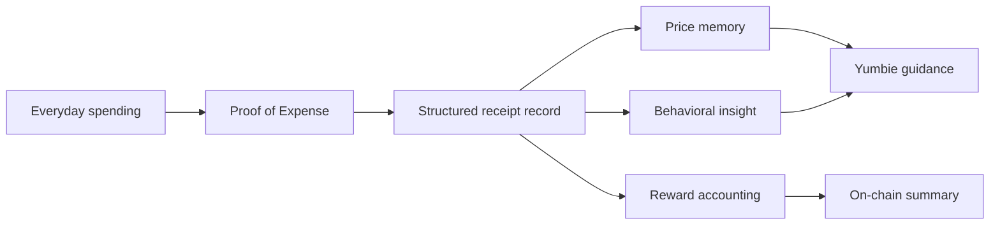
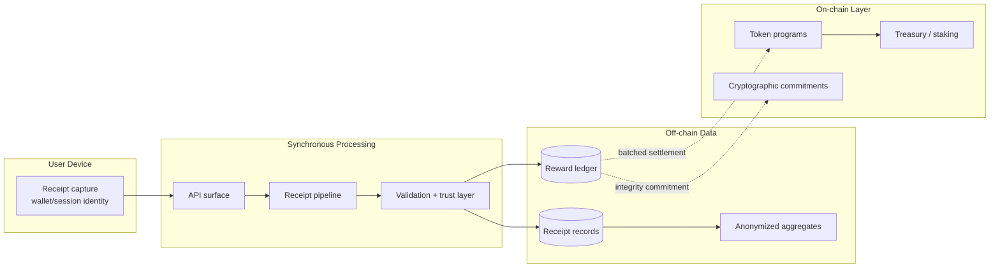

# Yumo Yumo

Yumo Yumo is a personal financial operating system built around **Proof of Expense**: the everyday receipt, invoice, bill, ticket, and payment record that shows how money actually moves through a household.

Traditional personal finance products usually begin with account balances and transaction categories. Yumo Yumo begins one level deeper: the item, merchant, time, basket, document type, and recurring routine behind the transaction. This lets the product read spending as **financial memory**, **price memory**, and **behavioral evidence** at the same time.

The long-term vision is to help people understand their money through the psychology of real spending. Behavioral finance shows that financial decisions are shaped by bounded rationality, cognitive biases, emotional triggers, mental accounting, present bias, loss aversion, anchoring, and social context. Yumo Yumo turns those mechanisms into user-facing insight without shame, pressure, or fabricated certainty.

## Product Thesis

Yumo Yumo treats everyday spending records as a living data layer:

- **For the user**, verified receipts become clearer spending history, product-level price memory, hidden-cost insight, goals, spending identity, and Yumbie guidance.
- **For the protocol**, verified contributions become auditable reward events and aggregate market signals.
- **For the ecosystem**, anonymized basket and price data can become a contribution economy with user-owned continuity.



The platform is designed for emerging markets first, where inflation, price drift, category substitution, and household budgeting pressure are visible in daily receipts. Yumo Yumo connects those signals to a product experience that explains what happened, why it may be happening, and which small action can help next.

## What Yumo Yumo Builds

### Proof of Expense Engine

The receipt pipeline converts images and PDF invoices into structured records. It extracts merchant, date, totals, line items, category signals, and document type; validates consistency; resolves canonical products and merchants; then writes a reward-accounting event when the contribution qualifies.

The public technical contract is the stage order and typed handoff between stages. Provider routing, calibration values, and defense parameters stay in the internal operations layer.

### Living Price Memory

Receipts create a household-level history of what the same products cost across time, merchants, and baskets. Canonical product matching collapses surface forms such as abbreviations, package variants, and merchant-specific labels into stable product references.

This turns scattered receipts into a longitudinal view of price movement, substitution, recurring needs, and basket composition.

### Behavioral Finance Layer

Yumo Yumo uses spending data to make behavior legible:

- **Mental accounting** — how categories behave like separate budgets in the user's mind.
- **Present bias** — how short-term reward windows shape spending timing.
- **Loss aversion** — how price increases, budget overruns, and missed opportunities feel different from equivalent gains.
- **Anchoring** — how first-seen prices shape later purchase judgments.
- **Pain of paying** — how payment method and timing can change perceived cost.
- **Identity signaling** — how repeated symbolic purchases reveal taste, aspiration, and lifestyle routines.

The product surface translates these signals into readable patterns, evidence chips, soft goals, and Yumbie guidance. The current spending-identity model uses six grounded traits: impulsive, hunter, explorer, hedonist, loyal, and planner. Each trait is derived from concrete receipt observations; missing data stays empty.

### Hidden Cost Insight

Yumo Yumo estimates hidden cost components such as rent, energy, logistics, tax, and margin from official or academic data pipelines. These estimates are tied to category-level economic inputs and shown only when the data exists.

Hidden cost is surfaced as user insight and represented through ePoints in the broader mechanism design.

### Yumbie

Yumbie is the in-product companion that turns financial memory into a softer daily interface. It summarizes recent activity, visualizes real processing work, guides weekly reflection, supports soft spending limits, and answers user questions from available context.

Yumbie follows a strict product rule: if the system lacks data, it shows a neutral or empty state instead of inventing activity.

### Contribution Economy

Yumo Yumo separates product value from settlement mechanics:

- **cPoints** are the active in-product contribution point system.
- **bINT** represents soulbound contribution accounting in the technical paper.
- **ePoints** represent hidden-cost insight credit.
- **INT** is the long-term transferable Solana asset described in the technical paper.
- **Foundation NFT / Yumbie identity** carries user-bound identity continuity.

The current app experience uses cPoints for user-visible rewards while the protocol documents the longer-term asset model.

## Architecture

Yumo Yumo separates user-facing processing, reward accounting, aggregate data, and on-chain commitments.



Core boundaries:

- Raw receipt content is processed off-chain.
- Reward accounting starts in an append-only ledger.
- Aggregate data is separated from single-user receipt records.
- On-chain state carries token events, identity assets, and integrity commitments.
- Operational runbooks, calibration, provider selection, and security parameters remain private.

## Repository Map

| Area | Purpose |
|---|---|
| `app/` | Next.js App Router pages, layouts, and API routes |
| `components/` | Product UI, app shell, scanner, Yumbie, vision and technical-paper surfaces |
| `lib/` | Database access, receipt logic, insights, pricing, Yumbie state, app contracts |
| `content/technical-paper/` | Public technical paper in supported locales |
| `docs/` | Research notes, process documents, migration notes, and product research |
| `memory/` | Internal product decisions and working memory |
| `messages/` | Localization files; English is the source language |
| `scripts/` | Database, migration, ETL, localization, and verification scripts |
| `tooling/` | Regression and backfill tooling |

## Stack

- **Framework:** Next.js App Router, React, TypeScript
- **Data:** PostgreSQL / Neon
- **Deployment:** Vercel
- **Document Intelligence:** Google Vision OCR plus model-independent LLM extraction
- **AI Providers:** OpenAI, Gemini, Groq, Cerebras through internal provider interfaces
- **Web3:** Solana, SPL assets, wallet adapters
- **State and UI:** React Query, Zustand, Radix UI, Tailwind CSS
- **Internationalization:** English source with Turkish, Russian, Thai, Spanish, and Chinese localization

## Grant Readiness

Yumo Yumo is best evaluated as a working MVP with a staged protocol path. The live product uses off-chain cPoints for user-visible contribution rewards; the protocol path prepares reward epochs, Merkle proofs, and on-chain settlement boundaries without signing or minting from the application server.

Current grant-relevant evidence:

- Receipt and invoice processing is implemented through typed API routes, validation layers, persistence, and post-processing.
- Contribution accounting is append-only and user-visible through cPoints.
- Reward epoch tooling builds Merkle roots and proofs from the contribution ledger before any settlement action.
- Technical paper content is maintained in multiple locales under `content/technical-paper/`.
- Data collection and hidden-cost inputs are handled through scripted, source-backed pipelines.

The public mirror intentionally excludes selected internal anti-abuse, provider-routing, and calibration code. This keeps production defenses private while leaving the architecture, data contracts, reward model, migrations, and public documentation available for review.

## Development

Install dependencies:

```bash
npm install
```

Run the app locally:

```bash
npm run dev
```

Run checks:

```bash
npm run lint
npm run test
```

Database and data scripts:

```bash
npm run db:validate
npm run migrate:status
npm run etl:all
npm run verify:hidden-cost
```

The app expects environment variables for database access, OCR, AI providers, storage, push notifications, and cron protection. Use `docs/env-template.md` as the safe reference for local setup and keep local secrets outside the repository.

## Documentation

- Technical Paper: `content/technical-paper/en/README.md`
- Architecture Overview: `content/technical-paper/en/01-architecture-overview/01-overview.md`
- Receipt Pipeline: `content/technical-paper/en/02-receipt-pipeline/01-overview.md`
- Trust Layer: `content/technical-paper/en/03-trust-layer/01-overview.md`
- Token Mechanics: `content/technical-paper/en/04-tokenomics-mechanics/02-token-classes.md`
- Data Layers: `content/technical-paper/en/05-data-schema-and-api/02-data-layers.md`
- Privacy and Data Risk: `content/technical-paper/en/08-risks-and-mitigations/06-privacy-and-data.md`
- Behavioral research notes: `docs/pattern-research/`

## Product Principles

- **Real data first.** If backend data is empty, the interface shows an empty or explanatory state.
- **User understanding over judgment.** Insights explain behavior with evidence and neutral language.
- **Receipt-level truth.** Item-level records carry more behavioral and price signal than category-only transaction logs.
- **Privacy by separation.** Single-user records, aggregate data, and on-chain summaries live in separate layers.
- **Auditable contribution.** Reward accounting is written as an event stream before any settlement layer.
- **International product language.** Code and documentation use English; user-facing copy is localized.

## Current Focus

Yumo Yumo is in MVP development with live users. The active product priority is stabilizing the existing flows: receipt processing, bills, dashboard, spending identity, hidden cost, Yumbie, cPoints, and localization. New surfaces are added only when they strengthen the existing product loop.
