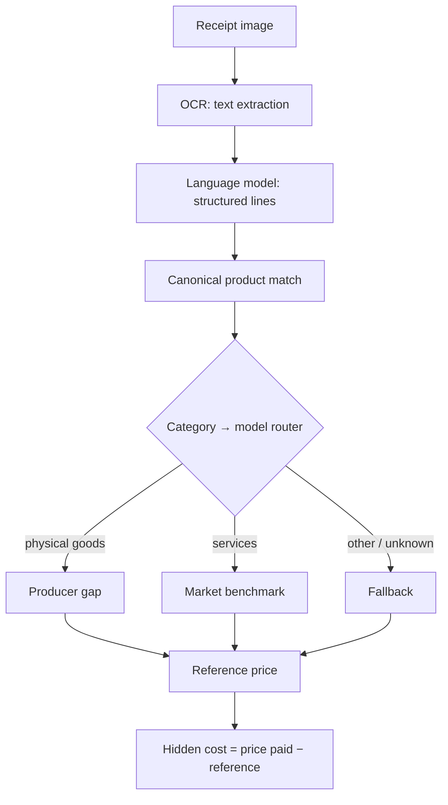

# The model family

The hidden-cost estimate does not use one formula for everything. A litre of milk,
a restaurant meal, and a bus ticket reach their reference prices by different
routes, because the data that best describes each is different. Yumo Yumo uses
three reference models and routes each line to the one that fits its category.

## 2.1 The pipeline at a glance

A receipt travels from image to attributed estimate through a fixed sequence:
optical character recognition reads the text, a language model extracts the
structured lines, each line is matched to a canonical product, the product's
category selects a reference model, and the model returns a reference price the
paid price is compared against.

## 2.2 Producer gap

For physical goods — groceries, apparel, electronics, personal care, home goods —
the reference is built bottom-up from **production cost**. The model combines a
category's cost composition (the relative weight of raw material, labour, energy
and overhead) with the relevant producer price index, and applies a reference
margin to reach a price the good could plausibly carry leaving the producer. The
paid price is compared against that reference.

This model answers the question "if this good were bought closer to where it is
made, how much less would it cost?" It suits goods with a traceable production
chain and published producer-price statistics.

## 2.3 Market benchmark

For services — prepared food and delivery, hospitality and lodging, transport
tickets, digital services — there is no factory price to build up from. Instead the
reference is the **sector average**, read from the relevant consumer price
sub-index. The model compares the paid price against what the sector typically
charges for that kind of service in the period.

This model answers a different question: "for this service, what is the going rate,
and where does this purchase sit against it?"

## 2.4 Fallback

When a line cannot be confidently placed in either family — an unknown or mixed
category — the model uses a **general reference** drawn from the aggregate consumer
and producer price indices. The fallback is deliberately conservative; it produces
a coarse estimate and is flagged as such rather than presented with false
precision.

## 2.5 Routing

Routing is by canonical category, not by guesswork on the raw line text. Each
internal category carries its model assignment and, for the market-benchmark cases,
the consumer price sub-index it compares against. The assignment lives with the
category, so the same good is always routed the same way.

The **specific weights, indices, and the reference margin** that each model uses
are calibrated in production and are not reproduced here. What this section fixes is
the shape of the method: three models, one router, a reference price, and a gap.
The data that feeds them is the subject of the [next section](03-data-foundations.md).
