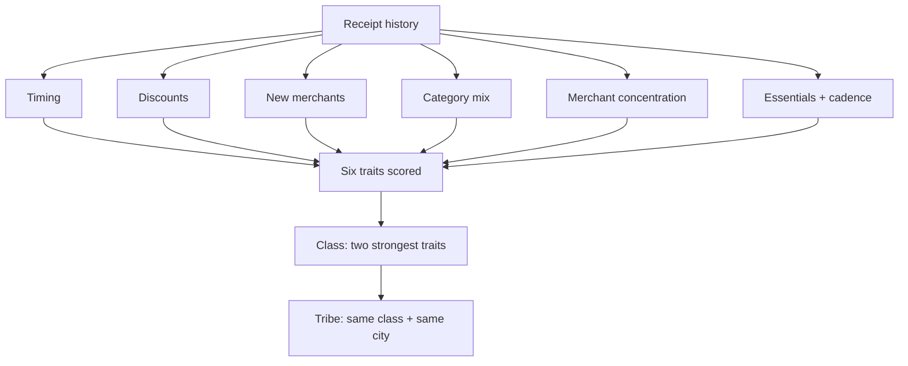

# Six signals

The spending identity is six independent traits. Each is scored from exactly one
concrete signal in a person's receipts — no trait borrows another's data, and none
is invented where the data is missing.

## 1.1 The six traits

| Trait | Receipt signal |
|---|---|
| **Impulse** | Share of spend landing on weekends or evening/night |
| **Hunter** | Ratio of discounted items in the basket |
| **Explorer** | Rate of first-seen merchants in the window |
| **Hedonist** | Share of spend in hedonic categories (cafés, treats, fun) |
| **Loyal** | Concentration of visits in a few merchants |
| **Planner** | Essentials share plus a steady basket cadence |

Each trait is computed deterministically: the same receipts always produce the same
identity. Each carries a confidence that reflects how much data supports it, and a
trait with no supporting data returns empty rather than a number.

## 1.2 From signals to identity

The six traits are not the end point. The two strongest traits name a **class**;
people who share their primary trait and city form a **tribe**. The flow is direct:

## 1.3 Why these six

The six are chosen to be **independent** and **observable**. Independent, so that
each adds information the others do not — timing, price sensitivity, novelty,
pleasure, loyalty, and planning are distinct axes of shopping behaviour. Observable,
so that each maps to something a receipt actually records, rather than an attitude
that would have to be assumed.

The behavioural-science reasoning for treating each of these as a meaningful axis is
the subject of the [next section](02-behavioural-basis.md). The exact cutoffs that
turn a signal into a score are calibrated in production and are not reproduced here.
