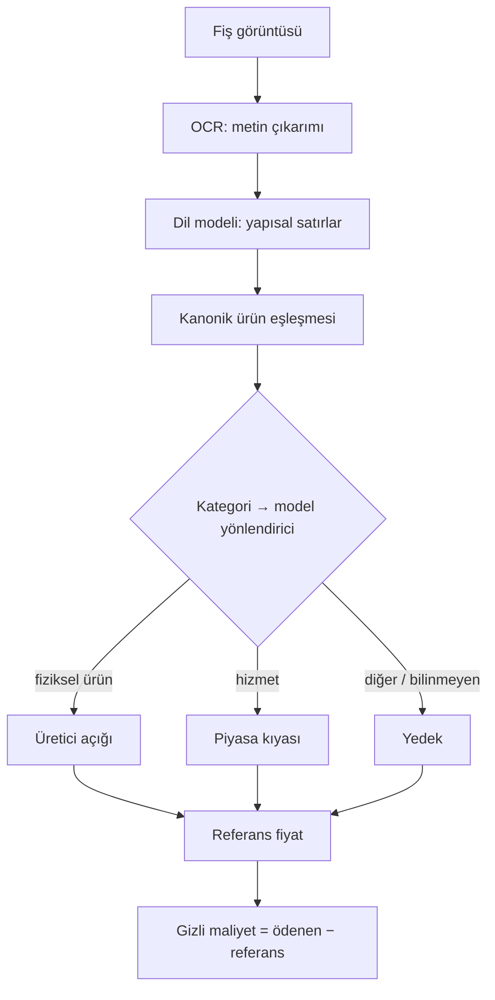

# Model ailesi

Gizli maliyet tahmini her şey için tek bir formül kullanmaz. Bir litre süt, bir
restoran yemeği ve bir otobüs bileti referans fiyatlarına farklı yollardan ulaşır;
çünkü her birini en iyi tanımlayan veri farklıdır. Yumo Yumo üç referans modeli
kullanır ve her satırı kategorisine uyana yönlendirir.

## 2.1 Boru hattına genel bakış

Bir fiş, görüntüden atfedilmiş tahmine sabit bir sırayla ilerler: optik karakter
tanıma metni okur, bir dil modeli yapısal satırları çıkarır, her satır kanonik bir
ürünle eşleşir, ürünün kategorisi bir referans modeli seçer, ve model, ödenen fiyatın
karşılaştırıldığı bir referans fiyat döndürür.

## 2.2 Üretici açığı

Fiziksel ürünler için — market, giyim, elektronik, kişisel bakım, ev eşyası —
referans, **üretim maliyetinden** aşağıdan yukarıya kurulur. Model, bir kategorinin
maliyet kompozisyonunu (ham madde, işçilik, enerji ve genel giderin göreli ağırlığı)
ilgili üretici fiyat endeksiyle birleştirir ve ürünün üreticiden çıkarken makul olarak
taşıyabileceği bir fiyata ulaşmak için bir referans marj uygular. Ödenen fiyat o
referansla karşılaştırılır.

Bu model şunu yanıtlar: "bu ürün üretildiği yere daha yakın alınsaydı, ne kadar daha
ucuz olurdu?" İzlenebilir bir üretim zinciri ve yayınlanmış üretici fiyat
istatistikleri olan ürünlere uyar.

## 2.3 Piyasa kıyası

Hizmetler için — hazır yemek ve teslimat, konaklama, ulaşım biletleri, dijital
hizmetler — aşağıdan kurulacak bir fabrika fiyatı yoktur. Bunun yerine referans,
ilgili tüketici fiyat alt endeksinden okunan **sektör ortalamasıdır**. Model, ödenen
fiyatı, sektörün o dönemde o tür bir hizmet için tipik olarak istediğiyle
karşılaştırır.

Bu model farklı bir soruyu yanıtlar: "bu hizmet için geçerli oran nedir ve bu satın
alma ona göre nerede duruyor?"

## 2.4 Yedek

Bir satır iki aileden hiçbirine güvenle yerleştirilemediğinde — bilinmeyen veya karma
bir kategori — model, toplam tüketici ve üretici fiyat endekslerinden çekilen bir
**genel referans** kullanır. Yedek bilinçli olarak temkinlidir; kaba bir tahmin
üretir ve sahte bir kesinlikle sunulmak yerine öyle işaretlenir.

## 2.5 Yönlendirme

Yönlendirme, ham satır metni üzerinde tahmine göre değil, kanonik kategoriye göredir.
Her iç kategori model atamasını ve piyasa-kıyası durumları için karşılaştırdığı
tüketici fiyat alt endeksini taşır. Atama kategoriyle birlikte yaşar; böylece aynı
ürün her zaman aynı şekilde yönlendirilir.

Her modelin kullandığı **belirli ağırlıklar, endeksler ve referans marj** üretimde
kalibre edilir ve burada tekrar verilmez. Bu bölümün sabitlediği, yöntemin biçimidir:
üç model, bir yönlendirici, bir referans fiyat ve bir fark. Onları besleyen veri
[sonraki bölümün](03-data-foundations.md) konusudur.
