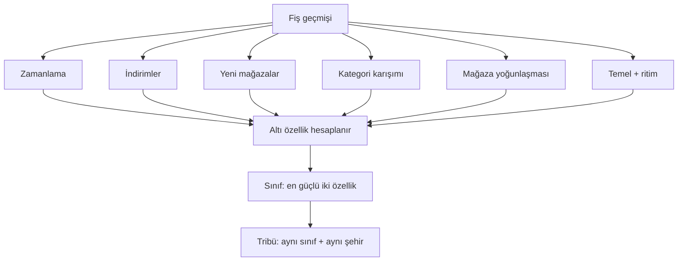

# Altı sinyal

Harcama kimliği altı bağımsız özelliktir. Her biri kişinin fişlerindeki tam olarak tek
somut bir sinyalden hesaplanır — hiçbir özellik bir diğerinin verisini ödünç almaz, ve
hiçbiri verinin eksik olduğu yerde uydurulmaz.

## 1.1 Altı özellik

| Özellik | Fiş sinyali |
|---|---|
| **Anlık** | Harcamanın hafta sonu ya da akşam/gece düşen payı |
| **Avcı** | Sepetteki indirimli kalemlerin oranı |
| **Keşifçi** | Dönem içinde ilk kez görülen mağazaların oranı |
| **Keyif** | Hedonik kategorilerdeki (kafe, tatlı, eğlence) harcama payı |
| **Sadık** | Ziyaretlerin birkaç mağazada yoğunlaşması |
| **Planlı** | Temel harcama payı ve düzenli sepet ritmi |

Her özellik deterministik hesaplanır: aynı fişler her zaman aynı kimliği üretir. Her
biri onu ne kadar verinin desteklediğini yansıtan bir güven taşır, ve verisi olmayan
bir özellik bir rakam yerine boş döner.

## 1.2 Sinyallerden kimliğe

Altı özellik son nokta değildir. En güçlü iki özellik bir **sınıf** adlandırır; birincil
özelliğini ve şehrini paylaşanlar bir **tribü** oluşturur. Akış doğrudandır:

## 1.3 Neden bu altısı

Altısı **bağımsız** ve **gözlemlenebilir** olacak şekilde seçilmiştir. Bağımsız;
böylece her biri ötekilerin katmadığı bilgiyi ekler — zamanlama, fiyat duyarlılığı,
yenilik, keyif, sadakat ve planlama, alışverişin ayrı eksenleridir. Gözlemlenebilir;
böylece her biri varsayılması gereken bir tutuma değil, fişin gerçekten kaydettiği bir
şeye karşılık gelir.

Bunların her birini anlamlı bir eksen saymanın davranış-bilimi gerekçesi [sonraki
bölümün](02-behavioural-basis.md) konusudur. Bir sinyali bir puana çeviren kesin
kesme noktaları üretimde kalibre edilir ve burada tekrar verilmez.
