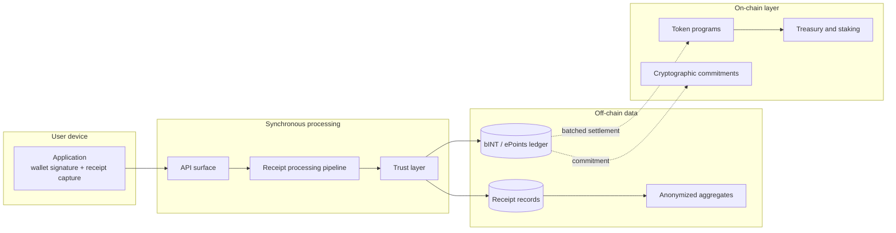

# High-level system map

## 1.1 High-level system map

The map shows the public architecture boundary: user-facing preview is synchronous; bINT and ePoints accounting is written to the ledger first and later settled to the on-chain layer by settlement workers. The diagram focuses on protocol components and data movement.
