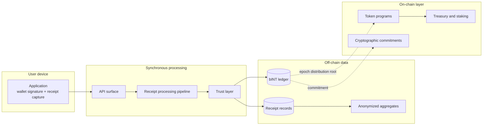

# High-level system map

## 1.1 High-level system map

```mermaid
flowchart LR
    subgraph Client["User device"]
        A["Application<br/>wallet signature + receipt capture"]
    end

    subgraph Processing["Synchronous processing"]
        B["API surface"]
        C["Receipt processing pipeline"]
        D["Trust layer"]
    end

    subgraph Data["Off-chain data"]
        E[("Receipt records")]
        F[("bINT ledger")]
        G["Anonymized aggregates"]
    end

    subgraph Chain["On-chain layer"]
        H["Token programs"]
        I["Treasury and staking"]
        J["Cryptographic commitments"]
    end

    A --> B --> C --> D
    D --> E
    D --> F
    E --> G
    F -. "epoch distribution root" .-> H
    F -. "commitment" .-> J
    H --> I
```

The map shows the public architecture boundary: user-facing preview is synchronous, while bINT accounting remains off-chain. Settlement workers commit an INT distribution root derived from eligible bINT credits to the on-chain layer. The diagram focuses on protocol components and data movement.
