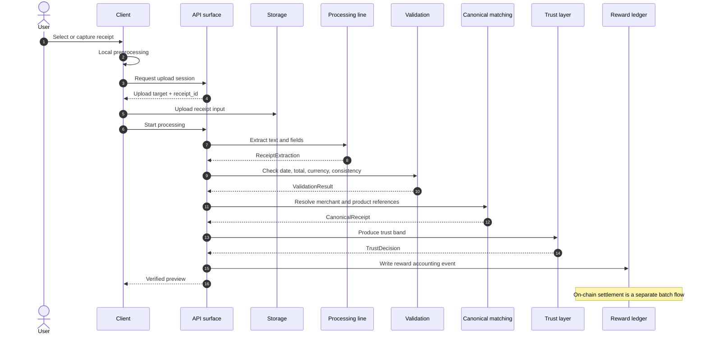

# 02 — Receipt Pipeline

The receipt pipeline converts a user-submitted receipt image or PDF invoice into a structured receipt record. The public contract is the stage order and each stage's input/output type; provider choice, prompt details, threshold values, and fallback rules remain in operational documentation.

The pipeline separates two outputs: the verified preview shown to the user and the accounting event written to the reward ledger. This keeps the user experience independent from on-chain settlement.

## 2.1 Design goals

| Goal | Technical consequence |
|---|---|
| Low latency | The user-facing preview is produced in the synchronous flow |
| Typed stage handoff | Each stage emits a schema-bound output for the next stage |
| Re-runnability | Stage outputs are recorded as events; failed jobs can be retried with the same input |
| Quality separation | Low-confidence receipts can be separated from reward accounting or routed to review |
| Privacy | Raw receipt content is processed in the off-chain data layer; the data product is derived from the anonymized layer |

## 2.2 Pipeline at a glance

Stages are connected through typed events rather than shared mutable state. This makes the flow observable and allows historical reprocessing.
