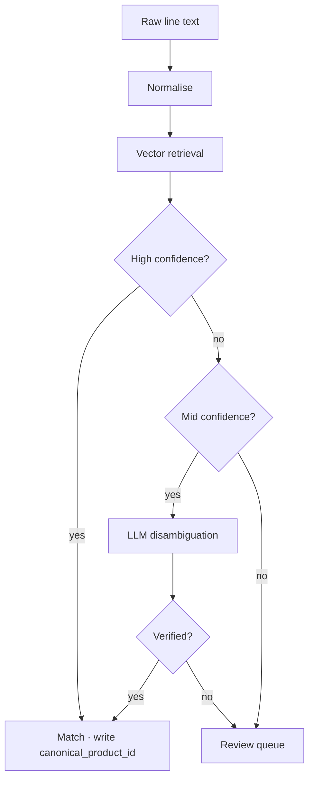

# Stage 4 — Canonical

## 2.7 Stage 4 — Canonical product matching

This stage collapses different surface forms of the same product into a single canonical identifier. For example:

- `COCA COLA 330ML KUTU`
- `C.COLA 33CL TENEKE`
- `COCA-COLA 0.33 L`
- `COKA 330 ML`

All four resolve to the same `canonical_product_id`. This resolution is a precondition for price memory and the B2B data product.

### Approach

Canonical resolution is a multi-stage embedding-based resolver with confidence-tiered disambiguation and a human review queue for ambiguous cases.



The exact similarity thresholds, embedding model, and disambiguation prompt are managed in the internal operations layer.

An unresolved line item is recorded with a null canonical reference. bINT for that line is calculated after queue canonicalisation.

### Taxonomy structure

```
category > subcategory > brand > product > variant
```

Example:

```
Beverages > Carbonated Soft Drinks > Coca-Cola > Coca-Cola Classic > 330 ml can
```

Each canonical product carries normalised attributes: `size_value`, `size_unit`, `package_type`, `brand_id`, `is_private_label`, `barcode_gtin` (when available).

### Cold start

The canonical index is bootstrapped from open product datasets, licensed catalog partnerships, and seeded user uploads from the closed beta. The index grows organically as the canonicalisation queue is drained.

### Pending canonicalisation queue

Ambiguous line items enter a review queue. The reviewer (initially the Yumo Yumo team, later a community pool earning PoC) either creates a new canonical product or maps the raw text to an existing one. This queue is a primary cost lever for the pipeline as it scales — 08 lists it as a core operational risk.

---
