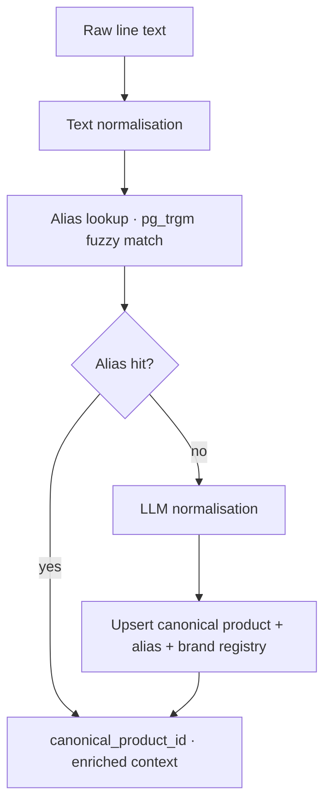

# Stage 4 — Canonical

## 2.7 Stage 4 — Canonical product matching

This stage collapses different surface forms of the same product into a single canonical identifier. For example:

- `COCA COLA 330ML KUTU`
- `C.COLA 33CL TENEKE`
- `COCA-COLA 0.33 L`
- `COKA 330 ML`

All four resolve to the same `canonical_product_id`. This resolution is a precondition for price memory and the B2B data product.

### Approach

Canonical resolution runs **asynchronously** in a background post-process worker, after the synchronous flow has already returned the verified preview to the user. This keeps product resolution off the latency-sensitive path: the user sees their receipt immediately, while canonical identifiers attach to the record moments later.

The resolver works on an alias table that maps raw receipt-line text to canonical products:


```mermaid
flowchart TD
    A[Raw line text] --> B[Text normalisation]
    B --> C[Alias lookup · pg_trgm fuzzy match]
    C --> D{Alias hit?}
    D -- yes --> E[canonical_product_id · enriched context]
    D -- no --> F[LLM normalisation]
    F --> G[Upsert canonical product + alias + brand registry]
    G --> E
```

- **Fuzzy alias lookup** — the normalized line text is matched against previously learned receipt aliases using PostgreSQL trigram similarity (`pg_trgm`). A hit resolves directly to the canonical product. Aliases learned at one merchant are reused across merchants only when the text reads as a real product name rather than a store-private abbreviation, which keeps distinct products from merging under one canonical.
- **LLM fallback** — on a miss, a language model normalizes the raw text into brand, product, and size attributes. The result is upserted as a new canonical product (or mapped to an existing one) together with a new alias row, so the same surface form resolves without a model call next time.

The similarity settings and the normalization prompt are managed in the internal operations layer.

An unresolved line item is recorded with a null canonical reference; resolution can complete on a later pass as the alias table grows.

### Taxonomy structure

```
category > subcategory > brand > product > variant
```

Example:

```
Beverages > Carbonated Soft Drinks > Coca-Cola > Coca-Cola Classic > 330 ml can
```

Each canonical product carries normalised attributes: `size_value`, `size_unit`, `package_type`, `brand_id`, `is_private_label`, `barcode_gtin` (when available).

### Growth model

The canonical index grows from receipt traffic itself: every LLM-normalized line adds a canonical product and an alias, and every repeat of that surface form afterwards resolves from the alias table without model cost. Ambiguous or low-quality entries are reviewed through the admin catalog tooling.
