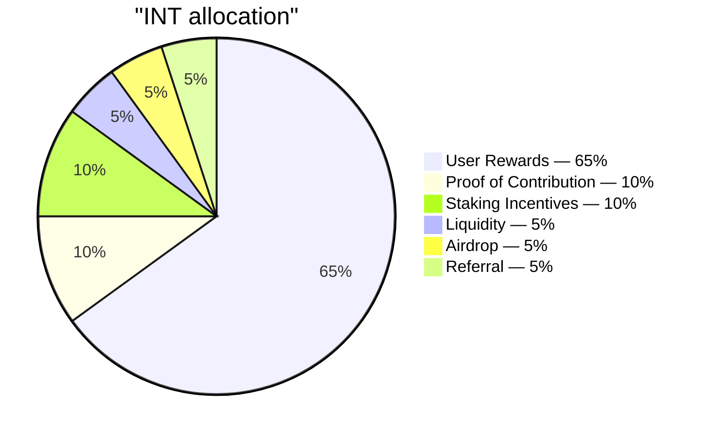

# Supply and allocation

## 4.16 Total supply

| Parameter | Value |
|---|---|
| Token | INT |
| Standard | SPL (Solana) |
| Decimals | 6 |
| Total supply | 99,000,000,000 |
| Mintable after genesis | None — mint authority is closed |

The full 99 billion INT is minted once at genesis into the treasury, then the mint authority is closed. No further INT can ever be created. Distribution is a transfer from the treasury through the audited distributor (4.15), not new minting.

## 4.17 Allocation table

| Rail | Share | Tokens | Purpose |
|---|---:|---:|---|
| User Rewards | 65% | 64,350,000,000 | Primary incentive for verified Proof of Expense contribution |
| Proof of Contribution | 10% | 9,900,000,000 | Impact-weighted distribution to core team, contractors, and external contributors (4.11) |
| Staking Incentives | 10% | 9,900,000,000 | Rewards for long-term holders who lock INT (4.6) |
| Liquidity | 5% | 4,950,000,000 | Seeds on-chain markets at TGE; reserve for community-governed depth |
| Airdrop | 5% | 4,950,000,000 | Participation-based marketing distributions over multiple periods |
| Referral | 5% | 4,950,000,000 | Event-driven unlocks when invitees complete verification milestones |
| **Total** | **100%** | **99,000,000,000** | |

The six rails account for one hundred percent of supply. There is no separate team allocation outside this map. The founding team and all contributors earn through the Proof of Contribution rail (4.11), under the same impact-weighted logic that applies to external participants.

## 4.18 Rail responsibilities

- **User Rewards** — the protocol's primary outflow. Governed by the emission curve (4.19) and metered by daily ceilings (4.22). Budget: 64.35 billion INT over the 15-year emission horizon.
- **Proof of Contribution** — periodic, rubric-scored distributions with vesting (4.13). Aligns team incentives with measurable work output.
- **Staking Incentives** — released over a 5-year horizon. Tier-weighted accrual described in 4.6.
- **Liquidity** — 1 billion INT seeds TGE through a liquidity bootstrapping pool (LP locked 12 months). 3.95 billion held in reserve for community-governed deployments.
- **Airdrop** — distributed over multiple periods across years (not all at once) as participation-based marketing distributions. Each distribution is surprise-timed yet transparently provable: the recipient set is committed on-chain before tokens move. Distribution sizing is governed in the operations layer.
- **Referral** — event-driven: a successful invite triggers a unit unlock to the referring user once the invited user crosses a meaningful contribution threshold. The threshold conditions are calibrated in production and not published.
