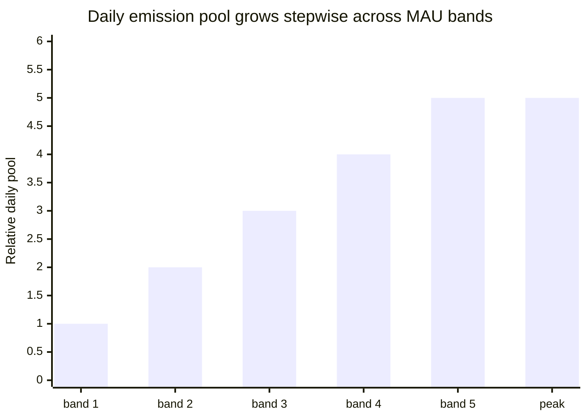

# Emission schedule and unlocks

## 4.19 User Rewards emission curve

The User Rewards rail (64.35 billion INT) is released over a 15-year horizon. Daily emission is metered by a stepwise function that scales with monthly active users (MAU).

The daily emission pool grows stepwise across MAU bands (from the smallest early-stage band up to a peak band), so the pool expands as the active user base grows rather than continuously. The MAU band boundaries and the per-band daily pool values are calibrated in production and not published.

After the peak band, additional MAU growth raises per-user contribution density rather than total emission. The stepwise shape avoids cliff effects when activity oscillates near a band boundary. The User Rewards budget (64.35 billion INT) is sized for a 15-year emission horizon; early-stage bands emit well below peak, extending the effective horizon further.

## 4.20 Unlock schedule by rail

| Rail | Unlock mechanism | Timing |
|---|---|---|
| **User Rewards (65%)** | Emission curve (4.19) → off-chain bINT accrual → weekly settlement → claim from distributor (4.4) | Continuous over 15 years |
| **Liquidity (5%)** | Initial: fully unlocked at TGE. Reserve: community-governed | TGE + governed schedule |
| **Airdrop (5%)** | Periodic, participation-based marketing distributions | Multiple periods across years |
| **Referral (5%)** | Event-driven per successful invite | Ongoing |
| **Staking (10%)** | Released into the staking reward pool once staking activates (4.6) | Later phase, over 5-year horizon |
| **Proof of Contribution (10%)** | Periodic impact-scored distributions with vesting (4.13) | Multi-year vesting per recipient |

### Decided unlock parameters

- **Liquidity** — 1,000,000,000 INT fully liquid at TGE to seed exchange pairs. LP position locked 12 months. The remaining 3,950,000,000 INT is held in reserve.
- **Airdrop** — released over multiple periods across years as participation-based marketing distributions, not in a single event. Each distribution is surprise-timed yet transparently provable: the recipient set is committed on-chain before tokens move. Each share is claimed in full with no vesting lock, through a dedicated distributor separate from the weekly user-reward settlement. Distribution sizing scales with participation and is governed in the operations layer.
- **Referral** — a qualifying invite triggers a unit unlock; the qualification threshold is calibrated in production and not published. No time-based vesting.

### Design-space items (parameters to be published at TGE)

The following items are part of active token-design work. The shapes are described here; specific parameters will be published when finalized.

- **User Rewards emission curve shape.** The stepwise bands above set the daily ceiling. The exact transition behavior between bands and the ramp-up schedule during early growth are calibrated against observed user-growth data.
- **Proof of Contribution distribution cadence.** Tied to contribution metrics (volume and quality of verified Proof of Expense, leaderboard standing) at periodic snapshots. Cliff and vesting durations are policy and documented per distribution.
- **Staking pool release schedule.** Designed in conjunction with the real-yield architecture to align long-term holders with platform revenue.

## 4.21 TGE circulating supply estimate

At the Token Generation Event, circulating supply is seeded by initial liquidity:

| Source | Amount (INT) | Notes |
|---|---:|---|
| Initial liquidity | 1,000,000,000 | Fully liquid at TGE |
| **TGE circulating** | **~1,000,000,000** | ~1.01% of total supply |

The remaining ~98.99% of supply is locked across emission schedules, vesting contracts, staking pools, governed reserves, and the multi-period airdrop program. Airdrop distributions enter circulation gradually over years as participation-based marketing events rather than at TGE. This low initial float reflects the protocol's design preference for gradual supply expansion tied to real contribution.
