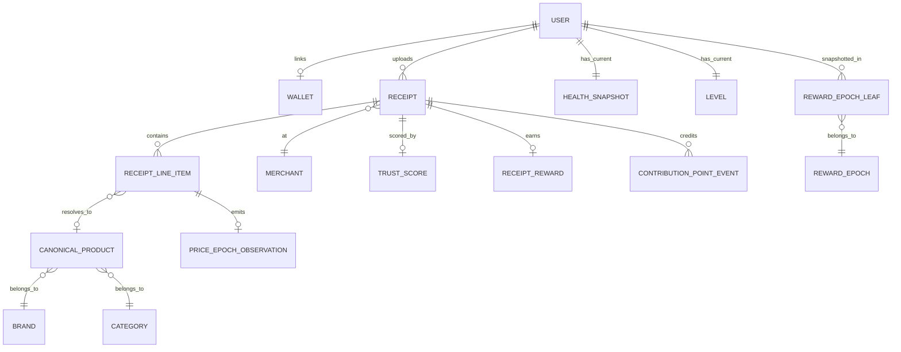

# Core entities

## 5.2 Core entities

The cardinalities matter: **one receipt has many line items**, **one line item resolves to at most one canonical product** (or none if it falls in the pending queue), **one receipt emits at most one trust score** (it can be re-scored, but each version supersedes the last). Reward accounting flows through append-only `contribution_point_events` rows and per-epoch snapshot leaves (5.7); the price ledger receives identity-free observation rows (5.6).

---
