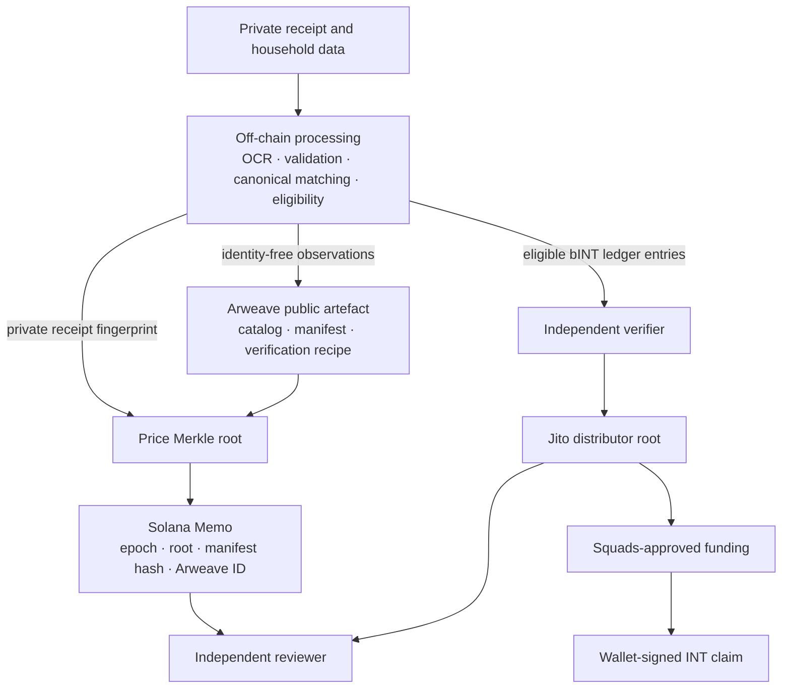
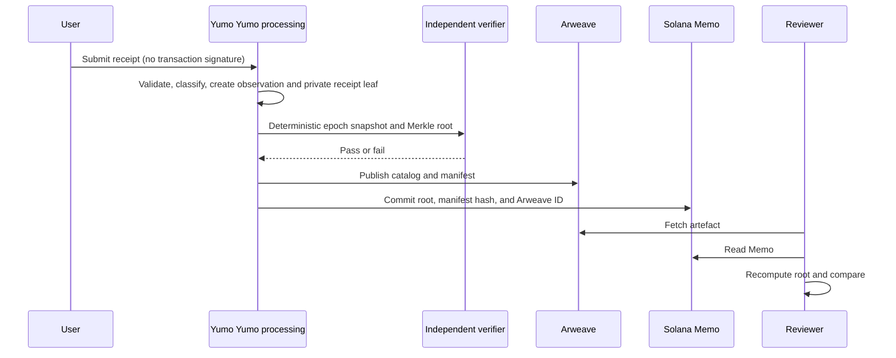

# Web3 infrastructure: verifiable public data and programmable settlement

## 6.1 The engineering problem

Yumo Yumo needs to handle three constraints at the same time:

- Receipt images and household spending history are private and sometimes need correction before publication.
- Public price data must remain inspectable after a release, even if a reviewer does not use the Yumo Yumo application or API.
- A reward allocation must be reproducible and funded before a user is asked to sign a token claim.

Putting everything on-chain fails the first constraint: it would expose receipt data, charge users for routine processing, and make correction impractical. Keeping everything in one application database fails the second: a reviewer would have to trust Yumo Yumo to keep serving the same result. The Web3 design assigns each job to the layer that can perform it without weakening the other two constraints.



The public-data path and token-settlement path meet at the verifier, not at the receipt image. Raw receipts do not enter Arweave or Solana.

## 6.2 Why these three layers

| Design decision | Reason | Verifiable output |
|---|---|---|
| Keep receipt processing off-chain | Privacy, correction, and no wallet or fee requirement at upload | Private source records and a deterministic epoch snapshot before publication |
| Publish price artefacts to Arweave | A reviewer can fetch the released dataset and method without Yumo Yumo infrastructure | Immutable transaction ID, manifest, catalog, and verification recipe |
| Commit compact identities to Solana | A short final record can bind the version, dataset hash, root, and publication ID | SPL Memo transaction and public timestamp/order |
| Settle INT through a distributor | Claims are bounded by a published root and pre-funded vault, not by a server-side balance mutation | Distributor account, funding transaction, claim status, and clawback record |

Solana is therefore the execution and authority layer. Arweave is the public artefact layer. The application database remains the private processing layer. None of these layers is presented as a replacement for the others.

### Why Solana and why Arweave

The choice begins with operating requirements rather than a claim that one network suits every workload. Yumo Yumo needs a public record that can carry a full, reproducible epoch; an economic settlement path where a wallet can verify and claim its own allocation; an approval trail for treasury movement; and a verification path that remains available outside the application. These requirements divide naturally between large, immutable artefacts and compact, stateful transactions.

| Requirement | Why Solana fits the execution role | Why Arweave fits the publication role |
|---|---|---|
| Public inspection | RPC-accessible transaction and account state expose commitments, funding, approvals, and claim outcomes | Content-addressed artefacts expose the catalogue, manifest, specification, and proof material |
| Economic settlement | Wallet-directed claims, token accounts, distributor state, and multisig approvals create a transaction-level settlement trail | The full epoch remains available for calculation and review without placing the whole catalogue in transaction data |
| Version integrity | A compact commitment binds epoch ID, root, manifest digest, and transaction order | An Arweave item supplies the byte-identified version of the released dataset and its verification recipe |
| Independent access | A reviewer can choose an RPC provider and read the relevant state directly | A reviewer can choose a gateway or keep a local mirror of the published artefacts |

Solana is selected for the part of the system that needs state transitions: settlement of a published allocation, wallet-authorised claim execution, treasury approval evidence, and a time-ordered commitment to a sealed epoch. The design keeps on-chain payloads compact: roots, digests, identifiers, authority state, funding references, and claim state. This preserves a direct verification path while keeping receipt processing and catalogue-sized data outside transaction payloads. The current plan uses existing Solana protocol components; a release registry will identify the actual mainnet instances only when a release is activated.

Arweave is selected for the part that needs durable, retrievable publication: the full price catalogue, manifest, canonicalisation rules, and material a verifier needs to rebuild a root. A conventional object store can distribute the same files, yet its continuity and access policy remain tied to the operator account. Content-addressed peer distribution can identify bytes, while long-term availability depends on the retention arrangement selected by the publisher. Arweave gives the publication artefact its own transaction identifier and makes that identifier suitable for inclusion in the Solana commitment.

The combination creates a cross-check rather than a single-provider assertion. A verifier fetches the Arweave artefact through a chosen gateway, recomputes the manifest digest and Merkle root, then reads the corresponding Solana transaction or account through a chosen RPC provider. The two records must agree on the epoch and root. The public file format remains portable: an independent team can mirror the artefacts, rebuild the tree, and verify the commitment without adopting Yumo Yumo infrastructure. This is the reason for using both systems: Arweave carries the evidence at publication scale; Solana carries the economic and authority consequences of that evidence.

## 6.3 From a receipt to a public, checkable record



The reviewer does not need a privileged endpoint. The price manifest contains public product, merchant, location, date, and unit-price observations; it does not contain receipt images, receipt IDs, wallet addresses, user accounts, OCR output, or trust signals. The complete public/private field boundary is specified in 06.2.

For a wallet-linked receipt, the owner can recompute the private fingerprint
`keccak256("price-receipt:v1|receipt_id|content_hash|wallet")`, obtain an inclusion proof, and compare the resulting root with the Memo. A separate nonce-bearing wallet signature proves current control of that wallet. This is evidence of inclusion in a sealed epoch—not independent proof that a bank or merchant completed a payment.

## 6.4 From verified contribution to INT claim

The token path deliberately does not reuse the public price tree. bINT is an off-chain accounting credit. At an epoch boundary, eligible entries are independently verified, transformed into a Jito-compatible SHA-256 distribution tree, and checked against the recorded leaf set. Only then can a distributor be configured and funded from the treasury through the applicable Squads approval.

```text
eligible bINT entries → independent verifier → Jito root → distributor vault funded
→ user signs claim → INT transfers from vault → unclaimed balance follows configured clawback
```

This provides two practical protections: the application cannot create an INT claim merely by changing a displayed bINT balance, and a user never needs to sign a transaction for receipt submission or off-chain accrual. The user signs only a voluntary ownership proof or an INT claim.

## 6.5 Evidence, maturity, and release conditions

| Surface | Evidence available in the repository | Release status to disclose |
|---|---|---|
| Price ledger | Rebuildable manifest, Merkle specification, publishing script, and public Memo verification recipe | Production publication is independently checkable after its Arweave and Memo IDs are released |
| Jito distribution tree | Clean-room TypeScript tree builder; byte-exact tests against two Jito CLI fixture trees | Devnet-rehearsed; each mainnet distributor needs its own address, root, funding transaction, and verification record |
| Treasury control | Scripts and role separation for root, treasury, and clawback | Mainnet multisig addresses, members, threshold, and release approvals must be published before activation |
| INT mint | Mainnet runbook with explicit mint-authority-close gate | Do not state that a mainnet mint is active until its address and authority state are published |

This distinction is deliberate. A rehearsed flow is implementation evidence; it is not a claim that the corresponding mainnet instance already exists.

## 6.6 What can be verified—and what remains a trust boundary

| A reviewer can verify | A reviewer must evaluate from process evidence |
|---|---|
| A published manifest matches its committed hash and Merkle root | OCR accuracy, canonical matching, and fraud review |
| A supplied receipt fingerprint was included in a price epoch | Whether a merchant or bank completed a payment |
| A claim proof matches a distributor root and a vault was funded | Private eligibility inputs used to create bINT |
| A completed on-chain action has a public transaction trail | Whether an external dependency will remain available |

Gateway delay, RPC outage, proof mismatch, rejected claim, failed verifier run, and unclaimed-fund clawback are separate operational states. The protocol does not claim to prevent them. It makes them diagnosable through published artefacts, roots, transactions, and release records.

## 6.7 Review path

A technical reviewer can begin with the Arweave transaction ID in a price-epoch Memo, download the manifest, recompute the root, and compare it with Solana. A reward reviewer can use the recorded leaf set, Jito tree format, distributor account, funding transaction, and claim status to reproduce the distribution boundary. The implementation-level formats, program IDs, release-state requirements, and failure handling are in [Protocol details and operational boundaries](02-protocol-details.md).

This is the purpose of the Web3 layer: not to move receipt processing onto a blockchain, but to make published data and token settlement independently inspectable at the points where they become durable or economically consequential.

---
