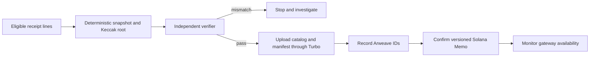
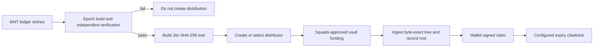

# Web3 protocol details and operational boundaries

## 6.8 Design choices

The system separates private processing, public evidence, and token execution because they have different cost, privacy, and recovery properties.

| Layer | Why it is used | What it is not used for |
|---|---|---|
| Application database | Private receipt processing, eligibility, and operational correction before publication | A public source of truth for sealed artefacts |
| Arweave | Public, content-addressed price artefacts and verification material that can be fetched without Yumo Yumo | Receipt images, private receipt rows, or mutable operational state |
| Solana | Token accounts, multisig-controlled vault movement, claim state, and compact commitments | Receipt storage, OCR execution, or per-receipt token minting |

This division is intentional. Storing every receipt on-chain would expose data, impose transaction costs, and make correction difficult. Keeping all published evidence only in the application database would make the publication dependent on Yumo Yumo's continued operation. The system therefore publishes a limited public artefact to Arweave and anchors its exact identity on Solana.

## 6.9 Release registry and activation criteria

This paper describes the integration surfaces planned for the system. When a mainnet release is activated, its release registry becomes the source of record for the concrete network, addresses, package versions, authority state, and release evidence. Published with the release, the registry supplies the deployment-specific addresses.

| Surface | Release record required before activation |
|---|---|
| INT settlement | Network, INT mint address, authority state, authorised supply transaction, and release version |
| Reward distribution | Distributor address, Merkle root, claim window, clawback receiver, funding transaction, and tree specification version |
| Treasury governance | Multisig address, member set, approval threshold, and proposal or approval record |
| Public price sealing | Sealer address, Solana transaction, Arweave manifest ID, and price-catalogue ID |

Each release record also includes dependency versions, applicable audit or review references, the RPC policy, and a security-reporting channel. This gives reviewers and users one versioned location from which to verify the live configuration.

## 6.10 Two Merkle systems

| Property | Public price ledger | INT distributor |
|---|---|---|
| Objective | Commit to reproducible public observations and opaque receipt fingerprints | Authorise exact token claims |
| Hash | Keccak-256 | SHA-256 |
| Leaf | Hash of a published observation line; receipt leaf has a private preimage | `hashv(claimant, unlocked_u64_le, locked_u64_le)`, then domain-separated leaf hash |
| Ordering and odd leaf | Leaves sorted by hash; odd leaf carried unchanged | Input order is deterministic; sorted hash pairs; odd node duplicated |
| Verification target | Manifest hash and root in a Solana Memo | Distributor account root and a claim instruction |

The trees must never be substituted for one another. A price inclusion proof cannot claim INT, and a distributor proof does not disclose or validate a receipt.

## 6.11 State transitions

### Price publication

The irreversible boundary is the Memo confirmation. A failed verifier permits rebuilding; an upload accepted by Turbo but not yet served by a gateway requires availability monitoring; a sealed epoch is corrected by a later publication, not mutation.

### Reward distribution

No party should both alter the source eligibility data and unilaterally fund a different distributor. The verifier, root setup, and treasury funding are separate operational controls.

## 6.12 Reproducibility and audit trail

An independent reviewer can verify a published price epoch without application access:

1. Discover the Memo from the public sealer address or Arweave tags.
2. Fetch the manifest by its Arweave transaction ID.
3. Check the manifest body against the memo's manifest hash.
4. Recompute observation and receipt leaves using the published specification.
5. Fold them to the Merkle root and compare it with the Memo.
6. Optionally fetch the catalog and verify its hash against the manifest.

The equivalent review for rewards uses the recorded distribution leaf set, the Jito tree specification, the distributor account, the funding transaction, and claim status. It verifies that a published allocation is consistent with a root and funded vault. It does not independently establish the correctness of the private eligibility inputs.

## 6.13 Authority and failure disclosure

Authority is described as a release state, not a future promise. Until a mainnet instance and its multisig addresses are published, the technical paper must state that the instance is not provisioned. Mainnet authority transfer, token mint closure, and distributor funding are separate, irreversible or high-impact actions with their own runbook gates.

Failure disclosure is part of the protocol surface: unavailable gateways, RPC outages, rejected claims, proof mismatches, failed verification, and unclaimed-fund clawbacks must be observable as distinct states. The system does not claim that Web3 prevents these events; it records enough evidence to investigate them.

## 6.14 Epoch lifecycle: from a receipt to a public, versioned record

An epoch is a bounded publication interval, not a rolling database view. Its purpose is to give every published dataset a stable input boundary and a stable verification target. The epoch identifier, opening and closing timestamps, inclusion policy, source-schema version, canonicalisation version, and verifier version are recorded in the manifest. A later query can therefore distinguish an observation that belonged to an epoch from one accepted after its cut-off.

The lifecycle has seven stages. First, receipt lines and price observations enter the private processing queue and receive validation, deduplication, merchant matching, unit normalisation, and eligibility decisions. Second, the epoch builder selects records that satisfy the published cut-off and policy. Third, it creates an immutable snapshot: each selected public observation is serialised in the documented field order and encoding; each eligible receipt contributes a privacy-preserving fingerprint rather than its image or its raw contents. Fourth, a separate verifier rebuilds the snapshot from the same frozen input and compares record counts, byte digests, leaf counts, roots, and manifest fields.

Only a matching verifier result permits publication. The builder then produces a price catalogue, a receipt-fingerprint set where applicable, a manifest, and inclusion-proof material. The manifest names the files, their SHA-256 digests, the Merkle algorithms, the root values, the epoch boundary, and the software/specification versions used to produce them. These artefacts are uploaded to Arweave. After retrieval from more than one gateway confirms the expected bytes, a compact Solana commitment links the epoch identifier, manifest digest, root, and format version. The resulting identifiers become part of the release evidence for that epoch.

The final stage is monitoring and correction. Gateway fetches, manifest digest checks, proof verification, and any claim-related outcomes are observed as independent signals. Corrections create a successor epoch or an explicit correction record referencing the affected epoch; the earlier artefact remains available for comparison. This sequence turns a price change, an ingestion correction, or a policy revision into an auditable event rather than a silent rewrite of a historical result.

## 6.15 Merkle construction and proof format

The two trees have different security boundaries, so their formats are versioned separately. The public price tree commits to records that a third party may reproduce. Each public leaf begins with a domain label, followed by the canonical byte representation of the observation. The canonical representation specifies the field list, UTF-8 encoding, date format, decimal scale, currency code, merchant/location identifiers, and newline convention. A verifier who uses the same bytes reaches the same leaf hash. The manifest records the leaf ordering rule, pair-hash rule, odd-leaf rule, root encoding, and the exact tree-specification version.

The receipt-fingerprint path adds a private preimage. A receipt owner retains the local values needed to recompute the fingerprint and may request or derive an inclusion proof without publishing the receipt image, bank data, account information, or wallet association. The proof contains the sibling hashes, left/right positions, epoch identifier, and specification version. Starting from the locally computed leaf, the owner folds each sibling in the stated order and compares the final root with the root named by the manifest and Solana commitment. That proves inclusion in a particular sealed epoch; it does not expose the underlying receipt to the public catalogue.

The INT distribution tree is a separate claim authorisation structure. Its leaf encodes the claimant public key and the unlocked and locked allocation values with the documented byte order and domain separator. The distribution manifest fixes the allocation epoch, root, tree format, claim opening and closing times, funding transaction, and clawback destination. A claimant verifies the leaf and proof locally, then submits the claim instruction from their own wallet. The distributor state records the claim outcome. No application session is required to check whether an allocation is represented by the published root.

## 6.16 Independent queries and developer methods

The public verification path must remain usable without a privileged Yumo Yumo endpoint. A user, researcher, or developer starts from the epoch index or a known Arweave manifest ID, retrieves the manifest through a gateway of their choice, and checks its digest against the Solana commitment. They can fetch the catalogue named by the manifest, compute file digests locally, reconstruct the tree, and compare its root. Where their own receipt is involved, they supply only their private preimage to a local verifier and use the returned sibling path to test inclusion. Wallets query claim state directly through a Solana RPC endpoint selected by the user or verifier.

The protocol publishes the data contracts that make these steps portable. The following methods are intended for a command-line verifier, a wallet extension, a research notebook, or an independent explorer; they describe artefact operations rather than a proprietary API:

| Method | Inputs | Output | Independent check |
|---|---|---|---|
| `getEpoch(epoch_id)` | Epoch identifier | Manifest ID, root, format and publication time | Manifest digest matches the chain commitment |
| `getCatalogue(manifest_id)` | Manifest ID | Byte-exact public catalogue | File digest matches the manifest |
| `buildPriceRoot(catalogue, spec)` | Catalogue bytes and tree specification | Leaf count and price root | Root matches the manifest |
| `proveReceipt(receipt_preimage, epoch_id)` | Locally held preimage and epoch | Leaf and sibling path | Folded path reaches the published receipt root |
| `getDistribution(epoch_id)` | Allocation epoch | Root, claim window, funding reference and format | Root and funding reference match release evidence |
| `verifyAllocation(wallet, allocation, proof)` | Wallet key, amounts and proof | Valid/invalid local result | Root matches the distribution record |

Reference implementations should make network access replaceable: a caller may use any Arweave gateway, retain a local mirror of artefacts, and choose its own Solana RPC provider. A verifier reports the gateway or RPC source, retrieval time, expected and observed digests, specification version, and every failed comparison. That output is sufficient for another party to reproduce the same investigation.

## 6.17 Public expenditure evidence and review scope

Proof of expense is deliberately narrower than public disclosure of a person’s purchase. The public layer demonstrates that an approved observation or receipt fingerprint formed part of a sealed epoch, and that the artefact set has remained byte-identifiable. The private layer preserves the information necessary for the relevant user to recompute their own fingerprint. This separation supports public review of publication integrity while keeping personal receipt content outside the public catalogue.

For grant reviewers, the important questions are operational. Which epoch was published? Which specification generated it? Which artefact carries its bytes? Which commitment identifies that artefact? Which authority approved the associated treasury movement? Which distribution root authorises claims, and which funding transaction made those claims payable? The release registry and per-epoch manifests answer these questions with identifiers and versioned records once a mainnet release is active. Until then, they remain deployment criteria and testable artefact formats, rather than claimed production addresses.

---
