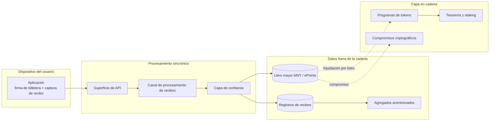

# Mapa del sistema de alto nivel

## 1.1 Mapa del sistema de alto nivel

El mapa muestra el límite de la arquitectura pública: la vista previa orientada al usuario es sincrónica; la contabilidad de bINT y ePoints se escribe primero en el libro mayor y luego se liquida por lotes a la capa en cadena por los workers de liquidación. El diagrama se centra en los componentes del protocolo y el movimiento de datos.
