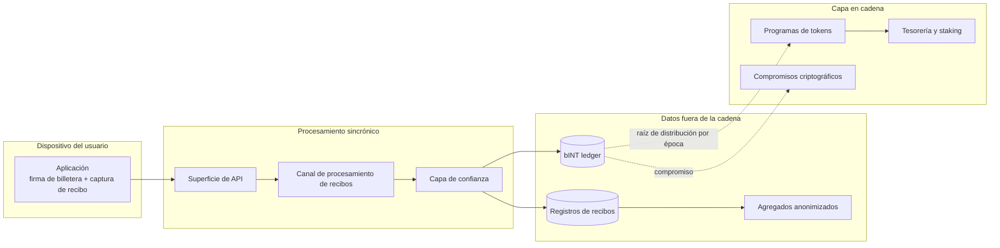

# Mapa del sistema de alto nivel

## 1.1 Mapa del sistema de alto nivel

```mermaid
flowchart LR
    subgraph Client["Dispositivo del usuario"]
        A["Aplicación<br/>firma de billetera + captura de recibo"]
    end

    subgraph Processing["Procesamiento sincrónico"]
        B["Superficie de API"]
        C["Canal de procesamiento de recibos"]
        D["Capa de confianza"]
    end

    subgraph Data["Datos fuera de la cadena"]
        E[("Registros de recibos")]
        F[("bINT ledger")]
        G["Agregados anonimizados"]
    end

    subgraph Chain["Capa en cadena"]
        H["Programas de tokens"]
        I["Tesorería y staking"]
        J["Compromisos criptográficos"]
    end

    A --> B --> C --> D
    D --> E
    D --> F
    E --> G
    F -. "raíz de distribución por época" .-> H
    F -. "compromiso" .-> J
    H --> I
```

El mapa muestra el límite de la arquitectura pública: la vista previa orientada al usuario es sincrónica, mientras que la contabilidad de bINT permanece fuera de la cadena. Los workers de liquidación publican en la capa en cadena una raíz de distribución de INT derivada de los créditos bINT elegibles. El diagrama se centra en los componentes del protocolo y el movimiento de datos.
