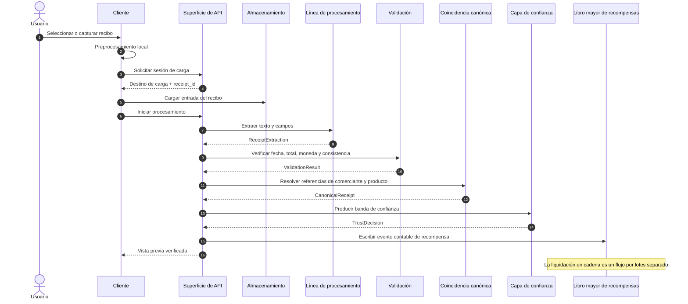

# 02 — Canal de procesamiento de recibos

El canal de procesamiento de recibos convierte una imagen de recibo o una factura en PDF enviada por el usuario en un registro de recibo estructurado. El contrato público es el orden de las etapas y el tipo de entrada/salida de cada etapa; la elección de proveedor, los detalles de los indicaciones, los valores umbral y las reglas de contingencia permanecen en la documentación operativa.

El canal separa dos salidas: la vista previa verificada que se muestra al usuario y el evento contable que se escribe en el libro mayor de recompensas. Esto mantiene la experiencia del usuario independiente de la liquidación en cadena.

## 2.1 Objetivos de diseño

| Objetivo | Consecuencia técnica |
|---|---|
| Baja latencia | La vista previa orientada al usuario se produce en el flujo síncrono |
| Transferencia tipada entre etapas | Cada etapa emite una salida vinculada a un esquema para la siguiente etapa |
| Reejecutabilidad | Las salidas de las etapas se registran como eventos; los trabajos fallidos pueden reintentarse con la misma entrada |
| Separación por calidad | Los recibos de baja confianza pueden separarse de la contabilidad de recompensas o dirigirse a revisión |
| Privacidad | El contenido bruto del recibo se procesa en la capa de datos fuera de cadena; el producto de datos se deriva de la capa anonimizada |

## 2.2 Visión general del canal

Las etapas se conectan mediante eventos tipados en lugar de un estado mutable compartido. Esto hace que el flujo sea observable y permite el reprocesamiento histórico.
