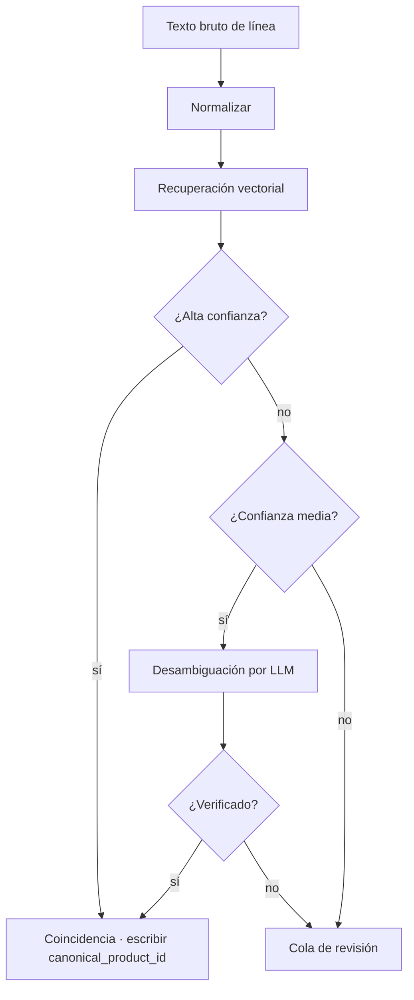

# Etapa 4 — Canónica

## 2.7 Etapa 4 — Coincidencia canónica de productos

Esta etapa colapsa diferentes formas superficiales del mismo producto en un único identificador canónico. Por ejemplo:

- `COCA COLA 330ML KUTU`
- `C.COLA 33CL TENEKE`
- `COCA-COLA 0.33 L`
- `COKA 330 ML`

Las cuatro se resuelven al mismo `canonical_product_id`. Esta resolución es una condición previa para la memoria de precios y el producto de datos B2B.

### Enfoque

La resolución canónica es un resolvedor basado en embeddings de múltiples etapas, con desambiguación por niveles de confianza y una cola de revisión humana para casos ambiguos.



Los umbrales exactos de similitud, el modelo de embeddings y el prompt de desambiguación se gestionan en la capa operativa interna.

Un artículo de línea no resuelto se registra con una referencia canónica nula. El bINT de esa línea se calcula después de la canonización de la cola.

### Estructura taxonómica

```
category > subcategory > brand > product > variant
```

Ejemplo:

```
Beverages > Carbonated Soft Drinks > Coca-Cola > Coca-Cola Classic > 330 ml can
```

Cada producto canónico lleva atributos normalizados: `size_value`, `size_unit`, `package_type`, `brand_id`, `is_private_label`, `barcode_gtin` (cuando está disponible).

### Arranque en frío

El índice canónico se inicializa a partir de conjuntos de datos de productos abiertos, alianzas de catálogos con licencia y cargas de usuarios sembradas desde la beta cerrada. El índice crece orgánicamente a medida que se vacía la cola de canonización.

### Cola de canonización pendiente

Los artículos de línea ambiguos entran en una cola de revisión. El revisor (inicialmente el equipo de Yumo Yumo, más tarde un pool comunitario que gana PoC) crea un nuevo producto canónico o asigna el texto bruto a uno existente. Esta cola es una palanca de costo principal del canal a medida que escala — 08 la enumera como un riesgo operativo central.

---
