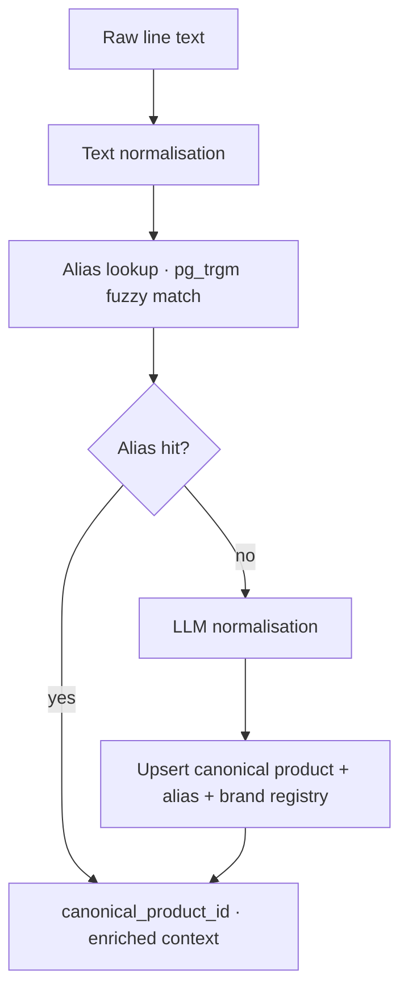

# Etapa 4 — Canónica

## 2.7 Etapa 4 — Coincidencia canónica de productos

Esta etapa colapsa diferentes formas superficiales del mismo producto en un único identificador canónico. Por ejemplo:

- `COCA COLA 330ML KUTU`
- `C.COLA 33CL TENEKE`
- `COCA-COLA 0.33 L`
- `COKA 330 ML`

Las cuatro se resuelven al mismo `canonical_product_id`. Esta resolución es una condición previa para la memoria de precios y el producto de datos B2B.

### Enfoque

La resolución canónica se ejecuta de forma **asíncrona** en un worker de post-procesamiento en segundo plano, después de que el flujo sincrónico ya devolvió al usuario la vista previa verificada. Esto mantiene la resolución de productos fuera de la ruta sensible a la latencia: el usuario ve su recibo de inmediato, mientras los identificadores canónicos se adjuntan al registro momentos después.

El resolvedor trabaja sobre una tabla de alias que asigna el texto bruto de la línea del recibo a productos canónicos:


```mermaid
flowchart TD
    A[Raw line text] --> B[Text normalisation]
    B --> C[Alias lookup · pg_trgm fuzzy match]
    C --> D{Alias hit?}
    D -- yes --> E[canonical_product_id · enriched context]
    D -- no --> F[LLM normalisation]
    F --> G[Upsert canonical product + alias + brand registry]
    G --> E
```

- **Búsqueda difusa de alias** — el texto de línea normalizado se compara con alias de recibo aprendidos previamente usando la similitud de trigramas de PostgreSQL (`pg_trgm`). Un acierto se resuelve directamente al producto canónico. Los alias aprendidos en un comerciante se reutilizan entre comerciantes solo cuando el texto se lee como un nombre de producto real y no como una abreviatura interna de la tienda, lo que evita que productos distintos se fusionen bajo un mismo canónico.
- **Respaldo LLM** — ante un fallo de búsqueda, un modelo de lenguaje normaliza el texto bruto en atributos de marca, producto y tamaño. El resultado se registra (upsert) como un nuevo producto canónico (o se asigna a uno existente) junto con una nueva fila de alias, de modo que la misma forma superficial se resuelve sin llamada al modelo la próxima vez.

Los ajustes de similitud y el prompt de normalización se gestionan en la capa de operaciones internas.

Una línea de artículo sin resolver se registra con una referencia canónica nula; la resolución puede completarse en una pasada posterior a medida que crece la tabla de alias.

### Estructura de taxonomía

```
category > subcategory > brand > product > variant
```

Ejemplo:

```
Beverages > Carbonated Soft Drinks > Coca-Cola > Coca-Cola Classic > 330 ml can
```

Cada producto canónico lleva atributos normalizados: `size_value`, `size_unit`, `package_type`, `brand_id`, `is_private_label`, `barcode_gtin` (cuando está disponible).

### Modelo de crecimiento

El índice canónico crece a partir del propio tráfico de recibos: cada línea normalizada por LLM añade un producto canónico y un alias, y cada repetición posterior de esa forma superficial se resuelve desde la tabla de alias sin costo de modelo. Las entradas ambiguas o de baja calidad se revisan mediante las herramientas de catálogo del panel de administración.
