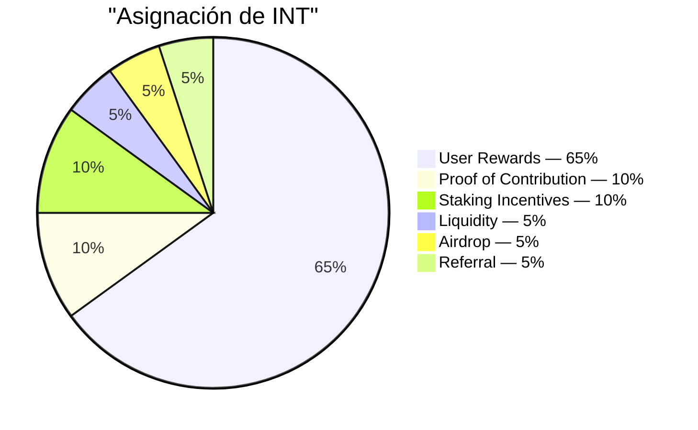

# Oferta y asignación

## 4.16 Oferta total

| Parámetro | Valor |
|---|---|
| Token | INT |
| Estándar | SPL (Solana) |
| Decimales | 6 |
| Oferta total | 99,000,000,000 |
| Acuñable tras el génesis | Ninguno — la autoridad de acuñación está cerrada |

Los 99 mil millones de INT completos se acuñan una sola vez en el génesis hacia el tesoro, luego se cierra la autoridad de acuñación. No se puede crear más INT nunca. La distribución es una transferencia del tesoro a través del distribuidor auditado (4.15), no una nueva acuñación.

## 4.17 Tabla de asignación

| Rail | Cuota | Tokens | Propósito |
|---|---:|---:|---|
| User Rewards | 65% | 64,350,000,000 | Incentivo principal para la contribución verificada de Proof of Expense |
| Proof of Contribution | 10% | 9,900,000,000 | Distribución ponderada por impacto al equipo central, contratistas y colaboradores externos (4.11) |
| Staking Incentives | 10% | 9,900,000,000 | Recompensas para holders a largo plazo que bloquean INT (4.6) |
| Liquidity | 5% | 4,950,000,000 | Siembra mercados on-chain en el TGE; reserva para profundidad gobernada por la comunidad |
| Airdrop | 5% | 4,950,000,000 | Distribuciones de marketing basadas en participación a lo largo de múltiples periodos |
| Referral | 5% | 4,950,000,000 | Desbloqueos por evento cuando los invitados completan hitos de verificación |
| **Total** | **100%** | **99,000,000,000** | |

Los seis rails representan el cien por cien de la oferta. No hay una asignación de equipo separada fuera de este mapa. El equipo fundador y todos los colaboradores ganan a través del rail de Proof of Contribution (4.11), bajo la misma lógica ponderada por impacto que se aplica a los participantes externos.

## 4.18 Responsabilidades de los rails

- **User Rewards** — el flujo de salida principal del protocolo. Regido por la curva de emisión (4.19) y medido por techos diarios (4.22). Presupuesto: 64.35 mil millones de INT a lo largo del horizonte de emisión de 15 años.
- **Proof of Contribution** — distribuciones periódicas puntuadas por rúbrica con vesting (4.13). Alinea los incentivos del equipo con la producción de trabajo medible.
- **Staking Incentives** — liberado a lo largo de un horizonte de 5 años. Acumulación ponderada por tramos descrita en 4.6.
- **Liquidity** — 1 mil millones de INT siembran el TGE a través de un pool de bootstrapping de liquidez (LP bloqueado 12 meses). 3.95 mil millones se mantienen en reserva para despliegues gobernados por la comunidad.
- **Airdrop** — distribuido a lo largo de múltiples periodos a través de los años (no todo de una vez) como distribuciones de marketing basadas en participación. Cada distribución es de tiempo sorpresa pero transparentemente demostrable: el conjunto de destinatarios se compromete on-chain antes de que se muevan los tokens. El dimensionamiento de la distribución se gestiona en la capa operativa.
- **Referral** — por evento: una invitación exitosa activa un desbloqueo de unidad para el usuario que refiere una vez que el usuario invitado cruza un umbral de contribución significativo. Las condiciones del umbral se calibran en producción y no se publican.
