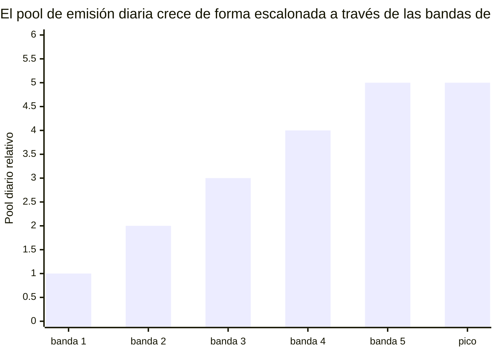

# Calendario de emisión y desbloqueos

## 4.19 Curva de emisión de User Rewards

El rail de User Rewards (64.35 mil millones de INT) se libera a lo largo de un horizonte de 15 años. La emisión diaria se mide mediante una función escalonada que escala con los usuarios activos mensuales (MAU).

El pool de emisión diaria crece de forma escalonada a través de las bandas de MAU (desde la banda más pequeña de etapa temprana hasta una banda pico), de modo que el pool se expande a medida que crece la base de usuarios activos en lugar de hacerlo de forma continua. Los límites de las bandas de MAU y los valores del pool diario por banda se calibran en producción y no se publican.

Tras la banda pico, el crecimiento adicional de MAU aumenta la densidad de contribución por usuario en lugar de la emisión total. La forma escalonada evita efectos de acantilado cuando la actividad oscila cerca de un límite de banda. El presupuesto de User Rewards (64.35 mil millones de INT) está dimensionado para un horizonte de emisión de 15 años; las bandas de etapa temprana emiten muy por debajo del pico, extendiendo aún más el horizonte efectivo.

## 4.20 Calendario de desbloqueo por rail

| Rail | Mecanismo de desbloqueo | Temporalización |
|---|---|---|
| **User Rewards (65%)** | Curva de emisión (4.19) → acumulación off-chain de bINT → liquidación semanal → reclamación del distribuidor (4.4) | Continuo a lo largo de 15 años |
| **Liquidity (5%)** | Inicial: totalmente desbloqueada en el TGE. Reserva: gobernada por la comunidad | TGE + calendario gobernado |
| **Airdrop (5%)** | Distribuciones de marketing periódicas basadas en participación | Múltiples periodos a través de los años |
| **Referral (5%)** | Por evento, por cada invitación exitosa | Continuo |
| **Staking (10%)** | Liberado al pool de recompensas de staking una vez que el staking se active (4.6) | Fase posterior, a lo largo de un horizonte de 5 años |
| **Proof of Contribution (10%)** | Distribuciones periódicas puntuadas por impacto con vesting (4.13) | Vesting plurianual por destinatario |

### Parámetros de desbloqueo decididos

- **Liquidity** — 1,000,000,000 INT totalmente líquidos en el TGE para sembrar pares de intercambio. Posición de LP bloqueada 12 meses. Los 3,950,000,000 INT restantes se mantienen en reserva.
- **Airdrop** — liberado a lo largo de múltiples periodos a través de los años como distribuciones de marketing basadas en participación, no en un único evento. Cada distribución es de tiempo sorpresa pero transparentemente demostrable: el conjunto de destinatarios se compromete on-chain antes de que se muevan los tokens. Cada parte se reclama íntegramente sin bloqueo de vesting, a través de un distribuidor dedicado separado de la liquidación semanal de recompensas de usuario. El dimensionamiento de la distribución escala con la participación y se gestiona en la capa operativa.
- **Referral** — una invitación que califica activa un desbloqueo de unidad; el umbral de calificación se calibra en producción y no se publica. Sin vesting basado en tiempo.

### Elementos del espacio de diseño (parámetros a publicar en el TGE)

Los siguientes elementos forman parte del trabajo activo de diseño del token. Aquí se describen las formas; los parámetros específicos se publicarán cuando se finalicen.

- **Forma de la curva de emisión de User Rewards.** Las bandas escalonadas anteriores fijan el techo diario. El comportamiento exacto de transición entre bandas y el calendario de aceleración durante el crecimiento temprano se calibran contra los datos observados de crecimiento de usuarios.
- **Cadencia de distribución de Proof of Contribution.** Ligada a métricas de contribución (volumen y calidad de Proof of Expense verificado, posición en la clasificación) en instantáneas periódicas. Las duraciones de cliff y vesting son política y se documentan por distribución.
- **Calendario de liberación del pool de staking.** Diseñado en conjunto con la arquitectura de rendimiento real (real yield) para alinear a los holders a largo plazo con los ingresos de la plataforma.

## 4.21 Estimación de oferta circulante en el TGE

En el Token Generation Event, la oferta circulante se siembra mediante la liquidez inicial:

| Fuente | Cantidad (INT) | Notas |
|---|---:|---|
| Liquidez inicial | 1,000,000,000 | Totalmente líquida en el TGE |
| **Circulante en el TGE** | **~1,000,000,000** | ~1.01% de la oferta total |

El ~98.99% restante de la oferta está bloqueado a través de calendarios de emisión, contratos de vesting, pools de staking, reservas gobernadas y el programa de airdrop multi-periodo. Las distribuciones de airdrop entran en circulación gradualmente a lo largo de los años como eventos de marketing basados en participación en lugar de en el TGE. Esta baja flotación inicial refleja la preferencia de diseño del protocolo por una expansión gradual de la oferta ligada a la contribución real.
