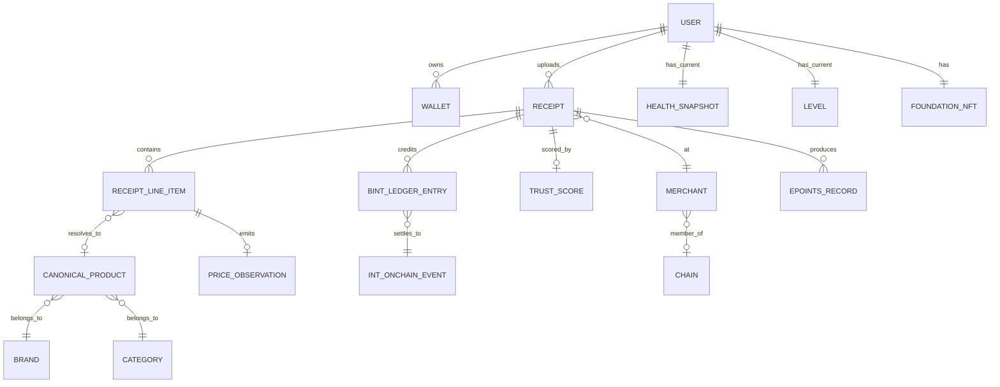

# Entidades centrales

## 5.2 Entidades centrales

Las cardinalidades importan: **un recibo tiene muchos artículos de línea**, **un artículo de línea se resuelve como máximo a un producto canónico** (o a ninguno si cae en la cola pendiente), **un recibo emite como máximo una puntuación de confianza** (puede ser re-puntuado, pero cada versión reemplaza a la anterior).

---
