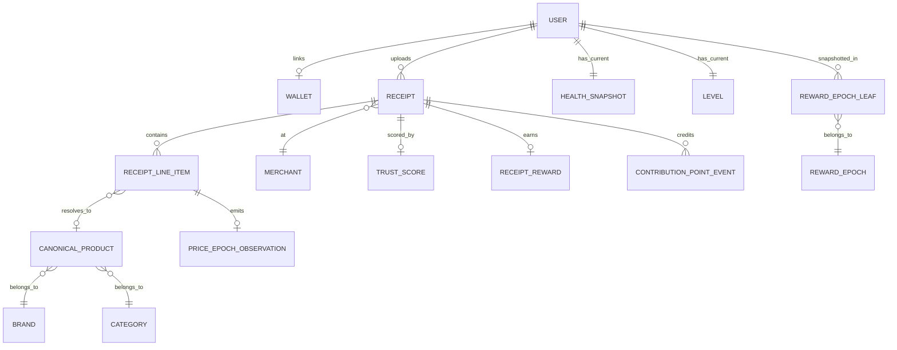

# Entidades centrales

## 5.2 Entidades centrales

```mermaid
erDiagram
    USER ||--o| WALLET : links
    USER ||--o{ RECEIPT : uploads
    USER ||--|| HEALTH_SNAPSHOT : has_current
    USER ||--|| LEVEL : has_current
    RECEIPT ||--o{ RECEIPT_LINE_ITEM : contains
    RECEIPT }o--|| MERCHANT : at
    RECEIPT_LINE_ITEM }o--o| CANONICAL_PRODUCT : resolves_to
    RECEIPT_LINE_ITEM ||--o| PRICE_EPOCH_OBSERVATION : emits
    RECEIPT ||--o| TRUST_SCORE : scored_by
    RECEIPT ||--o| RECEIPT_REWARD : earns
    RECEIPT ||--o{ CONTRIBUTION_POINT_EVENT : credits
    USER ||--o{ REWARD_EPOCH_LEAF : snapshotted_in
    REWARD_EPOCH_LEAF }o--|| REWARD_EPOCH : belongs_to

    CANONICAL_PRODUCT }o--|| BRAND : belongs_to
    CANONICAL_PRODUCT }o--|| CATEGORY : belongs_to
```

Las cardinalidades importan: **un recibo tiene muchos artículos de línea**, **un artículo de línea se resuelve como máximo a un producto canónico** (o a ninguno si cae en la cola pendiente), **un recibo emite como máximo una puntuación de confianza** (puede ser re-puntuado, pero cada versión reemplaza a la anterior). La contabilidad de recompensas fluye a través de filas de solo adición en `contribution_point_events` y hojas de instantánea por epoch (5.7); el libro de precios recibe filas de observación libres de identidad (5.6).

---
