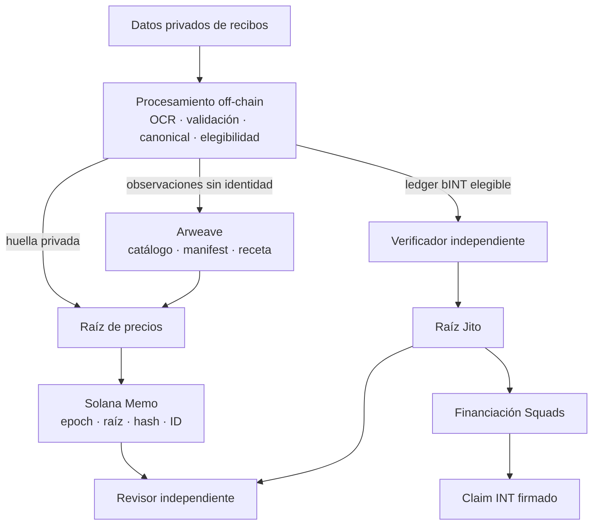
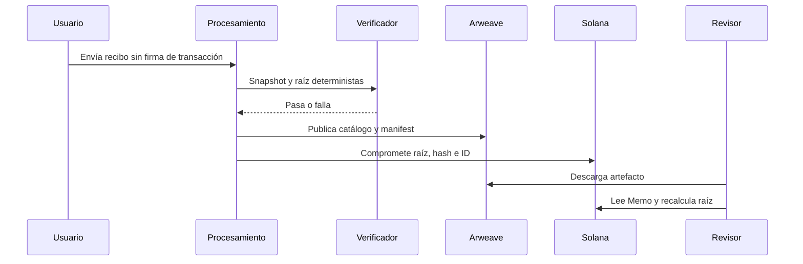

# Infraestructura Web3: datos públicos verificables y liquidación programable

## 6.1 El problema de ingeniería

Yumo Yumo debe mantener privados los recibos, publicar precios que un revisor pueda comprobar sin usar su API y financiar una asignación antes de pedir una firma de claim. Ponerlo todo en cadena expondría datos, cobraría operaciones rutinarias y dificultaría correcciones; dejarlo todo en una base central exigiría confiar en que Yumo Yumo siempre sirve el mismo resultado.

Los caminos de datos públicos y de settlement se encuentran en el verificador, no en la imagen del recibo. Los recibos brutos no entran en Arweave ni Solana.

## 6.2 Por qué tres capas

| Decisión | Razón | Salida verificable |
|---|---|---|
| Procesamiento privado fuera de cadena | Privacidad, corrección y carga sin wallet ni comisión | Snapshot determinista antes de publicar |
| Artefactos de precio en Arweave | El dataset y método pueden recuperarse sin infraestructura Yumo Yumo | ID, manifest, catálogo y receta |
| Compromiso en Solana | Une versión, raíz, hash e ID de publicación | Memo público con orden temporal |
| INT mediante distributor | El claim está limitado por una raíz publicada y vault financiado | Cuenta distributor, funding, claim y clawback |

Solana es la capa de ejecución y autoridad; Arweave es la capa de artefactos públicos; la base de aplicación conserva el procesamiento privado.

### Por qué Solana y por qué Arweave

La elección parte de requisitos operativos, no de la idea de que una red sea adecuada para cualquier carga. Yumo Yumo necesita un registro público que transporte un epoch completo y reproducible; una vía de settlement donde una wallet verifique y reclame su asignación; evidencia de aprobación para tesorería; y una ruta de verificación disponible fuera de la aplicación. Estos requisitos separan artefactos grandes e inmutables de transacciones compactas con estado.

| Requisito | Solana: rol de ejecución | Arweave: rol de publicación |
|---|---|---|
| Inspección pública | Estado de cuentas y transacciones vía RPC para commitments, financiación, aprobaciones y claims | Artefactos content-addressed para catálogo, manifest, especificación y proofs |
| Settlement económico | Claims dirigidos por wallet, cuentas de token, distributor y aprobaciones multisig | El epoch completo queda disponible para cálculo sin llevar el catálogo a datos de transacción |
| Integridad de versión | Commitment compacto para epoch ID, root, digest del manifest y orden | Transaction ID para la versión de bytes del dataset y la receta de verificación |
| Acceso independiente | El revisor elige un proveedor RPC | El revisor elige gateway o conserva un espejo local |

Solana sirve para transiciones de estado: settlement de una asignación publicada, claim autorizado por wallet, evidencia de aprobación de tesorería y commitment ordenado para un epoch sellado. El diseño mantiene compacta la carga on-chain: roots, digests, identificadores, estado de autoridad, referencias de financiación y claim state. El plan usa componentes publicados del ecosistema Solana; el registro de release identificará las instancias mainnet concretas al activar un release.

Arweave sirve para publicación durable y recuperable: catálogo completo, manifest, reglas de canonicalisation y materiales para reconstruir un root. Un object store convencional distribuye los mismos archivos, pero su continuidad y política de acceso dependen de la cuenta del operador. La distribución content-addressed identifica bytes, mientras la disponibilidad a largo plazo depende del acuerdo de retención elegido. Arweave aporta al artefacto un transaction ID propio, apto para enlazarse al commitment de Solana.

La combinación permite una comprobación cruzada. El verificador obtiene el artefacto Arweave mediante un gateway elegido, recalcula digest y Merkle root, y lee la transacción o cuenta Solana mediante un RPC elegido. Ambos registros deben coincidir en epoch y root. El formato público sigue siendo portable: un equipo independiente puede espejar artefactos, reconstruir el árbol y verificar el commitment sin infraestructura de Yumo Yumo. Arweave transporta la evidencia a escala de publicación; Solana transporta las consecuencias económicas y de autoridad de esa evidencia.

## 6.3 De recibo a registro comprobable

El manifest publica producto, comercio, ubicación, fecha y precio unitario, no imágenes, IDs de recibo, billeteras, cuentas, OCR ni señales de confianza. Un propietario de recibo puede recalcular `keccak256("price-receipt:v1|receipt_id|content_hash|wallet")`, usar su prueba de inclusión y comparar la raíz con el Memo. Una firma fuera de cadena con nonce prueba control actual de billetera. Esto prueba inclusión, no que un banco o comercio completó un pago.

## 6.4 De contribución verificada a claim INT

bINT es un crédito contable off-chain. Las entradas elegibles se verifican, se convierten en un árbol Jito SHA-256 distinto del árbol de precios y se comparan con los leaves registrados. Solo entonces se configura un distributor y se financia su vault mediante la aprobación Squads.

`bINT elegible → verificador → raíz Jito → vault financiado → claim firmado → transferencia INT → clawback configurado`

La aplicación no crea claims cambiando un saldo visible y el usuario no firma para subir un recibo ni para acumular bINT.

## 6.5 Evidencia y madurez

| Superficie | Evidencia | Estado que debe declararse |
|---|---|---|
| Libro de precios | Manifest reconstruible, especificación, script y receta Memo | Verificable cuando se publiquen IDs Arweave y Memo |
| Árbol Jito | Builder TypeScript clean-room y pruebas byte-exact contra dos fixtures CLI | Ensayado en devnet; cada distributor mainnet requiere dirección, raíz, funding y verificación propios |
| Tesorería e INT | Runbooks, separación de roles y gate de cierre de mint | No declarar mainnet activo antes de publicar direcciones, umbral y estado de autoridad |

Un flujo ensayado es evidencia de implementación, no evidencia de que la instancia mainnet exista.

## 6.6 Límites y ruta de revisión

Un revisor puede comprobar hash/root del manifest, inclusión de una huella y coherencia entre proof, distributor y vault. Debe evaluar por evidencia de proceso OCR, matching, fraude y elegibilidad privada. Retrasos de gateway, RPC caído, proof no coincidente, claim rechazado y clawback son estados observables; Web3 no afirma prevenirlos.

La revisión comienza con el ID de Arweave en un Memo de precios o con leaves, cuenta Jito, funding y claims de una distribución. Los formatos y controles están en [Detalles del protocolo y límites operativos](02-protocol-details.md).

---
