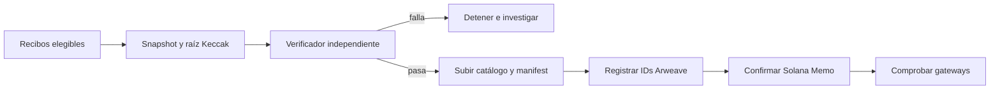
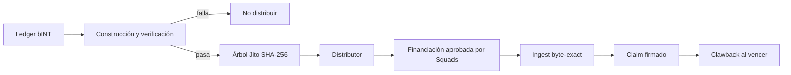

# Detalles del protocolo Web3 y límites operativos

## 6.8 Decisiones de diseño

El sistema separa el procesamiento privado, la evidencia pública y la ejecución de tokens porque sus costes, privacidad y posibilidades de corrección son distintos.

| Capa | Uso | No se usa para |
|---|---|---|
| Base de datos de aplicación | Procesamiento privado, elegibilidad y corrección antes de publicar | Fuente pública de artefactos sellados |
| Arweave | Artefactos públicos de precios y material de verificación disponible sin Yumo Yumo | Imágenes, líneas privadas o estado operativo mutable |
| Solana | Cuentas de token, movimientos de vault controlados por multisig, claims y compromisos compactos | Almacenar recibos, ejecutar OCR o mintear por recibo |

Guardar cada recibo en cadena expondría datos, añadiría costes y dificultaría corregirlos. Guardar toda la evidencia solo en la base de datos haría la publicación dependiente de Yumo Yumo. Por eso se publica un artefacto público limitado en Arweave y se ancla su identidad exacta en Solana.

## 6.9 Registro de release y criterios de activación

Este documento describe las superficies de integración previstas. Cuando se activa un release mainnet, su registro de release pasa a ser la fuente de referencia para la red concreta, direcciones, versiones de paquetes, estado de autoridades y evidencia del release. Publicado con el release, el registro incorpora las direcciones específicas del despliegue.

| Superficie | Registro requerido antes de la activación |
|---|---|
| Liquidación INT | Red, dirección del mint INT, estado de autoridades, transacción de suministro autorizada y versión del release |
| Distribución de recompensas | Dirección del distributor, raíz Merkle, periodo de claim, receptor de clawback, transacción de financiación y versión de la especificación del árbol |
| Gobierno de tesorería | Dirección multisig, conjunto de miembros, umbral de aprobación y registro de propuesta o aprobación |
| Sellado público de precios | Dirección sealer, transacción Solana, ID del manifiesto Arweave e ID del catálogo de precios |

Cada registro incorpora también versiones de dependencias, referencias de auditoría o revisión aplicables, política RPC y un canal de reportes de seguridad. Así, revisores y usuarios verifican la configuración activa desde un único registro versionado.

## 6.10 Dos sistemas Merkle

| Propiedad | Libro de precios | Distribuidor INT |
|---|---|---|
| Objetivo | Comprometer observaciones públicas y huellas opacas | Autorizar claims exactos |
| Hash | Keccak-256 | SHA-256 |
| Leaf | Hash de línea publicada; el leaf de recibo tiene preimagen privada | `hashv(claimant, unlocked_u64_le, locked_u64_le)` y hash de leaf con separación de dominio |
| Orden / impar | Ordenado por hash; impar se conserva | Orden de entrada determinista; pares ordenados; nodo impar duplicado |
| Objetivo de verificación | Hash y raíz del Memo | Raíz de cuenta distributor e instrucción claim |

No son sustituibles: una prueba de precios no puede reclamar INT y una prueba de distribuidor no valida un recibo.

## 6.11 Transiciones de estado

La confirmación del Memo es el límite irreversible. Un verificador fallido permite reconstruir; una carga Turbo aún no servida exige monitorización; un epoch sellado se corrige con una publicación posterior, no por mutación.

El verificador, la configuración de raíz y la financiación de tesorería son controles distintos; nadie debe modificar elegibilidad y financiar unilateralmente otro distribuidor.

## 6.12 Reproducción, autoridad y fallos

Para verificar un epoch público: descubrir el Memo, obtener el manifest por ID de Arweave, comparar su cuerpo con el manifest hash, recalcular leaves y raíz, y contrastar la raíz con el Memo. El catálogo se verifica contra el hash incluido en el manifest. No se necesita API ni base de datos de Yumo Yumo.

La revisión de recompensas usa leaves registrados, especificación Jito, cuenta distributor, transacción de financiación y estado de claim. Prueba consistencia de asignación, raíz y vault; no prueba por sí sola entradas privadas de elegibilidad.

La autoridad debe describirse como estado de release, no como promesa futura. Hasta publicar la instancia mainnet y las direcciones multisig, el documento debe decir que no están provisionadas. Gateway no disponible, caída RPC, claim rechazado, prueba no coincidente, verificación fallida y clawback son estados observables. Web3 no los evita; deja evidencia para investigarlos.

## 6.13 Ciclo de vida del epoch y límites de publicación

Un epoch es un intervalo de publicación cerrado, no una vista móvil de la base de datos. Da a cada conjunto publicado un límite de entrada estable y un objetivo de verificación estable. El manifest registra el identificador del epoch, hora de apertura y cierre, política de inclusión, versión del esquema fuente, versión de canonicalización y versión del verificador. Por ello una revisión posterior distingue una observación incluida antes del corte de otra aceptada después.

El proceso tiene siete pasos. Primero, líneas de recibo y observaciones de precio entran en la cola privada para validación, deduplicación, concordancia de comercio, normalización de unidades y decisión de elegibilidad. Segundo, el constructor selecciona los registros que cumplen la hora de corte y la política publicadas. Tercero, crea un snapshot inmutable: cada observación pública se serializa con el orden de campos y encoding definido; cada recibo elegible aporta una huella que preserva la privacidad en lugar de imagen o contenido bruto. Cuarto, un verificador independiente reconstruye el snapshot desde la entrada congelada y compara recuentos, digests de bytes, número de leaves, raíces y campos del manifest.

Un resultado coincidente abre la publicación. El constructor genera catálogo de precios, conjunto de huellas de recibos cuando corresponde, manifest y material de inclusion proof. El manifest nombra archivos, sus digests SHA-256, algoritmos Merkle, valores de raíz, límite del epoch y versiones de software y especificación. Los artefactos se cargan en Arweave. Cuando más de un gateway devuelve los bytes esperados, un compromiso compacto en Solana enlaza identificador del epoch, digest del manifest, raíz y versión de formato. Esos identificadores forman la evidencia de release del epoch.

La etapa final es monitorización y corrección. Lecturas de gateway, verificaciones de digest, validación de proofs y resultados de claim se registran como señales separadas. Una corrección crea un epoch sucesor o un registro explícito que referencia el epoch afectado; el artefacto anterior permanece disponible para comparación. Así una corrección de ingesta, precio o política queda como evento auditable y no como reescritura silenciosa.

## 6.14 Construcción Merkle, consulta local y prueba de recibo

Los árboles tienen fronteras de seguridad distintas y sus formatos se versionan por separado. El árbol público de precios compromete registros reproducibles por terceros. Cada leaf público empieza con una etiqueta de dominio y continúa con la representación canónica de bytes de la observación. La representación especifica lista de campos, UTF-8, formato de fecha, escala decimal, moneda, identificadores de comercio y ubicación, y convención de salto de línea. El manifest fija orden de leaves, regla de hash de pares, tratamiento de leaf impar, encoding de raíz y versión exacta de la especificación.

La ruta de huella de recibo incorpora una preimagen privada. El propietario conserva localmente los valores para recalcularla y puede obtener o construir una inclusion proof sin publicar imagen del recibo, datos bancarios, cuenta o asociación de wallet. La proof contiene hashes hermanos, posiciones izquierda/derecha, identificador de epoch y versión de especificación. Partiendo del leaf local, el propietario combina cada hermano en el orden publicado y compara la raíz final con la raíz del manifest y compromiso Solana. El resultado demuestra inclusión en un epoch sellado y mantiene el contenido del recibo fuera del catálogo público.

El árbol de distribución INT es una estructura separada para autorizar claims. Su leaf codifica public key del claimant y valores de asignación unlocked y locked con orden de bytes y separador de dominio documentados. El manifest de distribución fija epoch de asignación, raíz, fechas de apertura y cierre de claim, transacción de financiación y destino de clawback. El claimant verifica leaf y proof en local y después envía la instrucción de claim desde su propia wallet. El estado del distributor refleja el resultado, permitiendo comprobar la asignación contra la raíz publicada sin sesión de aplicación.

## 6.15 Métodos para desarrolladores y evidencia de gasto

La ruta pública funciona con artefactos y proveedores elegidos por el verificador. Un usuario, investigador o desarrollador parte del índice de epochs o de un manifest ID de Arweave, obtiene el manifest desde el gateway elegido y contrasta su digest con el compromiso Solana. Después descarga el catálogo indicado, calcula digests localmente, reconstruye el árbol y compara la raíz. Para su propio recibo entrega la preimagen solo a un verificador local y usa el sibling path para comprobar inclusión. Las wallets consultan el estado de claim por un endpoint RPC Solana elegido por el usuario.

| Método | Entrada | Resultado | Comprobación |
|---|---|---|---|
| `getEpoch(epoch_id)` | Identificador | Manifest ID, raíz, formato y hora | Digest del manifest contra compromiso |
| `getCatalogue(manifest_id)` | Manifest ID | Catálogo público byte-exact | Digest de archivo contra manifest |
| `buildPriceRoot(catalogue, spec)` | Bytes y especificación | Número de leaves y raíz | Raíz contra manifest |
| `proveReceipt(receipt_preimage, epoch_id)` | Preimagen local y epoch | Leaf y sibling path | Path plegado contra raíz de recibos |
| `getDistribution(epoch_id)` | Epoch de asignación | Raíz, ventana de claim y financiación | Registro contra evidencia de release |
| `verifyAllocation(wallet, allocation, proof)` | Wallet, valores y proof | Resultado local | Raíz contra distribución |

Las implementaciones de referencia mantienen reemplazable el acceso de red: cualquier gateway Arweave, copia local de artefactos y proveedor RPC Solana. Un verificador informa origen de gateway/RPC, hora de obtención, digests esperados y observados, versión de especificación y toda comparación fallida. Otro desarrollador puede reproducir la misma investigación con esa salida.

La prueba de gasto tiene un alcance deliberado. La capa pública demuestra que una observación aprobada o huella de recibo participó en un epoch sellado y que el conjunto de artefactos sigue siendo identificable por bytes. La capa privada conserva información para que la persona relevante recalcule su huella. Para un comité grant, la revisión se resume en preguntas concretas: qué epoch se publicó, qué especificación lo generó, qué artefacto contiene sus bytes, qué compromiso lo identifica, qué autoridad aprobó el movimiento de tesorería y qué raíz y transacción de financiación hacen pagaderos los claims. El registro de release y los manifests de epoch aportan esas respuestas una vez activo el release mainnet.

---
