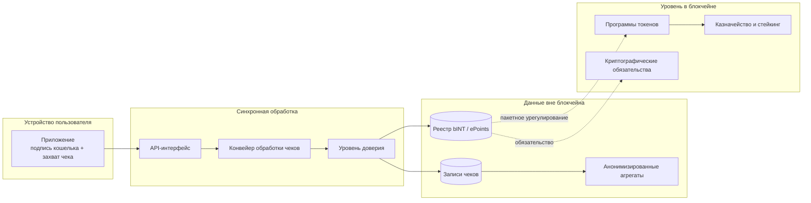

# Схема системы высокого уровня

## 1.1 Схема системы высокого уровня

Схема показывает границу публичной архитектуры: пользовательский предпросмотр является синхронным; учёт bINT и ePoints сначала записывается в реестр, а затем переносится на уровень в блокчейне расчётными workers. Диаграмма сфокусирована на компонентах протокола и потоках данных.
