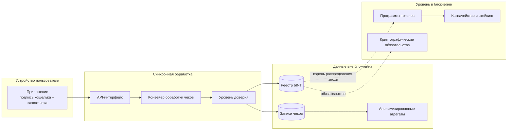

# Схема системы высокого уровня

## 1.1 Схема системы высокого уровня

```mermaid
flowchart LR
    subgraph Client["Устройство пользователя"]
        A["Приложение<br/>подпись кошелька + захват чека"]
    end

    subgraph Processing["Синхронная обработка"]
        B["API-интерфейс"]
        C["Конвейер обработки чеков"]
        D["Уровень доверия"]
    end

    subgraph Data["Данные вне блокчейна"]
        E[("Записи чеков")]
        F[("Реестр bINT")]
        G["Анонимизированные агрегаты"]
    end

    subgraph Chain["Уровень в блокчейне"]
        H["Программы токенов"]
        I["Казначейство и стейкинг"]
        J["Криптографические обязательства"]
    end

    A --> B --> C --> D
    D --> E
    D --> F
    E --> G
    F -. "корень распределения эпохи" .-> H
    F -. "обязательство" .-> J
    H --> I
```

Схема показывает границу публичной архитектуры: пользовательский предпросмотр является синхронным, а учёт bINT ведётся вне блокчейна. Расчётные workers публикуют в блокчейн корень распределения INT, выведенный из подходящих начислений bINT. Диаграмма сфокусирована на компонентах протокола и потоках данных.
