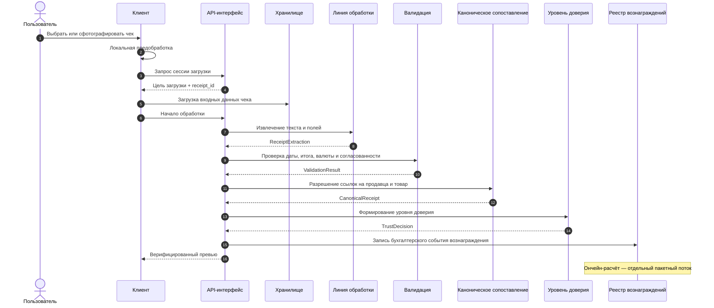

# 02 — Конвейер обработки чеков

Конвейер обработки чеков преобразует изображение чека или PDF-счёт, предоставленные пользователем, в структурированную запись чека. Публичный контракт определяет порядок этапов и тип входных/выходных данных каждого этапа; выбор провайдера, детали промптов, пороговые значения и правила отката остаются в операционной документации.

Конвейер разделяет два выходных потока: верифицированный превью, отображаемый пользователю, и бухгалтерское событие, записываемое в реестр вознаграждений. Это позволяет разделить пользовательский опыт и ончейн-расчёты.

## 2.1 Цели проектирования

| Цель | Техническое следствие |
|---|---|
| Низкая задержка | Пользовательское превью генерируется в синхронном потоке |
| Типизированная передача между этапами | Каждый этап выдаёт выходные данные, привязанные к схеме, для следующего этапа |
| Возможность повторного запуска | Выходные данные этапов записываются как события; неудачные задания можно повторить с тем же входом |
| Разделение по качеству | Чеки с низкой достоверностью можно отделить от учёта вознаграждений или направить на проверку |
| Конфиденциальность | Исходное содержимое чека обрабатывается в офчейн-слое данных; продукт данных получается из анонимизированного слоя |

## 2.2 Обзор конвейера

Этапы связаны типизированными событиями, а не общим изменяемым состоянием. Это делает поток наблюдаемым и позволяет выполнять историческую повторную обработку.
