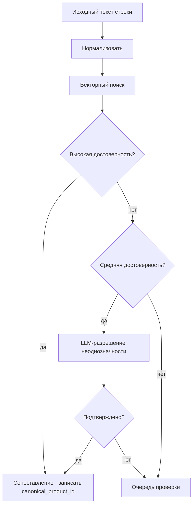

# Этап 4 — Канонизация

## 2.7 Этап 4 — Каноническое сопоставление продуктов

На этом этапе различные поверхностные формы одного и того же продукта сводятся к единому каноническому идентификатору. Например:

- `COCA COLA 330ML KUTU`
- `C.COLA 33CL TENEKE`
- `COCA-COLA 0.33 L`
- `COKA 330 ML`

Все четыре разрешаются в один и тот же `canonical_product_id`. Это разрешение является предварительным условием для памяти цен и B2B-продукта данных.

### Подход

Каноническое разрешение — это многоэтапный эмбеддинг-резолвер с разрешением неоднозначности по уровням достоверности и очередью человеческой проверки для неоднозначных случаев.



Точные пороги сходства, эмбеддинг-модель и промпт разрешения неоднозначности управляются внутренним операционным слоем.

Неразрешённая строка записывается с нулевой канонической ссылкой. bINT для этой строки рассчитывается после канонизации из очереди.

### Структура таксономии

```
category > subcategory > brand > product > variant
```

Пример:

```
Beverages > Carbonated Soft Drinks > Coca-Cola > Coca-Cola Classic > 330 ml can
```

Каждый канонический продукт несёт нормализованные атрибуты: `size_value`, `size_unit`, `package_type`, `brand_id`, `is_private_label`, `barcode_gtin` (при наличии).

### Холодный старт

Канонический индекс загружается из открытых наборов данных о продуктах, лицензированных каталоговых партнёрств и загрузок пользователей из закрытого бета-тестирования. Индекс растёт органически по мере опустошения очереди канонизации.

### Очередь ожидающей канонизации

Неоднозначные строки попадают в очередь проверки. Проверяющий (изначально команда Yumo Yumo, позже — пул сообщества, зарабатывающий PoC) либо создаёт новый канонический продукт, либо сопоставляет исходный текст с существующим. Эта очередь является основным рычагом стоимости при масштабировании конвейера — 08 перечисляет её как ключевой операционный риск.

---
