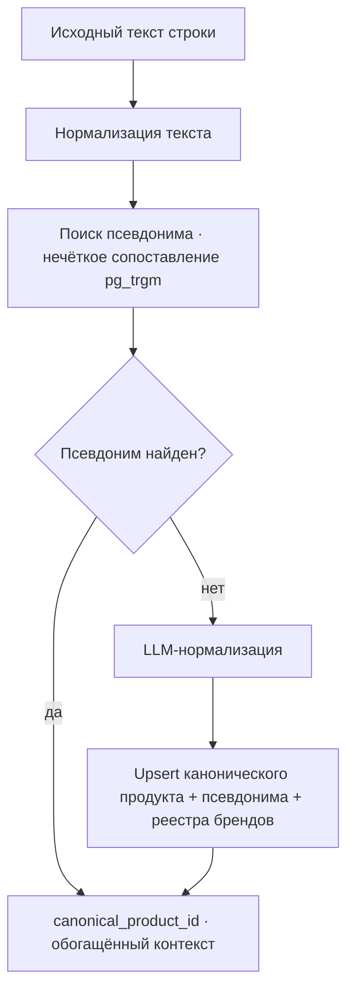

# Этап 4 — Канонизация

## 2.7 Этап 4 — Каноническое сопоставление продуктов

На этом этапе различные поверхностные формы одного и того же продукта сводятся к единому каноническому идентификатору. Например:

- `COCA COLA 330ML KUTU`
- `C.COLA 33CL TENEKE`
- `COCA-COLA 0.33 L`
- `COKA 330 ML`

Все четыре разрешаются в один и тот же `canonical_product_id`. Это разрешение является предварительным условием для памяти цен и B2B-продукта данных.

### Подход

Каноническое разрешение выполняется **асинхронно** в фоновом worker пост-обработки, после того как синхронный поток уже вернул пользователю проверенный предпросмотр. Это выводит разрешение продуктов с чувствительного к задержке пути: пользователь видит свой чек сразу, а канонические идентификаторы прикрепляются к записи мгновением позже.

Резолвер работает с таблицей псевдонимов, которая сопоставляет исходный текст строк чека с каноническими продуктами:


```mermaid
flowchart TD
    A[Исходный текст строки] --> B[Нормализация текста]
    B --> C[Поиск псевдонима · нечёткое сопоставление pg_trgm]
    C --> D{Псевдоним найден?}
    D -- да --> E[canonical_product_id · обогащённый контекст]
    D -- нет --> F[LLM-нормализация]
    F --> G[Upsert канонического продукта + псевдонима + реестра брендов]
    G --> E
```

- **Нечёткий поиск псевдонима** — нормализованный текст строки сопоставляется с ранее выученными псевдонимами чеков с помощью триграммного сходства PostgreSQL (`pg_trgm`). Совпадение разрешается напрямую в канонический продукт. Псевдонимы, выученные у одного торговца, переиспользуются между торговцами только тогда, когда текст читается как настоящее название продукта, а не как внутренняя аббревиатура магазина, — это удерживает разные продукты от слияния под одним каноническим идентификатором.
- **Резервный вызов LLM** — при промахе языковая модель нормализует исходный текст в атрибуты бренда, продукта и размера. Результат записывается upsert-ом как новый канонический продукт (или сопоставляется с существующим) вместе с новой строкой псевдонима, поэтому та же поверхностная форма в следующий раз разрешается без вызова модели.

Настройки сходства и промпт нормализации управляются внутренним операционным слоем.

Неразрешённая позиция чека записывается с нулевой канонической ссылкой; разрешение может завершиться на более позднем проходе по мере роста таблицы псевдонимов.

### Структура таксономии

```
category > subcategory > brand > product > variant
```

Пример:

```
Beverages > Carbonated Soft Drinks > Coca-Cola > Coca-Cola Classic > 330 ml can
```

Каждый канонический продукт несёт нормализованные атрибуты: `size_value`, `size_unit`, `package_type`, `brand_id`, `is_private_label`, `barcode_gtin` (при наличии).

### Модель роста

Канонический индекс растёт из самого потока чеков: каждая нормализованная LLM строка добавляет канонический продукт и псевдоним, и каждое последующее повторение этой поверхностной формы разрешается из таблицы псевдонимов без затрат на модель. Неоднозначные или низкокачественные записи проверяются через административный инструментарий каталога.
