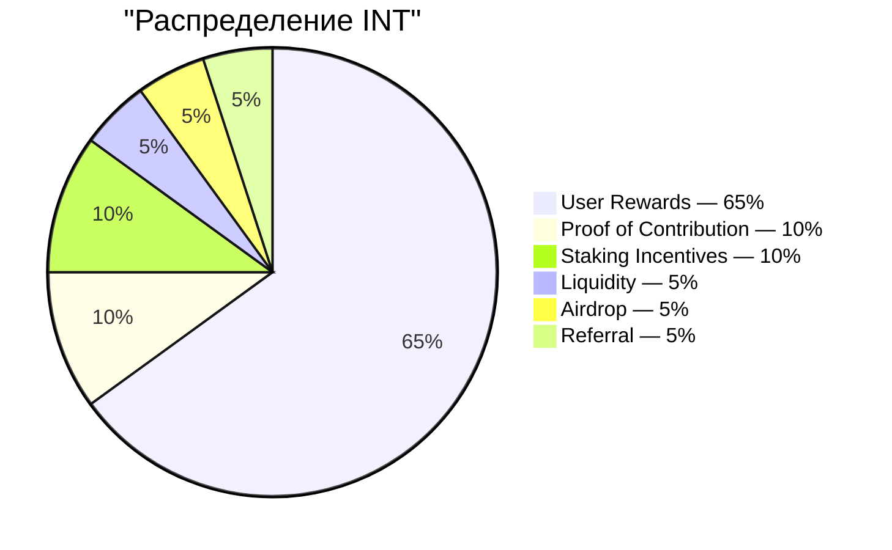

# Предложение и распределение

## 4.16 Общее предложение

| Параметр | Значение |
|---|---|
| Токен | INT |
| Стандарт | SPL (Solana) |
| Десятичные разряды | 6 |
| Общее предложение | 99 000 000 000 |
| Выпускаемо после генезиса | Нет — полномочие на выпуск закрыто |

Все 99 млрд INT выпускаются единожды на генезисе в казначейство, затем полномочие на выпуск закрывается. Больше INT создать нельзя никогда. Распределение — это перевод из казначейства через аудированный дистрибьютор (4.15), а не новый выпуск.

## 4.17 Таблица распределения

| Рельс | Доля | Токены | Назначение |
|---|---:|---:|---|
| User Rewards | 65% | 64 350 000 000 | Основной стимул за верифицированный вклад Proof of Expense |
| Proof of Contribution | 10% | 9 900 000 000 | Распределение, взвешенное по влиянию, для основной команды, подрядчиков и внешних контрибьюторов (4.11) |
| Staking Incentives | 10% | 9 900 000 000 | Вознаграждения для долгосрочных держателей, блокирующих INT (4.6) |
| Liquidity | 5% | 4 950 000 000 | Начальная ликвидность on-chain-рынков при TGE; резерв для управляемой сообществом глубины |
| Airdrop | 5% | 4 950 000 000 | Маркетинговые распределения на основе участия в течение нескольких периодов |
| Referral | 5% | 4 950 000 000 | Событийная разблокировка при достижении приглашёнными верификационных рубежей |
| **Итого** | **100%** | **99 000 000 000** | |

Шесть рельсов полностью покрывают всё предложение. Отдельного командного распределения вне этой карты нет. Команда основателей и все контрибьюторы получают токены через рельс Proof of Contribution (4.11) по той же логике взвешивания по влиянию, что применяется к внешним участникам.

## 4.18 Ответственности рельсов

- **User Rewards** — основной отток протокола. Управляется эмиссионной кривой (4.19) и ограничивается ежедневными потолками (4.22). Бюджет: 64,35 млрд INT на 15-летнем эмиссионном горизонте.
- **Proof of Contribution** — периодические распределения с оценкой по рубрике и вестингом (4.13). Привязывает стимулы команды к измеримому результату работы.
- **Staking Incentives** — выпускается в течение 5-летнего горизонта. Начисление, взвешенное по тирам, описано в 4.6.
- **Liquidity** — 1 млрд INT для начальной ликвидности TGE через пул начального формирования ликвидности (LP заблокирован на 12 месяцев). 3,95 млрд INT хранится в резерве для управляемых сообществом размещений.
- **Airdrop** — распределяется в течение нескольких периодов на протяжении лет (не всё сразу) в качестве маркетинговых распределений на основе участия. Каждое распределение имеет неожиданное время, но прозрачно доказуемо: набор получателей фиксируется в блокчейне до движения токенов. Объём распределений управляется на операционном уровне.
- **Referral** — событийный: успешное приглашение запускает единичную разблокировку для пригласившего, как только приглашённый пользователь преодолевает значимый порог вклада. Условия порога калибруются в продакшене и не публикуются.
