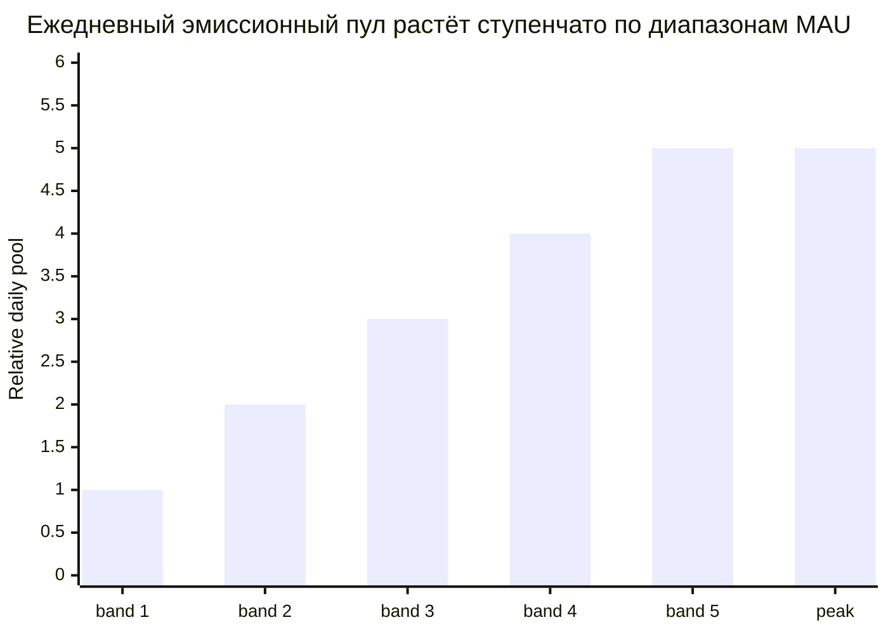

# График эмиссии и разблокировки

## 4.19 Эмиссионная кривая User Rewards

Ежедневный эмиссионный пул растёт ступенчато по диапазонам MAU (от наименьшего раннего диапазона до пикового), так что пул расширяется по мере роста активной пользовательской базы, а не непрерывно. Границы диапазонов MAU и значения ежедневного пула для каждого диапазона калибруются в продакшене и не публикуются.

После пикового диапазона дополнительный рост MAU повышает плотность вклада на пользователя, а не общую эмиссию. Ступенчатая форма позволяет избежать эффекта обрыва, когда активность колеблется вблизи границы диапазона. Бюджет User Rewards (64,35 млрд INT) рассчитан на 15-летний эмиссионный горизонт; ранние диапазоны эмитируют значительно ниже пика, дополнительно продлевая эффективный горизонт.

## 4.20 График разблокировки по рельсам

| Рельс | Механизм разблокировки | Сроки |
|---|---|---|
| **User Rewards (65%)** | Эмиссионная кривая (4.19) → начисление bINT вне блокчейна → еженедельный расчёт → получение из дистрибьютора (4.4) | Непрерывно в течение 15 лет |
| **Liquidity (5%)** | Начальная: полностью разблокирована при TGE. Резерв: управляется сообществом | TGE + управляемый график |
| **Airdrop (5%)** | Периодические маркетинговые распределения на основе участия | Несколько периодов на протяжении лет |
| **Referral (5%)** | Событийная разблокировка за каждое успешное приглашение | Непрерывно |
| **Staking (10%)** | Выпускается в пул стейкинговых вознаграждений после активации стейкинга (4.6) | Более поздняя фаза, в течение 5-летнего горизонта |
| **Proof of Contribution (10%)** | Периодические распределения с оценкой по влиянию и вестингом (4.13) | Многолетний вестинг на получателя |

### Утверждённые параметры разблокировки

- **Liquidity** — 1 000 000 000 INT полностью ликвидны при TGE для начальной ликвидности торговых пар. LP-позиция заблокирована на 12 месяцев. Оставшиеся 3 950 000 000 INT хранятся в резерве.
- **Airdrop** — выпускается в течение нескольких периодов на протяжении лет в качестве маркетинговых распределений на основе участия, а не одним событием. Каждое распределение имеет неожиданное время, но прозрачно доказуемо: набор получателей фиксируется в блокчейне до движения токенов. Каждая доля забирается полностью без вестинг-блокировки, через выделенный дистрибьютор, отдельный от еженедельного расчёта пользовательских вознаграждений. Объём распределений масштабируется с участием и управляется на операционном уровне.
- **Referral** — квалифицирующее приглашение запускает единичную разблокировку; порог квалификации калибруется в продакшене и не публикуется. Временного вестинга нет.

### Элементы дизайн-пространства (параметры будут опубликованы при TGE)

Перечисленные элементы являются частью активной работы над дизайном токена. Здесь описаны формы; конкретные параметры будут опубликованы после финализации.

- **Форма эмиссионной кривой User Rewards.** Ступенчатые диапазоны выше задают ежедневный потолок. Точное переходное поведение между диапазонами и график набора скорости на ранних этапах роста калибруются по наблюдаемым данным о росте пользователей.
- **Периодичность распределения Proof of Contribution.** Привязана к метрикам вклада (объём и качество верифицированных Proof of Expense, позиция в таблице лидеров) на периодических снимках. Длительность клиффа и вестинга определяется политикой и документируется для каждого распределения.
- **График выпуска стейкинговых пулов.** Проектируется совместно с архитектурой реального дохода для согласования долгосрочных держателей с доходами платформы.

## 4.21 Оценка оборотного предложения при TGE

При Token Generation Event оборотное предложение формируется начальной ликвидностью:

| Источник | Объём (INT) | Примечания |
|---|---:|---|
| Начальная ликвидность | 1 000 000 000 | Полностью ликвидна при TGE |
| **Оборотное при TGE** | **~1 000 000 000** | ~1,01% от общего предложения |

Оставшиеся ~98,99% предложения заблокированы в рамках эмиссионных графиков, вестинговых контрактов, стейкинговых пулов, управляемых резервов и многопериодной программы airdrop. Распределения airdrop входят в обращение постепенно в течение лет в качестве маркетинговых событий на основе участия, а не при TGE. Этот низкий начальный флоат отражает проектное предпочтение протокола к постепенному расширению предложения, привязанному к реальному вкладу.
