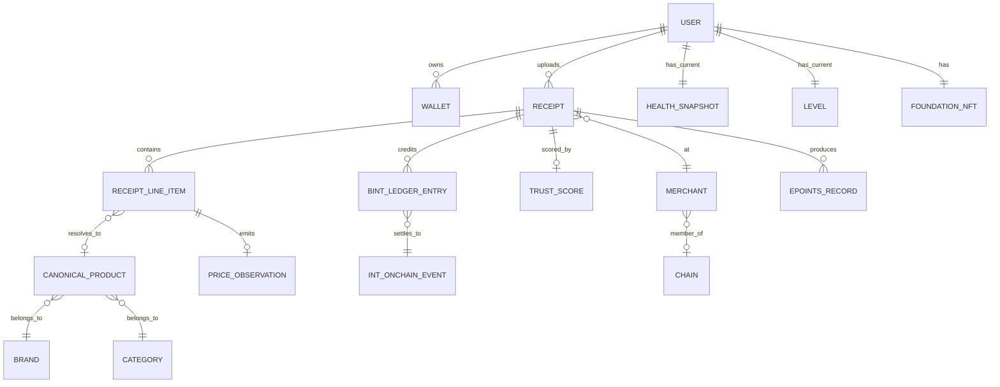

# Основные сущности

## 5.2 Основные сущности

Кардинальности имеют значение: **один чек содержит много строк**, **одна строка разрешается максимум в один канонический продукт** (или ни в один, если попадает в очередь ожидания), **один чек испускает максимум одну оценку доверия** (переоценка возможна, но каждая версия заменяет предыдущую).

---
