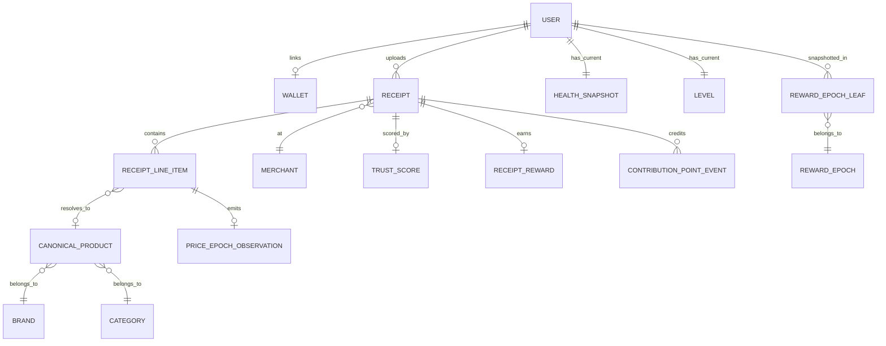

# Основные сущности

## 5.2 Основные сущности

```mermaid
erDiagram
    USER ||--o| WALLET : links
    USER ||--o{ RECEIPT : uploads
    USER ||--|| HEALTH_SNAPSHOT : has_current
    USER ||--|| LEVEL : has_current
    RECEIPT ||--o{ RECEIPT_LINE_ITEM : contains
    RECEIPT }o--|| MERCHANT : at
    RECEIPT_LINE_ITEM }o--o| CANONICAL_PRODUCT : resolves_to
    RECEIPT_LINE_ITEM ||--o| PRICE_EPOCH_OBSERVATION : emits
    RECEIPT ||--o| TRUST_SCORE : scored_by
    RECEIPT ||--o| RECEIPT_REWARD : earns
    RECEIPT ||--o{ CONTRIBUTION_POINT_EVENT : credits
    USER ||--o{ REWARD_EPOCH_LEAF : snapshotted_in
    REWARD_EPOCH_LEAF }o--|| REWARD_EPOCH : belongs_to

    CANONICAL_PRODUCT }o--|| BRAND : belongs_to
    CANONICAL_PRODUCT }o--|| CATEGORY : belongs_to
```

Кардинальности имеют значение: **один чек содержит много строк**, **одна строка разрешается максимум в один канонический продукт** (или ни в один, если попадает в очередь ожидания), **один чек испускает максимум одну оценку доверия** (переоценка возможна, но каждая версия заменяет предыдущую). Учёт вознаграждений проходит через append-only строки `contribution_point_events` и снимки-листья по эпохам (5.7); реестр цен получает строки наблюдений без привязки к личности (5.6).

---
