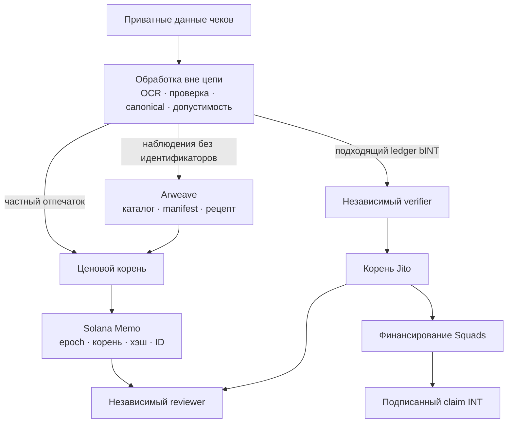
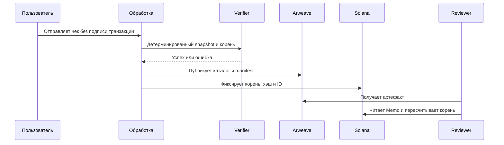

# Web3-инфраструктура: проверяемые публичные данные и программируемый расчёт

## 6.1 Инженерная задача

Yumo Yumo должен сохранять чеки приватными, публиковать цены, проверяемые без API, и финансировать распределение до подписи claim. Размещение всего в цепи раскрыло бы данные, обложило бы обычную обработку комиссиями и затруднило исправления; хранение всего в центральной базе потребовало бы доверять Yumo Yumo как единственному источнику результата.

Публичный путь и путь расчёта встречаются у verifier, а не в изображении чека. Сырые чеки не попадают в Arweave или Solana.

## 6.2 Почему три слоя

| Решение | Причина | Проверяемый результат |
|---|---|---|
| Частная обработка вне цепи | Приватность, исправление, отсутствие wallet и комиссии при загрузке | Детерминированный snapshot до публикации |
| Ценовые артефакты в Arweave | Датасет и метод доступны без инфраструктуры Yumo Yumo | ID, manifest, каталог и рецепт |
| Обязательство в Solana | Связывает версию, корень, хэш и ID публикации | Публичный Memo с порядком во времени |
| INT через distributor | Claim ограничен опубликованным корнем и профинансированным vault | Distributor, funding, claim и clawback |

Solana — слой исполнения и полномочий, Arweave — слой публичных артефактов, база приложения — слой частной обработки.

### Почему Solana и почему Arweave

Выбор начинается с операционных требований, а не с утверждения, что одна сеть подходит любой нагрузке. Yumo Yumo нужен публичный record полного воспроизводимого epoch, путь settlement, по которому wallet проверяет и получает allocation, след одобрения treasury и проверка вне приложения. Эти требования разделяют крупные неизменяемые artefacts и компактные stateful transactions.

| Требование | Solana: роль исполнения | Arweave: роль публикации |
|---|---|---|
| Публичный review | RPC-доступные accounts и transactions показывают commitments, funding, approvals и claims | Content-addressed artefacts содержат catalogue, manifest, specification и proof material |
| Economic settlement | Wallet-directed claims, token accounts, distributor state и multisig approval | Полный epoch доступен для расчёта без переноса catalogue в transaction data |
| Version integrity | Compact commitment связывает epoch ID, root, manifest digest и порядок transaction | Transaction ID определяет byte-версию dataset и verification recipe |
| Independent access | Reviewer выбирает RPC provider | Reviewer выбирает gateway или local mirror |

Solana используется для state transitions: settlement опубликованного allocation, wallet-authorised claim, evidence treasury approval и упорядоченного commitment sealed epoch. On-chain payload содержит roots, digests, identifiers, authority state, funding references и claim state. План использует опубликованные protocol components Solana; конкретные mainnet instances будут зафиксированы в release registry при активации release.

Arweave используется для долговечной публикации полного price catalogue, manifest, правил canonicalisation и материалов для rebuild root. Conventional object storage распространяет те же файлы, но continuity и access policy остаются у account оператора. Content-addressed distribution идентифицирует bytes, а долгосрочная доступность определяется выбранным retention arrangement. Arweave даёт artefact собственный transaction ID для связи с Solana commitment.

Совместное использование даёт cross-check: verifier получает artefact через выбранный Arweave gateway, пересчитывает digest и Merkle root, затем читает Solana transaction или account через выбранный RPC. Оба records должны совпасть по epoch и root. Независимая команда может mirror artefacts, rebuild tree и verify commitment без инфраструктуры Yumo Yumo. Arweave несёт evidence масштаба публикации, Solana — экономические и authority consequences этого evidence.

## 6.3 От чека к проверяемой записи

Manifest публикует товар, магазин, место, дату и цену, но не изображения, IDs чеков, кошельки, аккаунты, OCR или сигналы доверия. Владелец может пересчитать `keccak256("price-receipt:v1|receipt_id|content_hash|wallet")`, применить proof включения и сравнить корень с Memo. Подпись с nonce вне цепи доказывает текущий контроль кошелька. Это доказывает включение, а не завершение платежа банком или магазином.

## 6.4 От проверенного вклада к claim INT

bINT — учётный кредит вне цепи. Подходящие записи проверяются, превращаются в отдельное от ценового дерева Jito SHA-256 дерево и сравниваются с записанными leaves. Затем distributor настраивается и vault финансируется с одобрением Squads.

`подходящий bINT → verifier → корень Jito → профинансированный vault → подписанный claim → перевод INT → clawback`

Приложение не создаёт claims изменением видимого баланса, а пользователь не подписывает отправку чека или начисление bINT.

## 6.5 Доказательства и зрелость

| Поверхность | Доказательство | Статус для раскрытия |
|---|---|---|
| Ценовой реестр | Пересобираемый manifest, спецификация, скрипт, рецепт Memo и открытый verifier | Живой Solana mainnet с артефактами Arweave; публичный индекс https://yumoyumo.com/ledger; независимая проверка https://github.com/Yumo-Yumo-Inc/price-ledger-verifier |
| Дерево Jito | Clean-room TypeScript builder и byte-exact тесты с двумя CLI fixtures | Devnet-репетиция; каждый mainnet distributor требует своего адреса, корня, funding и проверки |
| Казначейство и INT | Runbooks, разделение ролей и gate закрытия mint | Не заявлять активный mainnet до публикации адресов, порога и authority state |

Отрепетированный поток — доказательство реализации, не доказательство существования mainnet instance.

## 6.6 Границы и путь проверки

Reviewer может проверить hash/root manifest, включение отпечатка и согласованность proof, distributor и vault. OCR, matching, fraud и частная допустимость оцениваются по процессным доказательствам. Задержка gateway, RPC outage, несовпадение proof, отклонённый claim и clawback — наблюдаемые состояния; Web3 не заявляет, что предотвращает их.

Публичная проверка ценового реестра начинается с https://yumoyumo.com/ledger: открыть sealed epoch, перейти по Memo (Solana) и артефакту (Arweave), затем выполнить `npx tsx src/verify.ts <epoch>` из https://github.com/Yumo-Yumo-Inc/price-ledger-verifier. Проверка reward-пути использует leaves, Jito account, funding и claims. Форматы и контроли описаны в [Детали протокола и операционные границы](02-protocol-details.md).

---
