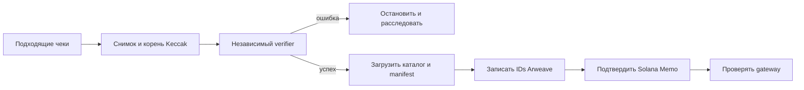
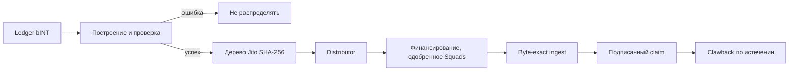

# Детали Web3-протокола и операционные границы

## 6.8 Проектные решения

Система разделяет частную обработку, публичное доказательство и исполнение токенов, поскольку у них различаются стоимость, приватность и возможности исправления.

| Слой | Для чего используется | Для чего не используется |
|---|---|---|
| База приложения | Частная обработка, допустимость и исправление до публикации | Публичный источник запечатанных артефактов |
| Arweave | Публичные ценовые артефакты и материал проверки без Yumo Yumo | Изображения, частные строки и изменяемое операционное состояние |
| Solana | Токен-аккаунты, движения vault под multisig, claims и компактные обязательства | Хранение чеков, OCR или выпуск за каждый чек |

Запись каждого чека в цепь раскрыла бы данные, добавила стоимость и усложнила исправление. Хранение всего доказательства только в базе сделало бы публикацию зависимой от Yumo Yumo. Поэтому ограниченный публичный артефакт публикуется в Arweave, а его точная идентичность фиксируется в Solana.

## 6.9 Реестр release и критерии активации

Этот документ описывает запланированные поверхности интеграции. При активации mainnet release его реестр становится источником данных о конкретной сети, адресах, версиях пакетов, статусе полномочий и доказательствах release. Реестр публикуется вместе с release и содержит адреса, относящиеся к этому развёртыванию.

| Поверхность | Запись, необходимая до активации |
|---|---|
| Расчёты INT | Сеть, адрес INT mint, статус полномочий, авторизованная транзакция выпуска и версия release |
| Распределение наград | Адрес distributor, Merkle root, период claim, получатель clawback, транзакция финансирования и версия спецификации дерева |
| Управление казначейством | Адрес multisig, состав участников, порог одобрения и запись предложения или одобрения |
| Публичное запечатывание цен | Адрес sealer, транзакция Solana, ID манифеста Arweave и ID каталога цен |

Каждая запись также включает версии зависимостей, применимые ссылки на аудит или review, RPC policy и канал сообщений о безопасности. Это даёт проверяющим и пользователям единый версионированный источник для проверки активной конфигурации.

## 6.10 Две системы Merkle

| Свойство | Ценовой реестр | INT distributor |
|---|---|---|
| Цель | Обязательство по публичным наблюдениям и непрозрачным отпечаткам | Авторизация точных claims |
| Хэш | Keccak-256 | SHA-256 |
| Leaf | Хэш опубликованной строки; leaf чека имеет закрытый предобраз | `hashv(claimant, unlocked_u64_le, locked_u64_le)` и domain-separated leaf hash |
| Порядок / нечётный | Сортировка по хэшу; нечётный переносится | Детерминированный вход; пары сортируются; нечётный node дублируется |
| Цель проверки | Хэш и корень Memo | Корень аккаунта distributor и инструкция claim |

Они не взаимозаменяемы: proof цен не может получить INT, а proof distributor не проверяет чек.

## 6.11 Переходы состояний

Подтверждение Memo — необратимая граница. Ошибка verifier позволяет пересборку; принятая Turbo, но ещё не доступная загрузка требует мониторинга; запечатанный epoch исправляется поздней публикацией, а не изменением.

Verifier, настройка корня и финансирование казначейства — разные контроли; никто не должен менять допустимость и единолично финансировать иной distributor.

## 6.12 Воспроизводимость, полномочия и сбои

Для проверки публичного epoch: найти Memo, получить manifest по ID Arweave, сравнить тело с manifest hash, пересчитать leaves и корень, затем сравнить корень с Memo. Каталог проверяется по хэшу из manifest. API и база Yumo Yumo не требуются.

Проверка наград использует записанные leaves, спецификацию Jito, аккаунт distributor, транзакцию финансирования и статус claim. Она доказывает согласованность allocation, корня и vault, но не самостоятельную правильность закрытых входов допустимости.

Полномочия описываются как состояние release, а не обещание. Пока instance mainnet и адреса multisig не опубликованы, документ должен говорить, что они не provisioned. Недоступный gateway, RPC outage, отклонённый claim, несовпадение proof, неудачная проверка и clawback — наблюдаемые состояния. Web3 их не предотвращает, но оставляет доказательства для расследования.

## 6.13 Жизненный цикл epoch и граница публикации

Epoch — это закрытый интервал публикации, а не подвижное представление базы данных. Он задаёт для каждого опубликованного набора стабильную границу входных данных и стабильную цель проверки. Manifest фиксирует идентификатор epoch, время открытия и закрытия, policy включения, версии исходной схемы, canonicalisation и verifier. Поэтому последующая проверка отличает наблюдение, вошедшее до cut-off, от записи, принятой позднее.

Процесс состоит из семи этапов. Сначала строки чеков и ценовые наблюдения поступают в закрытую очередь, где выполняются validation, deduplication, сопоставление merchant, нормализация единиц и решение о допустимости. Затем builder выбирает записи, соответствующие опубликованному cut-off и policy. Далее он создаёт неизменяемый snapshot: каждое публичное наблюдение сериализуется в определённом порядке полей и encoding, а каждый допустимый чек представлен сохраняющим приватность fingerprint вместо изображения или исходного содержания. Независимый verifier перестраивает snapshot из той же зафиксированной входной выборки и сопоставляет количество записей, byte digests, количество leaves, roots и поля manifest.

Совпадающий результат открывает путь к публикации. Builder формирует ценовой catalogue, набор fingerprints чеков при необходимости, manifest и материал inclusion proof. Manifest перечисляет файлы, SHA-256 digests, алгоритмы Merkle, значения roots, границы epoch, версии ПО и specification. Артефакты загружаются в Arweave. После того как ожидаемые bytes возвращаются более чем через один gateway, компактный Solana commitment связывает идентификатор epoch, digest manifest, root и версию формата. Эти идентификаторы образуют release evidence конкретного epoch.

Завершающий этап — мониторинг и исправления. Чтение через gateway, проверки digest, validation proof и результаты claim наблюдаются как отдельные сигналы. Исправление создаёт successor epoch или отдельную correction record со ссылкой на затронутый epoch; ранний artefact остаётся доступным для сравнения. Так изменение цены, исправление ingestion или revision policy становится проверяемым событием, а не скрытой заменой истории.

## 6.14 Merkle-структуры, локальная проверка и приватный чек

Деревья имеют разные границы безопасности, поэтому их форматы versioned отдельно. Публичное ценовое дерево фиксирует записи, воспроизводимые третьей стороной. Каждый публичный leaf начинается с domain label и продолжается canonical byte representation наблюдения. Эта representation задаёт перечень полей, UTF-8, формат даты, decimal scale, currency code, идентификаторы merchant и location, а также правило новой строки. Manifest фиксирует порядок leaves, правило pair hash, обработку нечётного leaf, encoding root и точную версию tree specification.

В пути fingerprint чека присутствует закрытый preimage. Владелец хранит локально значения для его пересчёта и может получить либо построить inclusion proof, не публикуя изображение чека, банковские данные, account или связь с wallet. Proof содержит sibling hashes, позиции left/right, идентификатор epoch и версию specification. Начиная с локально вычисленного leaf, владелец объединяет sibling в опубликованном порядке и сравнивает итоговый root с root из manifest и Solana commitment. Это показывает включение в конкретный sealed epoch и сохраняет содержание чека за пределами публичного catalogue.

INT distribution tree — отдельная структура авторизации claims. Leaf кодирует public key claimant и значения unlocked и locked allocation с документированными byte order и domain separator. Distribution manifest фиксирует allocation epoch, root, время открытия и закрытия claim, funding transaction и адресат clawback. Claimant проверяет leaf и proof локально, затем отправляет claim instruction из собственной wallet. Состояние distributor отражает результат claim; проверка наличия allocation под опубликованным root доступна без application session.

## 6.15 Методы для независимых разработчиков и доказательство расхода

Публичный путь проверки строится на artefacts и провайдерах, выбранных проверяющим. Пользователь, исследователь или разработчик начинает с epoch index либо известного Arweave manifest ID, получает manifest через выбранный gateway и сверяет его digest с Solana commitment. Затем он загружает названный catalogue, считает file digests локально, перестраивает дерево и сравнивает root. Для собственного чека preimage передаётся только локальному verifier, а sibling path используется для проверки inclusion. Wallet запрашивает claim state через Solana RPC endpoint, выбранный пользователем.

| Метод | Вход | Результат | Независимая проверка |
|---|---|---|---|
| `getEpoch(epoch_id)` | Идентификатор epoch | Manifest ID, root, формат и время | Digest manifest против commitment |
| `getCatalogue(manifest_id)` | Manifest ID | Byte-exact публичный catalogue | File digest против manifest |
| `buildPriceRoot(catalogue, spec)` | Bytes catalogue и specification | Число leaves и price root | Root против manifest |
| `proveReceipt(receipt_preimage, epoch_id)` | Локальный preimage и epoch | Leaf и sibling path | Folded path против receipt root |
| `getDistribution(epoch_id)` | Allocation epoch | Root, окно claim и funding | Запись против release evidence |
| `verifyAllocation(wallet, allocation, proof)` | Wallet, суммы и proof | Локальный результат | Root против distribution record |

Reference implementation делает сетевой доступ заменяемым: доступен любой Arweave gateway, локальное зеркало artefacts и любой Solana RPC provider. Verifier сообщает источник gateway/RPC, время получения, ожидаемые и наблюдаемые digests, версию specification и каждое неуспешное сравнение. Этого вывода достаточно, чтобы другой разработчик воспроизвёл проверку.

Proof of expense имеет ограниченный и проверяемый смысл. Публичный слой показывает, что approved observation или fingerprint чека входил в sealed epoch и что набор artefacts остаётся byte-identifiable. Закрытый слой хранит информацию, с которой соответствующий пользователь пересчитывает собственный fingerprint. Для grant committee проверка сводится к конкретным вопросам: какой epoch опубликован, какая specification его создала, какой artefact содержит bytes, какой commitment его идентифицирует, какое authority одобрило движение treasury и какие root и funding transaction делают claims исполнимыми. Release registry и manifests epoch дают эти ответы после активации mainnet release.

---
