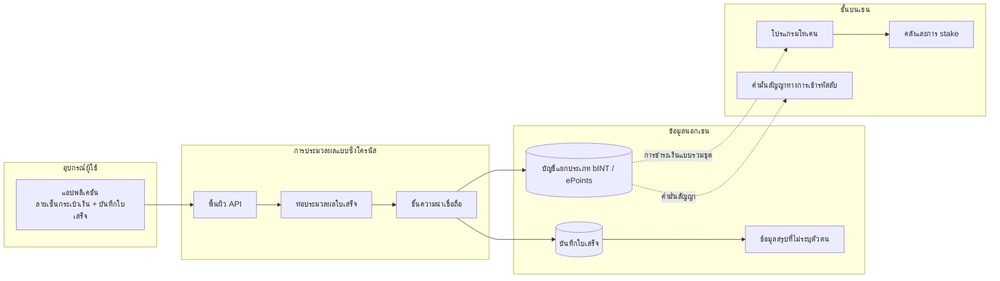

# แผนผังระบบระดับสูง

## 1.1 แผนผังระบบระดับสูง

แผนผังนี้แสดงขอบเขตสถาปัตยกรรมสาธารณะ ตัวอย่างที่มุ่งสู่ผู้ใช้เป็นแบบซิงโครนัส การบัญชี bINT และ ePoints เขียนลงในบัญชีแยกประเภทก่อน จากนั้นจึงชำระเงินเป็นชุดสู่ชั้นบนเชนโดย settlement workers แผนภาพเน้นที่องค์ประกอบโปรโตคอลและการเคลื่อนย้ายข้อมูล
