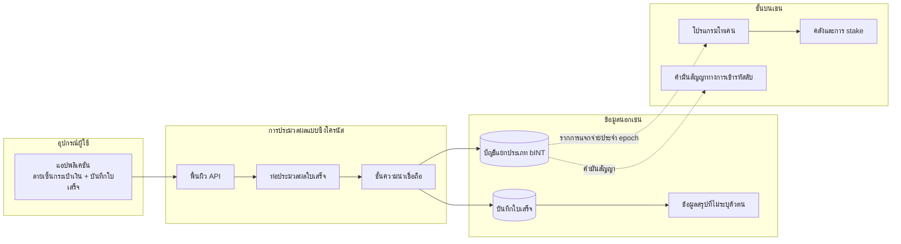

# แผนผังระบบระดับสูง

## 1.1 แผนผังระบบระดับสูง

```mermaid
flowchart LR
    subgraph Client["อุปกรณ์ผู้ใช้"]
        A["แอปพลิเคชัน<br/>ลายเซ็นกระเป๋าเงิน + บันทึกใบเสร็จ"]
    end

    subgraph Processing["การประมวลผลแบบซิงโครนัส"]
        B["พื้นผิว API"]
        C["ท่อประมวลผลใบเสร็จ"]
        D["ชั้นความน่าเชื่อถือ"]
    end

    subgraph Data["ข้อมูลนอกเชน"]
        E[("บันทึกใบเสร็จ")]
        F[("บัญชีแยกประเภท bINT")]
        G["ข้อมูลสรุปที่ไม่ระบุตัวตน"]
    end

    subgraph Chain["ชั้นบนเชน"]
        H["โปรแกรมโทเคน"]
        I["คลังและการ stake"]
        J["คำมั่นสัญญาทางการเข้ารหัสลับ"]
    end

    A --> B --> C --> D
    D --> E
    D --> F
    E --> G
    F -. "รากการแจกจ่ายประจำ epoch" .-> H
    F -. "คำมั่นสัญญา" .-> J
    H --> I
```

แผนผังนี้แสดงขอบเขตสถาปัตยกรรมสาธารณะ: ตัวอย่างผลลัพธ์ที่แสดงต่อผู้ใช้เป็นแบบซิงโครนัส ขณะที่การบัญชี bINT ยังคงอยู่นอกเชน settlement workers จะบันทึกรากการแจกจ่าย INT ที่คำนวณจากเครดิต bINT ที่มีสิทธิ์ลงบนชั้นบนเชน แผนภาพเน้นที่องค์ประกอบโปรโตคอลและการเคลื่อนย้ายข้อมูล
