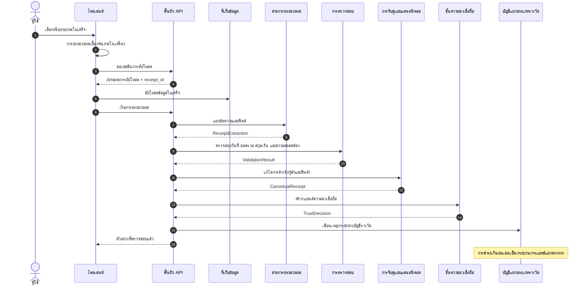

# 02 — ระบบไพพ์ไลน์ประมวลผลใบเสร็จ

ระบบไพพ์ไลน์ประมวลผลใบเสร็จแปลงภาพใบเสร็จหรือใบแจ้งหนี้ PDF ที่ผู้ใช้ส่งเข้ามาให้เป็นบันทึกใบเสร็จในรูปแบบโครงสร้าง สัญญาสาธารณะคือลำดับขั้นตอนและประเภทข้อมูลเข้า/ข้อมูลออกของแต่ละขั้นตอน การเลือกผู้ให้บริการ รายละเอียดของพรอมป์ ค่าเกณฑ์ และกฎการสำรองยังคงอยู่ในเอกสารปฏิบัติการ

ไพพ์ไลน์แยกผลลัพธ์ออกเป็นสองส่วน คือ ตัวอย่างที่ตรวจสอบแล้วซึ่งแสดงให้ผู้ใช้เห็น และเหตุการณ์ทางบัญชีที่เขียนลงในบัญชีแยกประเภทรางวัล สิ่งนี้ทำให้ประสบการณ์ของผู้ใช้เป็นอิสระจากการชำระเงินบนเชน

## 2.1 เป้าหมายการออกแบบ

| เป้าหมาย | ผลกระทบทางเทคนิค |
|---|---|
| ความหน่วงต่ำ | ตัวอย่างที่แสดงต่อผู้ใช้ถูกสร้างขึ้นในขั้นตอนการประมวลผลแบบซิงโครนัส |
| การส่งมอบแบบมีชนิดข้อมูลระหว่างขั้นตอน | แต่ละขั้นตอนส่งออกข้อมูลที่ผูกกับสคีมาไปยังขั้นตอนถัดไป |
| ความสามารถในการรันใหม่ | ผลลัพธ์ของแต่ละขั้นตอนถูกบันทึกเป็นเหตุการณ์ งานที่ล้มเหลวสามารถลองใหม่ด้วยข้อมูลเข้าเดิมได้ |
| การแยกตามคุณภาพ | ใบเสร็จที่มีความน่าเชื่อถือต่ำสามารถแยกออกจากบัญชีรางวัลหรือส่งไปตรวจสอบได้ |
| ความเป็นส่วนตัว | เนื้อหาใบเสร็จดิบถูกประมวลผลในชั้นข้อมูลนอกเชน ผลิตภัณฑ์ข้อมูลสืบเนื่องมาจากชั้นข้อมูลที่ไม่ระบุตัวตน |

## 2.2 ภาพรวมไพพ์ไลน์

แต่ละขั้นตอนเชื่อมต่อกันผ่านเหตุการณ์ที่มีชนิดข้อมูล แทนที่จะใช้สถานะที่เปลี่ยนแปลงร่วมกัน ซึ่งทำให้สามารถสังเกตกระบวนการและประมวลผลย้อนหลังได้
