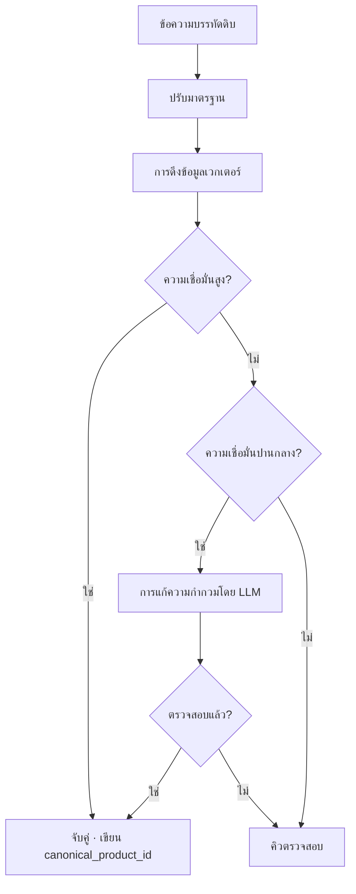

# ขั้นตอนที่ 4 — แคนอนิคอล

## 2.7 ขั้นตอนที่ 4 — การจับคู่สินค้าแบบแคนอนิคอล

ขั้นตอนนี้รวบรวมรูปแบบผิวเผินที่แตกต่างกันของสินค้าเดียวกันให้เป็นตัวระบุแคนอนิคอลเดียว ตัวอย่างเช่น:

- `COCA COLA 330ML KUTU`
- `C.COLA 33CL TENEKE`
- `COCA-COLA 0.33 L`
- `COKA 330 ML`

ทั้งสี่รายการแก้ไขไปยัง `canonical_product_id` เดียวกัน การแก้ไขนี้เป็นข้อกำหนดเบื้องต้นสำหรับความจำราคาและผลิตภัณฑ์ข้อมูล B2B

### วิธีการ

การแก้ไขแบบแคนอนิคอลเป็นตัวแก้ไขแบบหลายขั้นตอนที่อิงตาม embedding พร้อมการแก้ความกำกวมตามระดับความเชื่อมั่น และคิวตรวจสอบโดยมนุษย์สำหรับกรณีที่กำกวม



ค่าเกณฑ์ความคล้ายคลึงที่แน่นอน โมเดล embedding และพรอมป์การแก้ความกำกวมถูกจัดการในชั้นปฏิบัติการภายใน

รายการบรรทัดที่ไม่สามารถแก้ไขได้จะถูกบันทึกด้วยการอ้างอิงแคนอนิคอลเป็น null bINT สำหรับบรรทัดนั้นจะถูกคำนวณหลังจากการแคนอนิคอลในคิวเสร็จสมบูรณ์

### โครงสร้างการจัดหมวดหมู่

```
category > subcategory > brand > product > variant
```

ตัวอย่าง:

```
Beverages > Carbonated Soft Drinks > Coca-Cola > Coca-Cola Classic > 330 ml can
```

แต่ละสินค้าแคนอนิคอลมีแอตทริบิวต์ที่ปรับมาตรฐานแล้ว: `size_value`, `size_unit`, `package_type`, `brand_id`, `is_private_label`, `barcode_gtin` (เมื่อมี)

### การเริ่มต้นเย็น

ดัชนีแคนอนิคอลถูกบูตสตรัพจากชุดข้อมูลสินค้าเปิด การเป็นพันธมิตรแคตตาล็อกที่ได้รับอนุญาต และการอัปโหลดของผู้ใช้จากเบต้าปิด ดัชนีเติบโตอย่างเป็นธรรมชาติเมื่อคิวแคนอนิคอลถูกเคลียร์

### คิวรอการแคนอนิคอล

รายการบรรทัดที่กำกวมเข้าสู่คิวตรวจสอบ ผู้ตรวจสอบ (เริ่มต้นจากทีม Yumo Yumo ต่อมาเป็นชุมชนที่ได้รับ PoC) จะสร้างสินค้าแคนอนิคอลใหม่ หรือจับคู่ข้อความดิบกับสินค้าที่มีอยู่ คิวนี้เป็นคันโยกต้นทุนหลักของไพพ์ไลน์เมื่อขยายขนาด — 08 ระบุว่าเป็นความเสี่ยงปฏิบัติการหลัก

---
