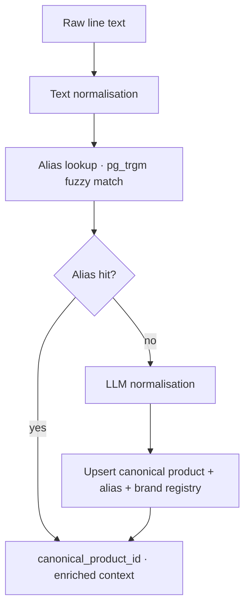

# ขั้นตอนที่ 4 — แคนอนิคอล

## 2.7 ขั้นตอนที่ 4 — การจับคู่สินค้าแบบแคนอนิคอล

ขั้นตอนนี้รวบรวมรูปแบบผิวเผินที่แตกต่างกันของสินค้าเดียวกันให้เป็นตัวระบุแคนอนิคอลเดียว ตัวอย่างเช่น:

- `COCA COLA 330ML KUTU`
- `C.COLA 33CL TENEKE`
- `COCA-COLA 0.33 L`
- `COKA 330 ML`

ทั้งสี่รายการแก้ไขไปยัง `canonical_product_id` เดียวกัน การแก้ไขนี้เป็นข้อกำหนดเบื้องต้นสำหรับความจำราคาและผลิตภัณฑ์ข้อมูล B2B

### วิธีการ

การแก้ไขแบบแคนอนิคอลทำงาน**แบบอะซิงโครนัส**ใน worker ประมวลผลภายหลังที่รันเบื้องหลัง หลังจากที่โฟลว์ซิงโครนัสส่งตัวอย่างที่ตรวจสอบแล้วคืนให้ผู้ใช้ไปแล้ว การจัดการเช่นนี้ทำให้การจับคู่สินค้าไม่อยู่บนเส้นทางที่ไวต่อความหน่วง: ผู้ใช้เห็นใบเสร็จของตนทันที ขณะที่ตัวระบุแคนอนิคอลถูกผูกเข้ากับบันทึกในอีกชั่วครู่ถัดมา

ตัวแก้ไขทำงานบนตารางนามแฝง (alias) ที่จับคู่ข้อความบรรทัดใบเสร็จดิบกับสินค้าแคนอนิคอล:


```mermaid
flowchart TD
    A[Raw line text] --> B[Text normalisation]
    B --> C[Alias lookup · pg_trgm fuzzy match]
    C --> D{Alias hit?}
    D -- yes --> E[canonical_product_id · enriched context]
    D -- no --> F[LLM normalisation]
    F --> G[Upsert canonical product + alias + brand registry]
    G --> E
```

- **การค้นหานามแฝงแบบ fuzzy** — ข้อความบรรทัดที่ปรับมาตรฐานแล้วถูกจับคู่กับนามแฝงใบเสร็จที่เคยเรียนรู้ไว้โดยใช้ความคล้ายคลึงแบบ trigram ของ PostgreSQL (`pg_trgm`) เมื่อพบ นามแฝงจะแก้ไขตรงไปยังสินค้าแคนอนิคอล นามแฝงที่เรียนรู้จากผู้ค้าหนึ่งจะถูกนำมาใช้ซ้ำข้ามผู้ค้าเฉพาะเมื่อข้อความอ่านได้เป็นชื่อสินค้าจริง ไม่ใช่ตัวย่อเฉพาะร้าน ซึ่งป้องกันไม่ให้สินค้าคนละชนิดถูกรวมเข้าใต้แคนอนิคอลเดียว
- **LLM สำรอง** — เมื่อไม่พบ โมเดลภาษาจะปรับข้อความดิบให้เป็นแอตทริบิวต์แบรนด์ สินค้า และขนาด ผลลัพธ์ถูก upsert เป็นสินค้าแคนอนิคอลใหม่ (หรือจับคู่กับสินค้าที่มีอยู่) พร้อมกับแถวนามแฝงใหม่ ทำให้รูปแบบผิวเผินเดิมแก้ไขได้โดยไม่ต้องเรียกโมเดลในครั้งถัดไป

การตั้งค่าความคล้ายคลึงและพรอมป์การปรับมาตรฐานถูกจัดการในชั้นปฏิบัติการภายใน

รายการบรรทัดที่ยังแก้ไขไม่ได้จะถูกบันทึกด้วยการอ้างอิงแคนอนิคอลเป็น null การแก้ไขสามารถเสร็จสมบูรณ์ในรอบถัดไปเมื่อตารางนามแฝงเติบโตขึ้น

### โครงสร้างการจัดหมวดหมู่

```
category > subcategory > brand > product > variant
```

ตัวอย่าง:

```
Beverages > Carbonated Soft Drinks > Coca-Cola > Coca-Cola Classic > 330 ml can
```

แต่ละสินค้าแคนอนิคอลมีแอตทริบิวต์ที่ปรับมาตรฐานแล้ว: `size_value`, `size_unit`, `package_type`, `brand_id`, `is_private_label`, `barcode_gtin` (เมื่อมี)

### แบบจำลองการเติบโต

ดัชนีแคนอนิคอลเติบโตจากปริมาณใบเสร็จเอง: ทุกบรรทัดที่ LLM ปรับมาตรฐานจะเพิ่มสินค้าแคนอนิคอลหนึ่งรายการและนามแฝงหนึ่งรายการ และการปรากฏซ้ำของรูปแบบผิวเผินนั้นในภายหลังจะแก้ไขจากตารางนามแฝงโดยไม่มีต้นทุนโมเดล รายการที่กำกวมหรือคุณภาพต่ำถูกตรวจทานผ่านเครื่องมือแคตตาล็อกของผู้ดูแลระบบ
