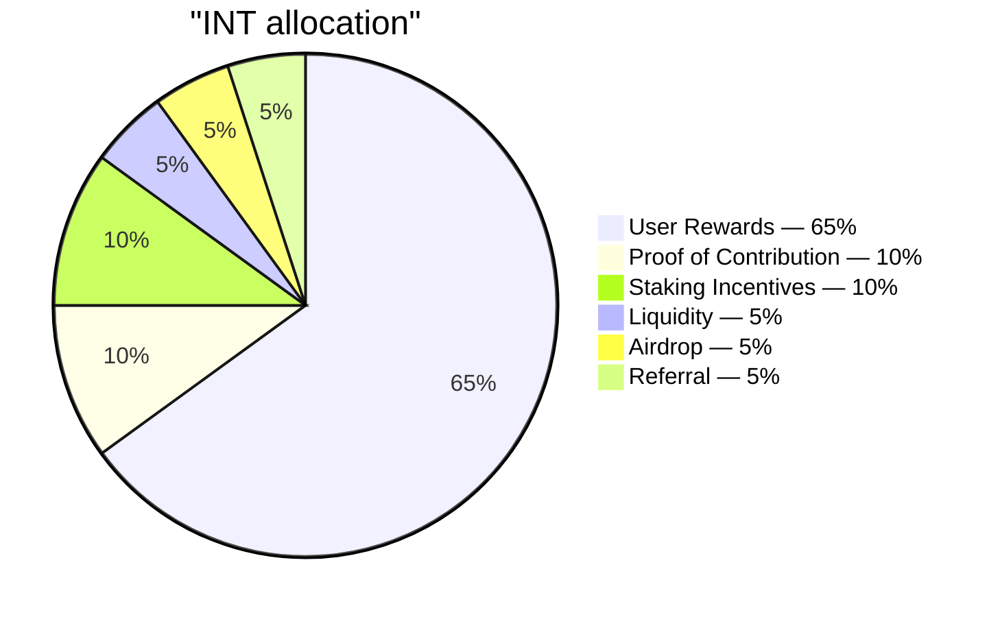

# อุปทานและการจัดสรร

## 4.16 อุปทานรวม

| พารามิเตอร์ | ค่า |
|---|---|
| โทเค็น | INT |
| มาตรฐาน | SPL (Solana) |
| ทศนิยม | 6 |
| อุปทานรวม | 99,000,000,000 |
| การ mint เพิ่มหลัง genesis | ไม่มี — ปิดอำนาจ mint แล้ว |

INT ทั้งหมด 99 พันล้านถูก mint ครั้งเดียว ณ genesis เข้าสู่คลังสำรอง จากนั้นปิดอำนาจ mint จะไม่สามารถสร้าง INT เพิ่มได้อีก การแจกจ่ายเป็นการโอนจากคลังสำรองผ่านตัวกระจาย (distributor) ที่ผ่านการตรวจสอบ (4.15) ไม่ใช่การ mint ใหม่

## 4.17 ตารางการจัดสรร

| ราง | สัดส่วน | จำนวนโทเค็น | วัตถุประสงค์ |
|---|---:|---:|---|
| User Rewards | 65% | 64,350,000,000 | แรงจูงใจหลักสำหรับการมีส่วนร่วม Proof of Expense ที่ได้รับการยืนยัน |
| Proof of Contribution | 10% | 9,900,000,000 | การกระจายตามน้ำหนักผลกระทบแก่ทีมหลัก ผู้รับเหมา และผู้มีส่วนร่วมภายนอก (4.11) |
| Staking Incentives | 10% | 9,900,000,000 | รางวัลสำหรับผู้ถือครองระยะยาวที่ล็อก INT (4.6) |
| Liquidity | 5% | 4,950,000,000 | เพาะตลาดบนบล็อกเชนเมื่อ TGE; สำรองสำหรับการเพิ่มสภาพคล่องภายใต้การกำกับของชุมชน |
| Airdrop | 5% | 4,950,000,000 | การกระจายเชิงการตลาดตามการมีส่วนร่วมตลอดหลายช่วงเวลา |
| Referral | 5% | 4,950,000,000 | ปลดล็อกตามเหตุการณ์เมื่อผู้ถูกเชิญบรรลุเป้าหมายการยืนยันตัวตน |
| **รวม** | **100%** | **99,000,000,000** | |

รางทั้งหกคิดเป็นร้อยเปอร์เซ็นต์ของอุปทาน ไม่มีการจัดสรรให้ทีมแยกต่างหากนอกเหนือจากแผนผังนี้ ทีมผู้ก่อตั้งและผู้มีส่วนร่วมทั้งหมดได้รับผ่านราง Proof of Contribution (4.11) ภายใต้ตรรกะถ่วงน้ำหนักตามผลกระทบเดียวกันที่ใช้กับผู้เข้าร่วมภายนอก

## 4.18 ความรับผิดชอบของแต่ละราง

- **User Rewards** — กระแสขาออกหลักของโปรโตคอล ถูกกำกับโดยเส้นโค้งการปล่อย (4.19) และวัดด้วยเพดานรายวัน (4.22) งบประมาณ: 64.35 พันล้าน INT ตลอดขอบเขตการปล่อย 15 ปี
- **Proof of Contribution** — การกระจายเป็นรอบตามการให้คะแนนเกณฑ์พร้อมการ vesting (4.13) ทำให้แรงจูงใจของทีมสอดคล้องกับผลงานที่วัดได้
- **Staking Incentives** — ปล่อยตลอดขอบเขต 5 ปี การสะสมแบบถ่วงน้ำหนักตามระดับอธิบายไว้ใน 4.6
- **Liquidity** — INT 1 พันล้านเพาะ TGE ผ่านพูลบูตสแตรปสภาพคล่อง (LP ล็อก 12 เดือน) INT 3.95 พันล้านถือเป็นสำรองสำหรับการใช้งานภายใต้การกำกับของชุมชน
- **Airdrop** — กระจายตลอดหลายช่วงเวลาข้ามปี (ไม่ใช่ทั้งหมดในครั้งเดียว) ในฐานะการกระจายเชิงการตลาดตามการมีส่วนร่วม การกระจายแต่ละครั้งกำหนดเวลาแบบเซอร์ไพรส์แต่พิสูจน์ได้อย่างโปร่งใส: ชุดผู้รับถูกยืนยัน (commit) บนบล็อกเชนก่อนที่โทเค็นจะเคลื่อนย้าย ขนาดของการกระจายถูกกำกับในชั้นดำเนินงาน
- **Referral** — ตามเหตุการณ์: การเชิญที่สำเร็จจะปลดล็อกหน่วยให้ผู้เชิญเมื่อผู้ถูกเชิญข้ามเกณฑ์การมีส่วนร่วมที่มีนัยสำคัญ เงื่อนไขเกณฑ์ถูกปรับเทียบในระบบผลิตและไม่เผยแพร่
