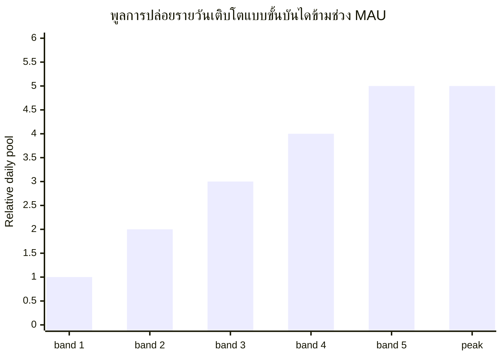

# กำหนดการปล่อยและการปลดล็อก

## 4.19 เส้นโค้งการปล่อย User Rewards

ราง User Rewards (64.35 พันล้าน INT) ถูกปล่อยตลอดขอบเขต 15 ปี การปล่อยรายวันถูกวัดด้วยฟังก์ชันแบบขั้นบันไดที่ปรับตามจำนวนผู้ใช้งานต่อเดือน (MAU)

พูลการปล่อยรายวันเติบโตแบบขั้นบันไดข้ามช่วง MAU (จากช่วงระยะเริ่มต้นที่เล็กที่สุดไปจนถึงช่วงสูงสุด) ดังนั้นพูลจึงขยายตัวตามการเติบโตของฐานผู้ใช้งานจริงแทนที่จะเพิ่มอย่างต่อเนื่อง ขอบเขตของช่วง MAU และค่าพูลรายวันต่อช่วงถูกปรับเทียบในระบบผลิตและไม่เผยแพร่

หลังจากช่วงสูงสุดแล้ว การเติบโตของ MAU ที่เพิ่มขึ้นจะเพิ่มความหนาแน่นของการมีส่วนร่วมต่อผู้ใช้แทนที่จะเพิ่มปริมาณการปล่อยรวม รูปร่างแบบขั้นบันไดช่วยหลีกเลี่ยงผลกระทบแบบหน้าผาเมื่อกิจกรรมแกว่งอยู่ใกล้เกณฑ์ของช่วง งบประมาณ User Rewards (64.35 พันล้าน INT) ถูกกำหนดขนาดสำหรับขอบเขตการปล่อย 15 ปี ช่วงระยะเริ่มต้นปล่อยต่ำกว่าจุดสูงสุดอย่างมาก ทำให้ขอบเขตที่แท้จริงขยายออกไปอีก

## 4.20 กำหนดการปลดล็อกแยกตามราง

| ราง | กลไกการปลดล็อก | ช่วงเวลา |
|---|---|---|
| **User Rewards (65%)** | เส้นโค้งการปล่อย (4.19) → การสะสม bINT นอกบล็อกเชน → การชำระรายสัปดาห์ → เคลมจากตัวกระจาย (4.4) | ต่อเนื่อง 15 ปี |
| **Liquidity (5%)** | เริ่มต้น: ปลดล็อกทั้งหมดเมื่อ TGE สำรอง: ภายใต้การกำกับของชุมชน | TGE + กำหนดการที่ชุมชนกำกับ |
| **Airdrop (5%)** | การกระจายเชิงการตลาดตามการมีส่วนร่วมเป็นระยะ | หลายช่วงเวลาข้ามปี |
| **Referral (5%)** | ตามเหตุการณ์ต่อการเชิญที่สำเร็จ | ต่อเนื่อง |
| **Staking (10%)** | ปล่อยเข้าพูลรางวัล staking เมื่อ staking เปิดใช้งาน (4.6) | ระยะถัดไป ตลอดขอบเขต 5 ปี |
| **Proof of Contribution (10%)** | การกระจายตามคะแนนผลกระทบเป็นรอบพร้อมการ vesting (4.13) | vesting หลายปีต่อผู้รับ |

### พารามิเตอร์การปลดล็อกที่กำหนดแล้ว

- **Liquidity** — INT 1,000,000,000 สภาพคล่องเต็มที่เมื่อ TGE เพื่อเพาะคู่ซื้อขาย ตำแหน่ง LP ล็อก 12 เดือน INT 3,950,000,000 ที่เหลือถือเป็นสำรอง
- **Airdrop** — ปล่อยตลอดหลายช่วงเวลาข้ามปี ในฐานะการกระจายเชิงการตลาดตามการมีส่วนร่วม ไม่ใช่ในเหตุการณ์เดียว การกระจายแต่ละครั้งกำหนดเวลาแบบเซอร์ไพรส์แต่พิสูจน์ได้อย่างโปร่งใส: ชุดผู้รับถูกยืนยัน (commit) บนบล็อกเชนก่อนที่โทเค็นจะเคลื่อนย้าย แต่ละส่วนถูกเคลมเต็มจำนวนโดยไม่มีการล็อก vesting ผ่านตัวกระจายเฉพาะที่แยกจากการชำระรางวัลผู้ใช้รายสัปดาห์ ขนาดของการกระจายปรับตามการมีส่วนร่วมและถูกกำกับในชั้นดำเนินงาน
- **Referral** — การเชิญที่ผ่านเกณฑ์จะปลดล็อกหน่วย เกณฑ์การผ่านถูกปรับเทียบในระบบผลิตและไม่เผยแพร่ ไม่มี vesting ตามระยะเวลา

### รายการที่อยู่ในขั้นตอนการออกแบบ (พารามิเตอร์จะเผยแพร่เมื่อ TGE)

รายการต่อไปนี้เป็นส่วนหนึ่งของงานออกแบบโทเค็นที่ดำเนินอยู่ รูปร่างอธิบายไว้ที่นี่ พารามิเตอร์เฉพาะจะเผยแพร่เมื่อสรุปเสร็จสิ้น

- **รูปร่างเส้นโค้งการปล่อย User Rewards** ช่วงแบบขั้นบันไดข้างต้นกำหนดเพดานรายวัน พฤติกรรมการเปลี่ยนผ่านระหว่างช่วงและกำหนดการเร่งในช่วงเติบโตเริ่มต้นถูกปรับเทียบตามข้อมูลการเติบโตของผู้ใช้ที่สังเกตได้
- **รอบการกระจาย Proof of Contribution** ผูกกับตัวชี้วัดการมีส่วนร่วม (ปริมาณและคุณภาพของ Proof of Expense ที่ยืนยันแล้ว ตำแหน่งในกระดานผู้นำ) ณ การสุ่มตัวอย่าง (snapshot) เป็นรอบ ระยะเวลา cliff และ vesting เป็นนโยบายและจัดทำเอกสารตามแต่ละรอบการกระจาย
- **กำหนดการปล่อยพูล Staking** ออกแบบควบคู่กับสถาปัตยกรรม real-yield เพื่อให้ผู้ถือครองระยะยาวสอดคล้องกับรายได้ของแพลตฟอร์ม

## 4.21 ประมาณการอุปทานหมุนเวียนเมื่อ TGE

ณ เหตุการณ์การสร้างโทเค็น (Token Generation Event) อุปทานหมุนเวียนมาจากสภาพคล่องเริ่มต้น:

| แหล่ง | จำนวน (INT) | หมายเหตุ |
|---|---:|---|
| สภาพคล่องเริ่มต้น | 1,000,000,000 | สภาพคล่องเต็มที่เมื่อ TGE |
| **TGE หมุนเวียน** | **~1,000,000,000** | ~1.01% ของอุปทานรวม |

อุปทานที่เหลือ ~98.99% ถูกล็อกตามกำหนดการปล่อย สัญญา vesting พูล staking สำรองภายใต้การกำกับ และโปรแกรม airdrop หลายช่วงเวลา การกระจาย airdrop เข้าสู่การหมุนเวียนอย่างค่อยเป็นค่อยไปตลอดหลายปีในฐานะกิจกรรมการตลาดตามการมีส่วนร่วม ไม่ใช่ที่ TGE สัดส่วนที่ลอยตัวต่ำในช่วงแรกนี้สะท้อนความตั้งใจในการออกแบบของโปรโตคอลที่ต้องการการขยายอุปทานอย่างค่อยเป็นค่อยไปโดยผูกกับการมีส่วนร่วมจริง
