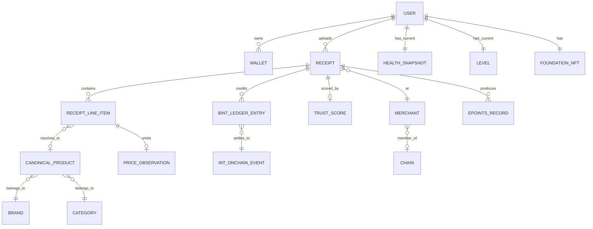

# เอนทิตีหลัก

## 5.2 เอนทิตีหลัก

จำนวนเชิงการ์ดินัลมีความสำคัญ: **หนึ่งใบเสร็จมีหลายรายการ** **หนึ่งรายการแก้ไขได้มากที่สุดหนึ่งสินค้ามาตรฐาน** (หรือไม่มีหากตกอยู่ในคิวที่รอดำเนินการ) **หนึ่งใบเสร็จส่งออกมากที่สุดหนึ่งคะแนนความน่าเชื่อถือ** (สามารถให้คะแนนใหม่ได้ แต่แต่ละเวอร์ชันจะแทนที่เวอร์ชันก่อนหน้า)

---
