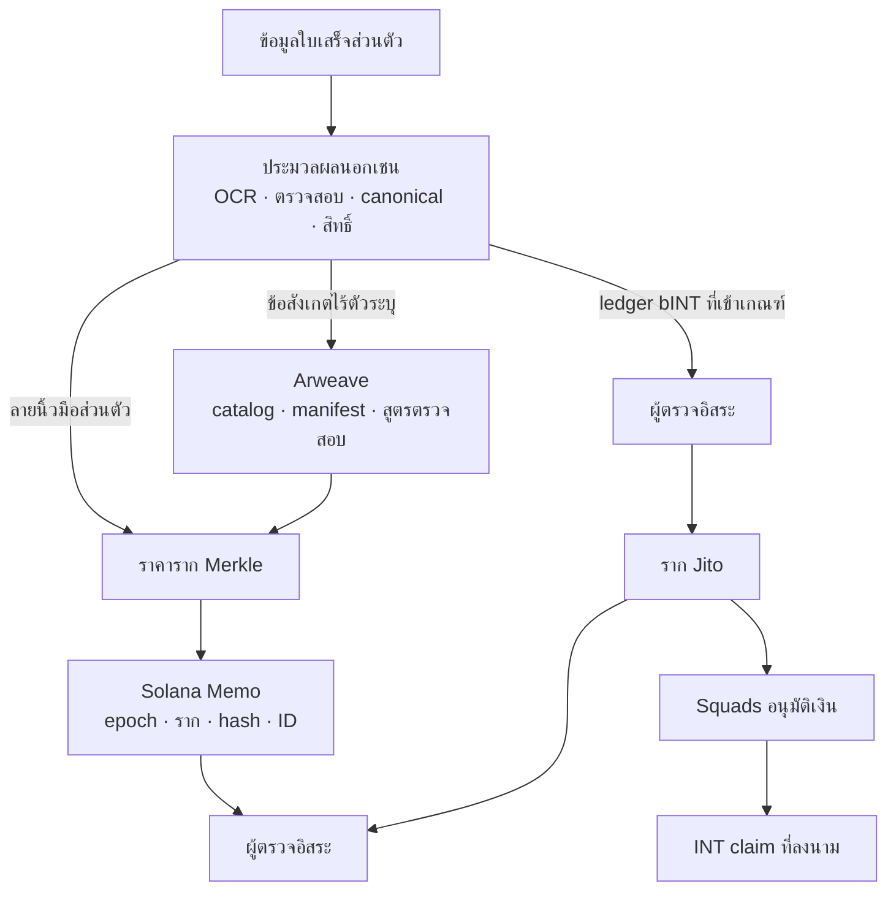

# โครงสร้างพื้นฐาน Web3: ข้อมูลสาธารณะที่ตรวจสอบได้และ settlement ที่ตั้งโปรแกรมได้

## 6.1 ปัญหาทางวิศวกรรม

Yumo Yumo ต้องเก็บใบเสร็จให้เป็นส่วนตัว เปิดเผยราคาที่ตรวจสอบได้โดยไม่ต้องใช้ API และเติมเงินการจัดสรรก่อนขอให้ผู้ใช้ลงนาม claim การนำทุกอย่างขึ้นเชนจะเปิดเผยข้อมูล เพิ่มค่าธรรมเนียม และทำให้แก้ไขยาก; การเก็บทั้งหมดในฐานข้อมูลกลางทำให้ผู้ตรวจต้องเชื่อ Yumo Yumo ว่ายังคงให้ผลลัพธ์เดิม

เส้นทางข้อมูลสาธารณะและ settlement มาบรรจบที่ผู้ตรวจ ไม่ใช่ที่ภาพใบเสร็จ ใบเสร็จดิบไม่เข้าสู่ Arweave หรือ Solana

## 6.2 เหตุผลของสามชั้น

| การตัดสินใจ | เหตุผล | ผลลัพธ์ที่ตรวจได้ |
|---|---|---|
| ประมวลผลส่วนตัวนอกเชน | ความเป็นส่วนตัว การแก้ไข และไม่ต้องมี wallet/ค่าธรรมเนียมตอนอัปโหลด | snapshot ที่กำหนดผลได้ก่อนเผยแพร่ |
| เผยแพร่ artefact ราคาใน Arweave | รับชุดข้อมูลและวิธีการได้โดยไม่พึ่งโครงสร้าง Yumo Yumo | ID, manifest, catalog และสูตร |
| ผูกข้อมูลย่อกับ Solana | ผูกเวอร์ชัน ราก hash และ ID เผยแพร่ | Memo สาธารณะตามลำดับเวลา |
| INT ผ่าน distributor | claim ถูกจำกัดด้วยรากที่เผยแพร่และ vault ที่มีเงินแล้ว | distributor, funding, claim และ clawback |

Solana คือชั้นดำเนินการและอำนาจ Arweave คือชั้น artefact สาธารณะ และฐานข้อมูลแอปคือชั้นประมวลผลส่วนตัว

### ทำไมจึงเลือก Solana และ Arweave

การเลือกเริ่มจากข้อกำหนดการทำงาน ไม่ใช่แนวคิดว่าเครือข่ายเดียวเหมาะกับทุกงาน Yumo Yumo ต้องมี public record ของ epoch ที่สร้างซ้ำได้, settlement path ที่ wallet ตรวจและ claim allocation ของตนเองได้, ร่องรอยการอนุมัติ treasury และเส้นทางตรวจสอบที่อยู่นอกแอป ข้อกำหนดเหล่านี้แยก artefact ขนาดใหญ่และเปลี่ยนไม่ได้ ออกจาก transaction ขนาดเล็กที่มี state

| ข้อกำหนด | บทบาทของ Solana | บทบาทของ Arweave |
|---|---|---|
| การตรวจสาธารณะ | accounts และ transactions ที่อ่านผ่าน RPC แสดง commitment, funding, approval และ claim | content-addressed artefacts มี catalogue, manifest, specification และ proof material |
| Economic settlement | wallet-directed claims, token accounts, distributor state และ multisig approval | epoch ฉบับเต็มใช้คำนวณได้โดยไม่ย้าย catalogue เข้า transaction data |
| Version integrity | compact commitment ผูก epoch ID, root, manifest digest และลำดับ transaction | transaction ID ระบุ byte-version ของ dataset และ verification recipe |
| Independent access | ผู้ตรวจเลือก RPC provider เอง | ผู้ตรวจเลือก gateway หรือเก็บ local mirror เอง |

Solana ใช้กับ state transitions: settlement ของ allocation ที่เผยแพร่, wallet-authorised claim, หลักฐาน treasury approval และ commitment ที่เรียงเวลาของ sealed epoch On-chain payload จึงมีเพียง roots, digests, identifiers, authority state, funding references และ claim state แผนใช้ published Solana protocol components และ release registry จะระบุ mainnet instances จริงเมื่อเปิด release

Arweave ใช้สำหรับ durable publication ของ price catalogue ฉบับเต็ม, manifest, canonicalisation rules และ material สำหรับ rebuild root Object storage ปกติกระจายไฟล์เดียวกันได้ แต่ continuity และ access policy ผูกกับ account ของ operator Content-addressed distribution ระบุ bytes ได้ ขณะที่ long-term availability ขึ้นกับ retention arrangement Arweave ให้ transaction ID ของ artefact เพื่อผูกกับ Solana commitment

ทั้งสองระบบสร้าง cross-check: verifier ดึง artefact จาก Arweave gateway ที่เลือก คำนวณ digest และ Merkle root ใหม่ แล้วอ่าน Solana transaction หรือ account ผ่าน RPC ที่เลือก Records ทั้งคู่ต้องตรงกันที่ epoch และ root ทีมอิสระสามารถ mirror artefacts, rebuild tree และ verify commitment โดยไม่ต้องใช้โครงสร้าง Yumo Yumo Arweave ถือ evidence ระดับ publication และ Solana ถือ economic/authority consequences ของ evidence นั้น

## 6.3 จากใบเสร็จสู่บันทึกที่ตรวจได้

ผู้ใช้ส่งใบเสร็จโดยไม่ต้องลงนามธุรกรรม ระบบสร้าง observation และ leaf ส่วนตัว สร้าง snapshot กับรากแบบกำหนดผลได้ ผู้ตรวจอิสระอนุมัติหรือหยุดการเผยแพร่ หลังผ่านจึงเผยแพร่ catalog/manifest ใน Arweave และผูกราก hash และ ID ด้วย Solana Memo ผู้ตรวจดาวน์โหลด artefact อ่าน Memo และคำนวณรากใหม่ได้

Manifest มีสินค้า ร้านค้า สถานที่ วันที่ และราคาต่อหน่วย แต่ไม่มีภาพใบเสร็จ ID ใบเสร็จ wallet บัญชี OCR หรือสัญญาณความน่าเชื่อถือ เจ้าของใบเสร็จคำนวณ `keccak256("price-receipt:v1|receipt_id|content_hash|wallet")` ใช้ inclusion proof และเทียบรากกับ Memo ได้ ลายเซ็น nonce นอกเชนพิสูจน์การควบคุม wallet ปัจจุบัน นี่พิสูจน์การรวม ไม่ใช่การยืนยันการชำระเงินจากธนาคารหรือร้านค้า

## 6.4 จาก contribution สู่ INT claim

bINT เป็นเครดิตบัญชีนอกเชน รายการที่เข้าเกณฑ์ถูกตรวจและแปลงเป็นต้นไม้ Jito SHA-256 ซึ่งแยกจากต้นไม้ราคา แล้วจึงตั้ง distributor และเติม vault ด้วย Squads

`bINT ที่เข้าเกณฑ์ → verifier → ราก Jito → vault มีเงิน → claim ที่ลงนาม → โอน INT → clawback`

แอปสร้าง claim จากการเปลี่ยนยอดที่แสดงไม่ได้ และผู้ใช้ไม่ต้องลงนามเพื่อส่งใบเสร็จหรือสะสม bINT

## 6.5 หลักฐาน ความพร้อม และขอบเขต

| พื้นผิว | หลักฐาน | สถานะที่ต้องเปิดเผย |
|---|---|---|
| ราคา | manifest ที่สร้างใหม่ได้ สเปก script สูตร Memo และ open-source verifier | ใช้งานจริงบน Solana mainnet พร้อม artefact บน Arweave; ดัชนีสาธารณะ https://yumoyumo.com/ledger; ตรวจสอบอิสระ https://github.com/Yumo-Yumo-Inc/price-ledger-verifier |
| ต้นไม้ Jito | builder แบบ clean-room และ byte-exact tests กับ CLI fixtures สองชุด | ซ้อม devnet; mainnet distributor แต่ละตัวต้องมี address/root/funding/record ของตน |
| Treasury/INT | runbook การแยกบทบาทและ gate ปิด mint | ห้ามบอกว่า mainnet active ก่อนเผยแพร่ addresses, threshold และ authority |

ผู้ตรวจตรวจ hash/root ของ manifest การรวม leaf และความสอดคล้องของ proof/distributor/vault ได้ แต่ OCR, fraud, matching และสิทธิ์ส่วนตัวต้องประเมินจากหลักฐานกระบวนการ Gateway delay, RPC outage, proof mismatch, claim ถูกปฏิเสธ และ clawback เป็นสถานะที่สังเกตได้ Web3 ไม่ได้อ้างว่าป้องกันสิ่งเหล่านี้

ทางเข้าสาธารณะของ price ledger: https://yumoyumo.com/ledger และ verifier ที่ https://github.com/Yumo-Yumo-Inc/price-ledger-verifier (`npx tsx src/verify.ts <epoch>`) รายละเอียดอยู่ที่ [รายละเอียดโปรโตคอลและขอบเขตการปฏิบัติงาน](02-protocol-details.md)

---
