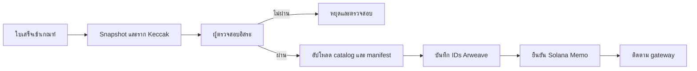
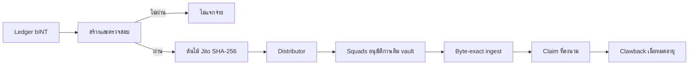

# รายละเอียดโปรโตคอล Web3 และขอบเขตการปฏิบัติงาน

## 6.8 เหตุผลการออกแบบ

ระบบแยกการประมวลผลส่วนตัว หลักฐานสาธารณะ และการดำเนินการโทเค็น เพราะมีต้นทุน ความเป็นส่วนตัว และความสามารถในการแก้ไขต่างกัน

| ชั้น | ใช้เพื่อ | ไม่ใช้เพื่อ |
|---|---|---|
| ฐานข้อมูลแอป | ประมวลผลส่วนตัว สิทธิ์ และการแก้ไขก่อนเผยแพร่ | แหล่งสาธารณะของ artefact ที่ผนึกแล้ว |
| Arweave | artefact ราคาสาธารณะและสื่อการตรวจสอบที่รับได้โดยไม่พึ่ง Yumo Yumo | รูปใบเสร็จ รายการส่วนตัว หรือสถานะปฏิบัติงานที่แก้ไขได้ |
| Solana | บัญชีโทเค็น การเคลื่อนย้าย vault ภายใต้ multisig สถานะ claim และคำมั่นสัญญาขนาดเล็ก | เก็บใบเสร็จ รัน OCR หรือ mint ต่อใบเสร็จ |

การเก็บใบเสร็จทุกใบบนเชนจะเปิดเผยข้อมูล เพิ่มต้นทุน และทำให้การแก้ไขยาก การเก็บหลักฐานทั้งหมดเฉพาะในฐานข้อมูลทำให้การเผยแพร่ขึ้นกับการดำรงอยู่ของ Yumo Yumo จึงเผยแพร่ artefact สาธารณะที่จำกัดบน Arweave และผูกตัวตนที่แน่นอนบน Solana

## 6.9 Release registry และเกณฑ์การเปิดใช้งาน

เอกสารนี้อธิบาย integration surface ที่วางแผนไว้ เมื่อเปิดใช้ mainnet release แล้ว release registry จะเป็นข้อมูลอ้างอิงสำหรับเครือข่ายจริง ที่อยู่ เวอร์ชันแพ็กเกจ สถานะ authority และหลักฐานของ release ทะเบียนจะเผยแพร่พร้อม release และมี deployment address ของ release นั้น

| พื้นผิว | ข้อมูลที่ release record ต้องมี ก่อนเปิดใช้งาน |
|---|---|
| การชำระบัญชี INT | เครือข่าย ที่อยู่ INT mint สถานะ authority ธุรกรรม supply ที่ได้รับอนุมัติ และเวอร์ชัน release |
| การกระจายรางวัล | ที่อยู่ distributor, Merkle root, ช่วงเวลา claim, ผู้รับ clawback, ธุรกรรมการเงิน และเวอร์ชันข้อกำหนดต้นไม้ |
| การกำกับดูแล treasury | ที่อยู่ multisig, ชุดสมาชิก, เกณฑ์อนุมัติ และบันทึกข้อเสนอหรือการอนุมัติ |
| การผนึกราคาสาธารณะ | ที่อยู่ sealer, ธุรกรรม Solana, ID manifest ของ Arweave และ ID แค็ตตาล็อกราคา |

แต่ละ release record ยังมีเวอร์ชัน dependency, เอกสารอ้างอิง audit หรือ review ที่เกี่ยวข้อง, นโยบาย RPC และช่องทางรายงานด้านความปลอดภัย ผู้ตรวจสอบและผู้ใช้จึงตรวจการตั้งค่าที่ใช้งานอยู่จากบันทึกที่มีเวอร์ชันเดียวกันได้

## 6.10 ระบบ Merkle สองระบบ

| คุณสมบัติ | บัญชีแยกประเภทราคา | INT distributor |
|---|---|---|
| เป้าหมาย | ผูกข้อสังเกตสาธารณะและลายนิ้วมือที่อ่านย้อนกลับไม่ได้ | อนุญาต claim โทเค็นที่แน่นอน |
| Hash | Keccak-256 | SHA-256 |
| Leaf | hash ของบรรทัดที่เผยแพร่; receipt leaf มี preimage ส่วนตัว | `hashv(claimant, unlocked_u64_le, locked_u64_le)` แล้วทำ leaf hash แบบแยกโดเมน |
| ลำดับ / คี่ | เรียงตาม hash; leaf คี่ถูกส่งต่อ | ลำดับอินพุตกำหนดได้; คู่ hash เรียง; node คี่ถูกทำซ้ำ |
| เป้าตรวจสอบ | hash และรากใน Memo | ราก distributor และ claim instruction |

ใช้แทนกันไม่ได้: proof ราคาคลেম INT ไม่ได้ และ proof distributor ไม่ตรวจสอบใบเสร็จ

## 6.11 การเปลี่ยนสถานะ

การยืนยัน Memo คือขอบเขตที่ย้อนกลับไม่ได้ การตรวจสอบล้มเหลวสร้างใหม่ได้; upload ที่ Turbo รับแล้วแต่ gateway ยังไม่ให้บริการต้องติดตาม; epoch ที่ผนึกแก้ด้วยการเผยแพร่ภายหลัง ไม่ใช่แก้ไขเดิม

Verifier การตั้งราก และการเติมเงินคลังเป็นการควบคุมแยกกัน ไม่มีฝ่ายใดควรแก้สิทธิ์แล้วเติมเงิน distributor อื่นได้ฝ่ายเดียว

## 6.12 การทำซ้ำ อำนาจ และความล้มเหลว

การตรวจ epoch สาธารณะทำโดยค้นหา Memo รับ manifest ตาม Arweave ID เปรียบเทียบเนื้อหากับ manifest hash คำนวณ leaves และรากใหม่ แล้วเทียบรากกับ Memo ตรวจ catalog ด้วย hash ใน manifest ได้โดยไม่ต้องใช้ API หรือฐานข้อมูล Yumo Yumo

การตรวจรางวัลใช้ leaves ที่บันทึกไว้ ข้อกำหนด Jito บัญชี distributor ธุรกรรมการเติมเงิน และสถานะ claim พิสูจน์ความสอดคล้องของ allocation ราก และ vault แต่ไม่พิสูจน์อินพุตสิทธิ์ส่วนตัวเอง

อำนาจต้องอธิบายเป็นสถานะ release ไม่ใช่คำมั่นในอนาคต จนกว่าจะเผยแพร่ mainnet instance และ multisig address เอกสารต้องระบุว่ายังไม่ provisioned Gateway ใช้ไม่ได้ RPC ล่ม claim ถูกปฏิเสธ proof ไม่ตรง การตรวจสอบล้มเหลว และ clawback เป็นสถานะที่สังเกตได้ Web3 ไม่ป้องกันเหตุการณ์เหล่านี้ แต่เก็บหลักฐานเพื่อสอบสวน

## 6.13 วงจรชีวิตของ epoch และขอบเขตการเผยแพร่

Epoch คือช่วงเวลาการเผยแพร่ที่มีขอบเขตปิด ไม่ใช่มุมมองฐานข้อมูลที่เปลี่ยนตามเวลา จุดประสงค์คือให้ชุดข้อมูลที่เผยแพร่แต่ละชุดมีขอบเขตข้อมูลนำเข้าที่แน่นอนและมีเป้าหมายการตรวจสอบที่แน่นอน Manifest บันทึก epoch identifier เวลาเปิดและปิด inclusion policy เวอร์ชัน source schema เวอร์ชัน canonicalisation และเวอร์ชัน verifier ดังนั้นผู้ตรวจในภายหลังจะแยก observation ที่เข้า epoch ก่อน cut-off ออกจากรายการที่รับเข้าหลัง cut-off ได้

ลำดับงานมีเจ็ดขั้น ขั้นแรก receipt line และ price observation เข้าสู่ private processing queue เพื่อ validation, deduplication, merchant matching, unit normalisation และการตัดสิน eligibility ขั้นที่สอง builder เลือกรายการที่ผ่านเวลาปิดและ policy ที่ประกาศ ขั้นที่สามสร้าง immutable snapshot: public observation ทุกบรรทัดถูก serialise ตามลำดับฟิลด์และ encoding ที่ระบุ ส่วน receipt ที่มีสิทธิ์สร้าง privacy-preserving fingerprint แทนภาพหรือเนื้อหาดิบ ขั้นที่สี่ independent verifier สร้าง snapshot ใหม่จาก frozen input เดียวกันและเทียบจำนวน records, byte digests, จำนวน leaves, roots และฟิลด์ใน manifest

ผล verifier ที่ตรงกันคือประตูสู่การเผยแพร่ Builder สร้าง price catalogue, receipt-fingerprint set เมื่อต้องใช้, manifest และ inclusion-proof material Manifest ระบุชื่อไฟล์ SHA-256 digest ของไฟล์ Merkle algorithms ค่า root ขอบเขต epoch และเวอร์ชัน software/specification จากนั้น artefacts ถูก upload ไปยัง Arweave เมื่อ gateway มากกว่าหนึ่งแห่งส่งคืน bytes ที่คาดไว้ compact Solana commitment จะเชื่อม epoch identifier, manifest digest, root และ format version identifiers เหล่านี้เป็น release evidence ของ epoch นั้น

ขั้นสุดท้ายคือ monitoring และ correction การอ่านผ่าน gateway การตรวจ digest การ verify proof และผลของ claim ถูกติดตามเป็นสัญญาณแยกกัน การแก้ไขสร้าง successor epoch หรือ correction record ที่อ้างถึง epoch ที่ได้รับผลกระทบ โดย artefact เดิมยังอยู่ให้เปรียบเทียบ วิธีนี้ทำให้การแก้ ingestion ราคาหรือนโยบายเป็นเหตุการณ์ที่ audit ได้ แทนการเขียนทับประวัติอย่างเงียบ ๆ

## 6.14 Merkle construction และ proof ของ receipt

ต้นไม้สองต้นมี security boundary ต่างกัน จึง version format แยกกัน Public price tree ผูก commitment กับ records ที่บุคคลภายนอกสร้างซ้ำได้ public leaf เริ่มด้วย domain label แล้วตามด้วย canonical byte representation ของ observation Representation ระบุ field list, UTF-8 encoding, date format, decimal scale, currency code, merchant/location identifiers และ newline convention Manifest ระบุ leaf ordering rule, pair-hash rule, odd-leaf rule, root encoding และ tree-specification version อย่างชัดเจน ผู้ตรวจที่ใช้ bytes เดียวกันจะได้ leaf hash เดียวกัน

เส้นทาง receipt fingerprint เพิ่ม private preimage เจ้าของ receipt เก็บค่าที่ใช้คำนวณ fingerprint ไว้ในเครื่อง และอาจขอหรือสร้าง inclusion proof ได้โดยไม่ต้องเผย receipt image, bank data, account หรือความสัมพันธ์กับ wallet Proof มี sibling hashes, ตำแหน่ง left/right, epoch identifier และ specification version เริ่มจาก leaf ที่คำนวณในเครื่อง เจ้าของรวม sibling ตามลำดับที่ประกาศ แล้วเปรียบ root สุดท้ายกับ root ใน manifest และ Solana commitment จึงยืนยันการรวมอยู่ใน sealed epoch โดยไม่เปิดเนื้อหา receipt สู่ public catalogue

INT distribution tree เป็นโครงสร้างแยกสำหรับอนุญาต claim Leaf เข้ารหัส claimant public key และ allocation แบบ unlocked/locked ตาม byte order และ domain separator ที่ระบุ Distribution manifest กำหนด allocation epoch, root, เวลาเปิด/ปิด claim, funding transaction และ clawback destination Claimant ตรวจ leaf และ proof ในเครื่องก่อนส่ง claim instruction จาก wallet ของตน Distributor state แสดงผลของ claim จึงตรวจว่าการจัดสรรอยู่ใต้ root ที่เผยแพร่ได้โดยไม่ต้องมี application session

## 6.15 วิธีสำหรับผู้ใช้และนักพัฒนาอิสระ

เส้นทางตรวจสาธารณะทำงานด้วย artefacts และ provider ที่ผู้ตรวจเลือกเอง ผู้ใช้ นักวิจัย หรือนักพัฒนาเริ่มจาก epoch index หรือ Arweave manifest ID ที่รู้จัก รับ manifest จาก gateway ที่เลือก แล้วเทียบ digest กับ Solana commitment จากนั้นดาวน์โหลด catalogue ที่ manifest ระบุ คำนวณ file digests ในเครื่อง สร้าง tree ใหม่ และเทียบ root หากตรวจ receipt ของตนเอง จะส่ง preimage ให้ local verifier เท่านั้นและใช้ sibling path ตรวจ inclusion Wallet สอบถาม claim state จาก Solana RPC endpoint ที่ผู้ใช้เลือก

| Method | Input | Output | Independent check |
|---|---|---|---|
| `getEpoch(epoch_id)` | epoch identifier | Manifest ID, root, format, time | manifest digest ตรงกับ commitment |
| `getCatalogue(manifest_id)` | Manifest ID | public catalogue แบบ byte-exact | file digest ตรงกับ manifest |
| `buildPriceRoot(catalogue, spec)` | catalogue bytes และ spec | leaf count และ price root | root ตรงกับ manifest |
| `proveReceipt(receipt_preimage, epoch_id)` | local preimage และ epoch | leaf และ sibling path | folded path ตรงกับ receipt root |
| `getDistribution(epoch_id)` | allocation epoch | root, claim window, funding ref | record ตรงกับ release evidence |
| `verifyAllocation(wallet, allocation, proof)` | wallet, amounts, proof | local valid/invalid result | root ตรงกับ distribution record |

Reference implementation ต้องทำให้ network access เปลี่ยนได้: ใช้ Arweave gateway ใดก็ได้ เก็บ local mirror ของ artefacts ได้ และเลือก Solana RPC provider เอง Verifier รายงาน gateway/RPC source, retrieval time, expected และ observed digests, specification version และทุก failed comparison เพื่อให้บุคคลอื่นทำการตรวจเดิมซ้ำได้

Proof of expense มีขอบเขตชัดเจน public layer แสดงว่า approved observation หรือ receipt fingerprint เป็นส่วนหนึ่งของ sealed epoch และ artefact set ยังคงระบุตัวได้ในระดับ bytes private layer เก็บข้อมูลให้ผู้ใช้ที่เกี่ยวข้องคำนวณ fingerprint ของตนเองใหม่ สำหรับ grant committee คำถามคือ epoch ใดเผยแพร่, specification ใดสร้างมัน, artefact ใดมี bytes, commitment ใดระบุ artefact, authority ใดอนุมัติ treasury movement และ root/funding transaction ใดทำให้ claims ชำระได้ Release registry และ epoch manifests ให้คำตอบเหล่านี้เมื่อ mainnet release เปิดใช้

## 6.16 สัญญา artefact และการสร้างเครื่องมือตรวจสอบ

ไฟล์ทุกชนิดที่ verifier ใช้มี schema ที่ระบุเวอร์ชันได้ Manifest ทำหน้าที่เป็นจุดเริ่มต้นและต้องระบุ `epoch_id`, `publication_time`, `catalogue_id`, digest ของ catalogue, price root, receipt root เมื่อมี, hash algorithm, canonicalisation version และ tree version Distribution record ใช้หลักเดียวกันและเพิ่ม allocation epoch, distribution root, claim window, funding reference, clawback receiver และ format version ด้วยการกำหนดสัญญานี้ นักพัฒนาไม่ต้องเดา field order หรือใช้ผลที่ได้จากหน้าเว็บเป็นแหล่งข้อมูล

เครื่องมืออิสระสามารถทำงานเป็นลำดับที่แน่นอน: รับ manifest bytes, ตรวจ digest ที่ประกาศ, รับ catalogue bytes, parse ตาม schema version, serialise fields กลับเป็น canonical bytes, hash leaves, fold tree และเทียบ root เมื่อผลต่างเกิดขึ้น เครื่องมือบันทึกชื่อไฟล์ offset ของบรรทัด การคำนวณที่ใช้ และ expected/observed value แทนการซ่อนข้อผิดพลาด ผู้พัฒนาอาจสร้าง explorer ที่แสดง epoch history, local mirror ที่ตรวจ gateway หลายแห่ง, หรือ wallet helper ที่ตรวจ allocation ก่อนส่ง claim ได้ โดย implementation แต่ละตัวแสดง specification version และแหล่งข้อมูลที่อ่านเสมอ

การเปิดเผยเช่นนี้ทำให้ transparency มีความหมายเชิงปฏิบัติ: ผู้ตรวจไม่จำเป็นต้องเชื่อว่า operator รันระบบถูกต้อง แต่ตรวจ artefacts เดียวกันและใช้ rules เดียวกันได้ การควบคุม application ยังสำคัญต่อ receipt intake และ privacy แต่การยืนยันสิ่งที่ได้เผยแพร่แล้วกระจายไปยังผู้ใช้ นักวิจัย และผู้พัฒนาอิสระ

ผลลัพธ์ของ verifier จึงเป็น evidence package ที่พกพาได้ ไม่ใช่เพียงข้อความว่า “ผ่าน” Package ควรมี manifest ที่อ่านได้ ไฟล์ input ที่อ้างถึงได้ root ที่คำนวณใหม่ รายการ proof ที่ตรวจแล้ว และ metadata ของ runtime ผู้สร้างเครื่องมือสามารถใช้ package นี้ทำ regression test ระหว่าง specification versions หรือเปรียบเทียบผลจาก implementation สองตัวได้ หาก implementation ให้ root ต่างกัน แม้ catalogue จะมีชื่อเดียวกัน ผู้ตรวจจะตามความต่างกลับไปที่ canonical bytes หรือ tree rule ที่ระบุใน manifest ได้ทันที

ระบบยังแยก public price verification จาก private eligibility review อย่างชัดเจน ผู้พัฒนาอิสระตรวจ publication integrity, byte identity และ allocation arithmetic ได้จาก artefacts สาธารณะ ส่วน eligibility ที่อาศัยข้อมูลส่วนบุคคลจะผ่านขอบเขต privacy และกระบวนการ review ที่ประกาศไว้ การแยกนี้ทำให้การตรวจแบบกระจายศูนย์ใช้ได้จริง โดยไม่เปลี่ยนข้อมูลส่วนบุคคลให้กลายเป็นข้อมูลสาธารณะ

ทุก epoch จึงมีร่องรอยตรวจสอบที่ระบุแหล่งข้อมูล กฎ ผลลัพธ์ version เวลา และหลักฐานครบถ้วนให้ทุกฝ่ายตรวจซ้ำได้อย่างอิสระ

---
