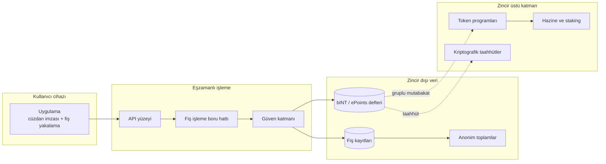

# Yüksek seviyeli sistem haritası

## 1.1 Yüksek seviyeli sistem haritası

Harita açık mimari sınırını gösterir: kullanıcıya dönen önizleme eşzamanlıdır; bINT ve ePoints muhasebesi deftere yazıldıktan sonra mutabakat işçileri tarafından zincir üstü katmana taşınır. Diyagram, protokol bileşenlerini ve veri hareketini gösterir.
