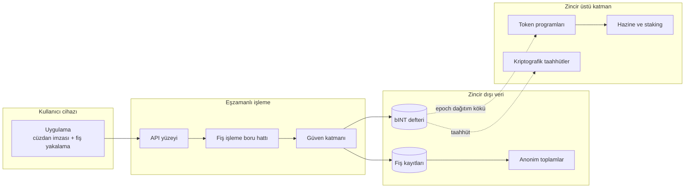

# Yüksek seviyeli sistem haritası

## 1.1 Yüksek seviyeli sistem haritası

```mermaid
flowchart LR
    subgraph Client["Kullanıcı cihazı"]
        A["Uygulama<br/>cüzdan imzası + fiş yakalama"]
    end

    subgraph Processing["Eşzamanlı işleme"]
        B["API yüzeyi"]
        C["Fiş işleme boru hattı"]
        D["Güven katmanı"]
    end

    subgraph Data["Zincir dışı veri"]
        E[("Fiş kayıtları")]
        F[("bINT defteri")]
        G["Anonim toplamlar"]
    end

    subgraph Chain["Zincir üstü katman"]
        H["Token programları"]
        I["Hazine ve staking"]
        J["Kriptografik taahhütler"]
    end

    A --> B --> C --> D
    D --> E
    D --> F
    E --> G
    F -. "epoch dağıtım kökü" .-> H
    F -. "taahhüt" .-> J
    H --> I
```

Harita açık mimari sınırını gösterir: kullanıcıya dönen önizleme eşzamanlıdır; bINT muhasebesi zincir dışında kalır. Uygun bINT kredilerinden üretilen INT dağıtım kökü, mutabakat işçileri tarafından zincir üstü katmana taahhüt edilir. Diyagram, protokol bileşenlerini ve veri hareketini gösterir.
