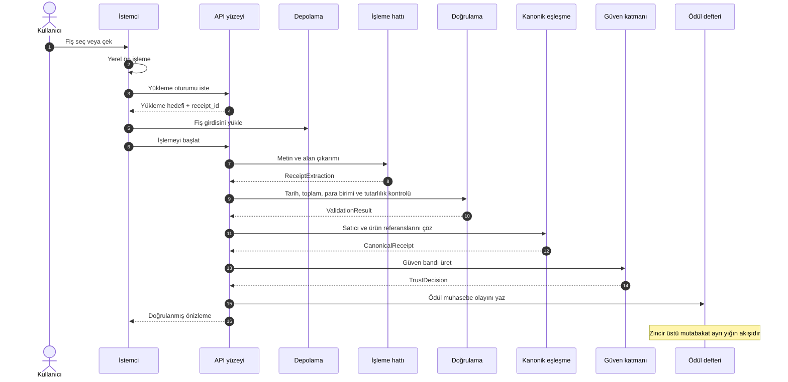

# 02 — Fiş İşleme Boru Hattı

Fiş işleme boru hattı, kullanıcıdan gelen fiş görüntüsünü veya PDF faturayı yapılandırılmış bir fiş kaydına dönüştüren işleme zinciridir. Açık dokümanda açılan sözleşme, aşamaların sırası ve her aşamanın girdi/çıktı tipidir; sağlayıcı seçimi, istem ayrıntıları, eşik değerleri ve yedek kuralları operasyonel dokümantasyonda kalır.

Boru hattı iki çıktıyı birbirinden ayırır: kullanıcıya gösterilen doğrulanmış önizleme ve ödül defterine yazılan muhasebe olayı. Bu ayrım, kullanıcı deneyimini zincir üstü mutabakattan bağımsız tutar.

## 2.1 Tasarım hedefleri

| Hedef | Teknik sonuç |
|---|---|
| Düşük gecikme | Kullanıcıya dönen önizleme eşzamanlı akışta üretilir |
| Tipli aşama devri | Her aşama bir sonraki aşamaya şemalı çıktı verir |
| Tekrar çalıştırılabilirlik | Aşama çıktıları olay olarak kaydedilir; başarısız işler aynı girdiyle tekrar denenebilir |
| Kalite ayrımı | Düşük güvenli fişler ödül muhasebesinden ayrıştırılabilir veya incelemeye alınabilir |
| Gizlilik | Ham fiş içeriği zincir dışı veri katmanında işlenir; veri ürünü anonimleştirilmiş katmandan türetilir |

## 2.2 Bir bakışta boru hattı

Aşamalar paylaşılan değişken durum yerine tipli olaylar üzerinden bağlanır. Bu yapı hem gözlemlenebilirliği hem de geri dönük yeniden işlemeyi mümkün kılar.
